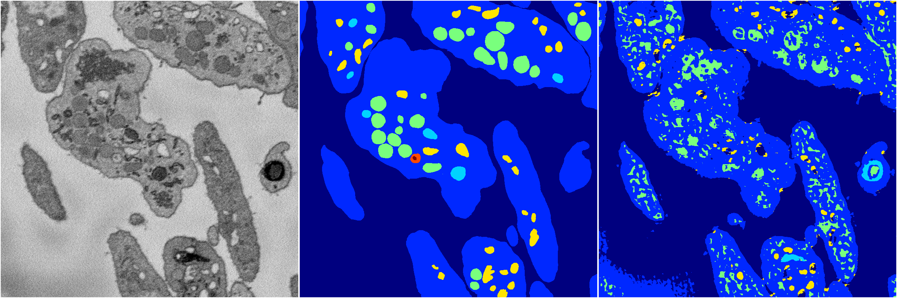
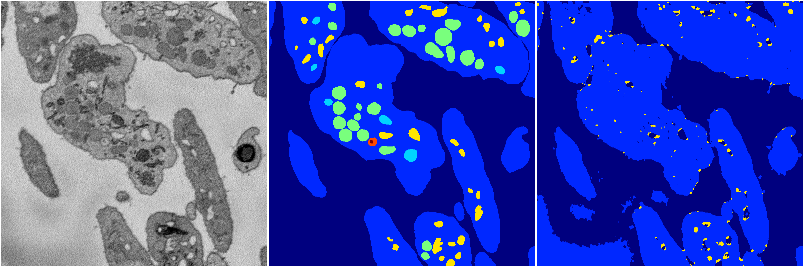
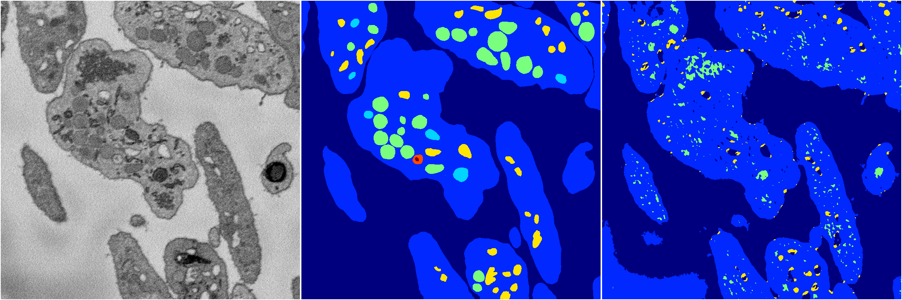
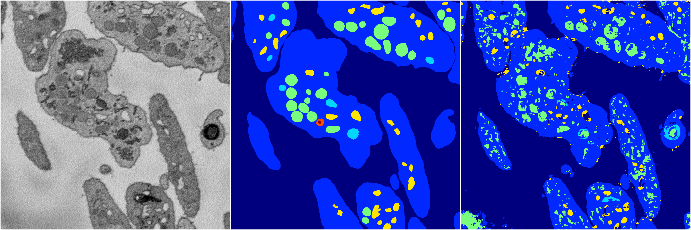
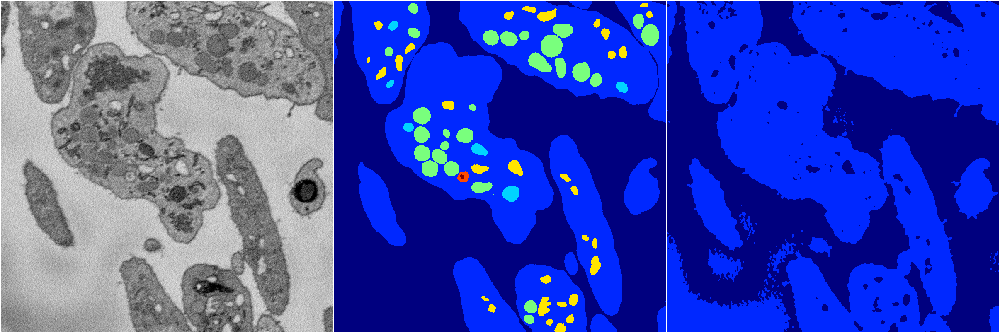

[Back](..)&nbsp;&nbsp;&nbsp;&nbsp;&nbsp;[Home](https://leapmanlab.github.io/snapshots)

---

<a href="3"><h2>random_2d_ed / 1210 / 30 / 3</h2></a>
(Created 13 Dec 2018, 16:39:48. Modified 13 Dec 2018, 16:39:48)

<i>Click for more details</i>

**ari**: 0.6948. **miou**: 0.3170. **accuracy**: 0.8669. **n_params**: 456204.0000. 

---

<a href="4"><h2>random_2d_ed / 1210 / 30 / 4</h2></a>
(Created 13 Dec 2018, 16:39:48. Modified 13 Dec 2018, 16:39:48)

<i>Click for more details</i>

**ari**: 0.6541. **miou**: 0.2683. **accuracy**: 0.8675. **n_params**: 456204.0000. 

---

<a href="1"><h2>random_2d_ed / 1210 / 30 / 1</h2></a>
(Created 13 Dec 2018, 16:39:48. Modified 13 Dec 2018, 16:39:48)

<i>Click for more details</i>

**ari**: 0.6659. **miou**: 0.2800. **accuracy**: 0.8600. **n_params**: 456204.0000. 

---

<a href="2"><h2>random_2d_ed / 1210 / 30 / 2</h2></a>
(Created 13 Dec 2018, 16:39:48. Modified 13 Dec 2018, 16:39:48)

<i>Click for more details</i>

**ari**: 0.7080. **miou**: 0.3548. **accuracy**: 0.8663. **n_params**: 456204.0000. 

---

<a href="0"><h2>random_2d_ed / 1210 / 30 / 0</h2></a>
(Created 13 Dec 2018, 16:39:48. Modified 13 Dec 2018, 16:39:48)

<i>Click for more details</i>

**ari**: 0.6325. **miou**: 0.2337. **accuracy**: 0.8601. **n_params**: 456204.0000. 

---

[Back](..)&nbsp;&nbsp;&nbsp;&nbsp;&nbsp;[Home](https://leapmanlab.github.io/snapshots)

---