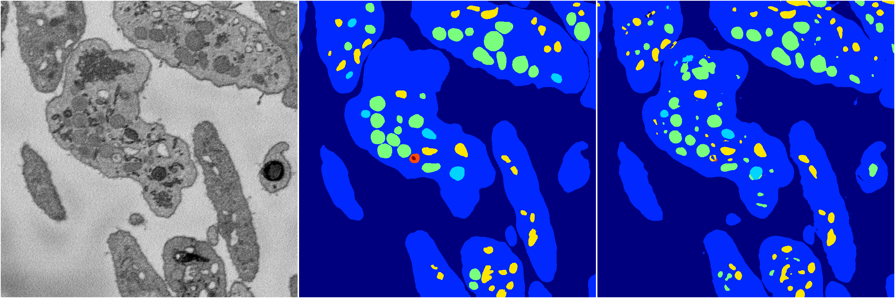
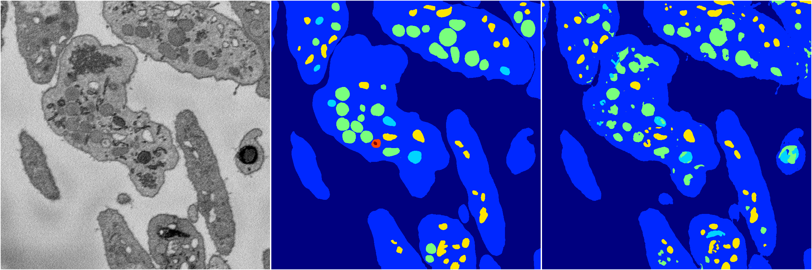
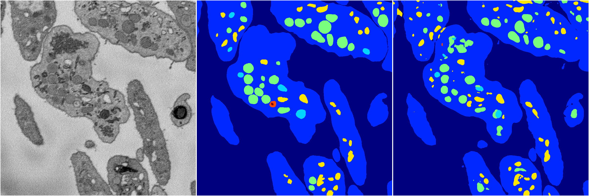
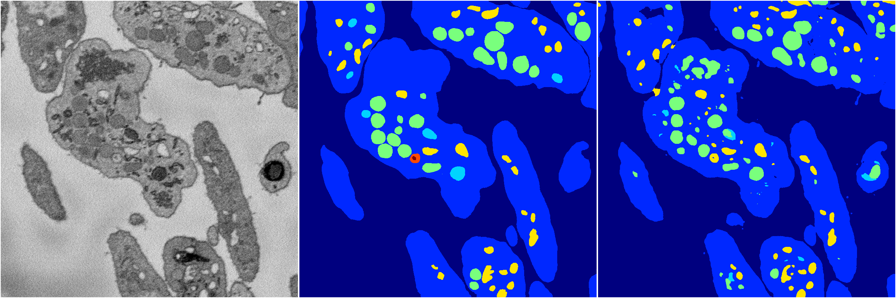

[Back](..)&nbsp;&nbsp;&nbsp;&nbsp;&nbsp;[Home](https://leapmanlab.github.io/snapshots)

---

<a href="4"><h2>random_2d_ed / 1210 / 31 / 4</h2></a>
(Created 13 Dec 2018, 16:44:47. Modified 13 Dec 2018, 16:44:47)

<i>Click for more details</i>

**ari**: 0.8149. **miou**: 0.5240. **accuracy**: 0.9277. **n_params**: 52598179.0000. 

---

<a href="3"><h2>random_2d_ed / 1210 / 31 / 3</h2></a>
(Created 13 Dec 2018, 16:44:47. Modified 13 Dec 2018, 16:44:47)

<i>Click for more details</i>

**ari**: 0.8074. **miou**: 0.4440. **accuracy**: 0.9216. **n_params**: 52598179.0000. 

---

<a href="2"><h2>random_2d_ed / 1210 / 31 / 2</h2></a>
(Created 13 Dec 2018, 16:44:47. Modified 13 Dec 2018, 16:44:47)

<i>Click for more details</i>

**ari**: 0.8150. **miou**: 0.4811. **accuracy**: 0.9270. **n_params**: 52598179.0000. 

---

<a href="1"><h2>random_2d_ed / 1210 / 31 / 1</h2></a>
(Created 13 Dec 2018, 16:44:47. Modified 13 Dec 2018, 16:44:47)

<i>Click for more details</i>

**ari**: 0.7990. **miou**: 0.4204. **accuracy**: 0.9198. **n_params**: 52598179.0000. 

---

<a href="0"><h2>random_2d_ed / 1210 / 31 / 0</h2></a>
(Created 13 Dec 2018, 16:44:47. Modified 13 Dec 2018, 16:44:47)

<i>Click for more details</i>

**ari**: 0.8241. **miou**: 0.4738. **accuracy**: 0.9338. **n_params**: 52598179.0000. 

---

[Back](..)&nbsp;&nbsp;&nbsp;&nbsp;&nbsp;[Home](https://leapmanlab.github.io/snapshots)

---