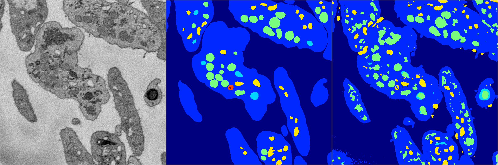
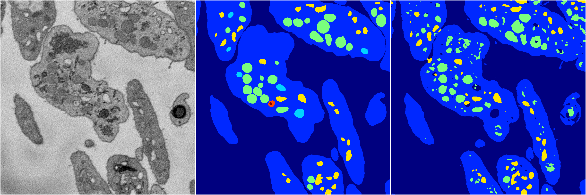
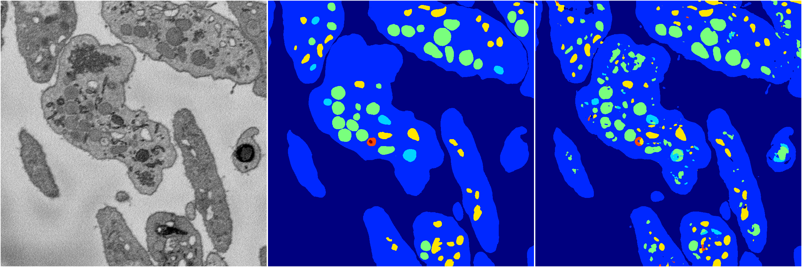
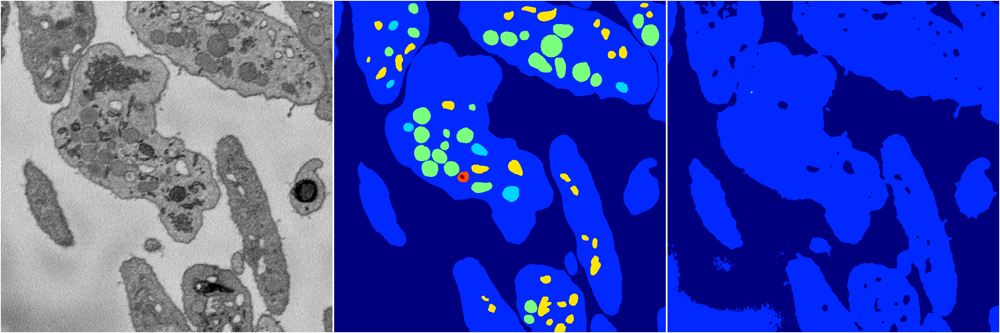
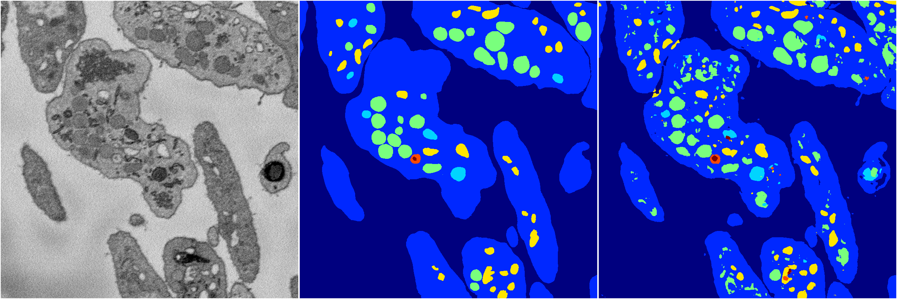

[Back](..)&nbsp;&nbsp;&nbsp;&nbsp;&nbsp;[Home](https://leapmanlab.github.io/snapshots)

---

<a href="4"><h2>random_2d_ed / 1210 / 32 / 4</h2></a>
Created 13 Dec 2018, 16:45:49

<i>Click for more details</i>

**ari**: 0.7299. **miou**: 0.4457. **accuracy**: 0.8975. **n_params**: 4459788.0000. 

---

<a href="2"><h2>random_2d_ed / 1210 / 32 / 2</h2></a>
Created 13 Dec 2018, 16:45:49

<i>Click for more details</i>

**ari**: 0.7700. **miou**: 0.3933. **accuracy**: 0.9058. **n_params**: 4459788.0000. 

---

<a href="3"><h2>random_2d_ed / 1210 / 32 / 3</h2></a>
Created 13 Dec 2018, 16:45:49

<i>Click for more details</i>

**ari**: 0.7990. **miou**: 0.5088. **accuracy**: 0.9205. **n_params**: 4459788.0000. 

---

<a href="1"><h2>random_2d_ed / 1210 / 32 / 1</h2></a>
Created 13 Dec 2018, 16:45:49

<i>Click for more details</i>

**ari**: 0.6660. **miou**: 0.2969. **accuracy**: 0.8590. **n_params**: 4459788.0000. 

---

<a href="0"><h2>random_2d_ed / 1210 / 32 / 0</h2></a>
Created 13 Dec 2018, 16:45:49

<i>Click for more details</i>

**ari**: 0.7732. **miou**: 0.5488. **accuracy**: 0.9068. **n_params**: 4459788.0000. 

---

[Back](..)&nbsp;&nbsp;&nbsp;&nbsp;&nbsp;[Home](https://leapmanlab.github.io/snapshots)

---