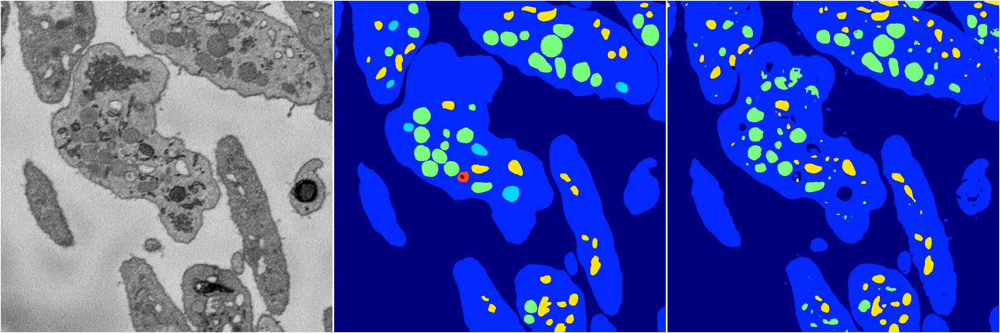
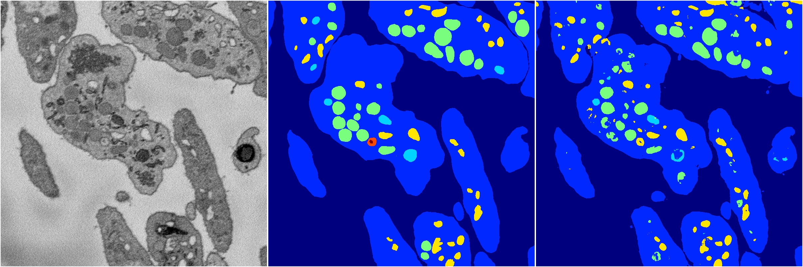
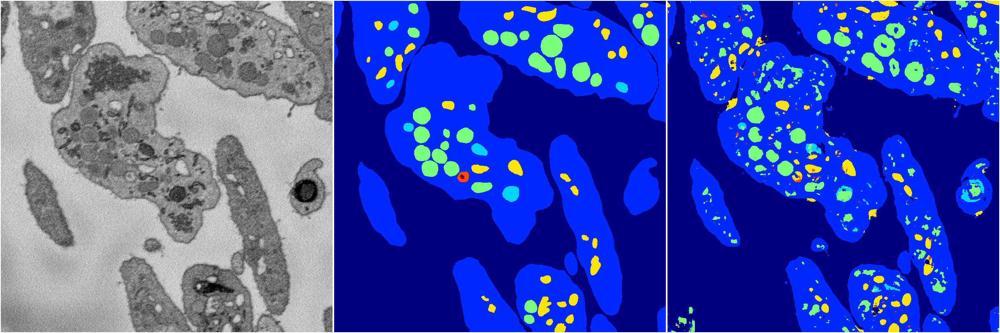

[Back](..)&nbsp;&nbsp;&nbsp;&nbsp;&nbsp;[Home](https://leapmanlab.github.io/snapshots)

---

<a href="4"><h2>random_2d_ed / 1210 / 33 / 4</h2></a>
Created 16 Dec 2018, 15:39:18

<i>Click for more details</i>

**ari**: 0.7973. **miou**: 0.4549. **accuracy**: 0.9220. **n_params**: 44963904.0000. 

---

<a href="3"><h2>random_2d_ed / 1210 / 33 / 3</h2></a>
Created 16 Dec 2018, 15:39:18

<i>Click for more details</i>

**ari**: 0.8165. **miou**: 0.5110. **accuracy**: 0.9296. **n_params**: 44963904.0000. 

---

<a href="1"><h2>random_2d_ed / 1210 / 33 / 1</h2></a>
Created 16 Dec 2018, 15:39:18

<i>Click for more details</i>

**ari**: 0.8098. **miou**: 0.4039. **accuracy**: 0.9256. **n_params**: 44963904.0000. 

---

<a href="2"><h2>random_2d_ed / 1210 / 33 / 2</h2></a>
Created 16 Dec 2018, 15:39:18

<i>Click for more details</i>

**ari**: 0.8212. **miou**: 0.5013. **accuracy**: 0.9318. **n_params**: 44963904.0000. 

---

<a href="0"><h2>random_2d_ed / 1210 / 33 / 0</h2></a>
Created 16 Dec 2018, 15:39:18

<i>Click for more details</i>

**ari**: 0.7783. **miou**: 0.4598. **accuracy**: 0.9033. **n_params**: 44963904.0000. 

---

[Back](..)&nbsp;&nbsp;&nbsp;&nbsp;&nbsp;[Home](https://leapmanlab.github.io/snapshots)

---