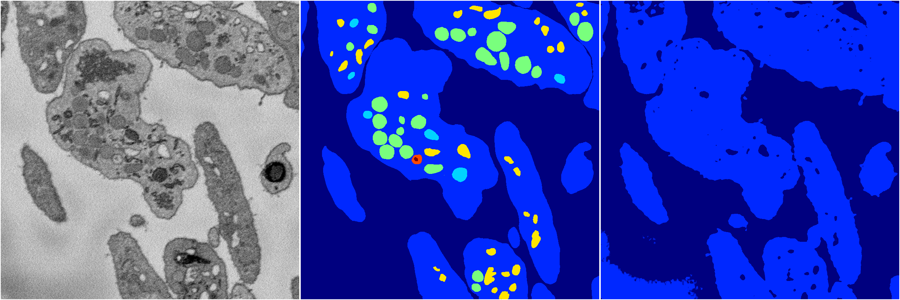
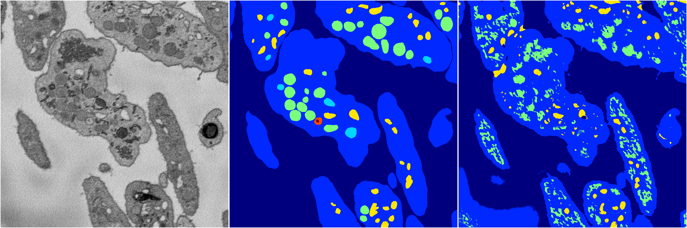
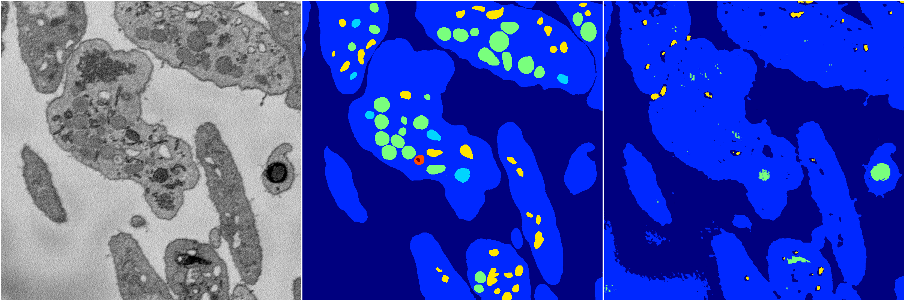
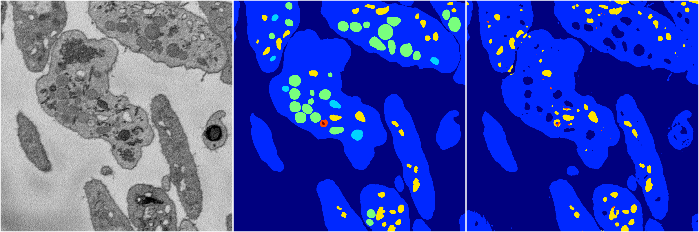

[Back](..)&nbsp;&nbsp;&nbsp;&nbsp;&nbsp;[Home](https://leapmanlab.github.io/snapshots)

---

<a href="4"><h2>random_2d_ed / 1210 / 34 / 4</h2></a>
Created 13 Dec 2018, 16:45:49

<i>Click for more details</i>

**ari**: 0.6853. **miou**: 0.2406. **accuracy**: 0.8863. **n_params**: 176986.0000. 

---

<a href="3"><h2>random_2d_ed / 1210 / 34 / 3</h2></a>
Created 13 Dec 2018, 16:45:49

<i>Click for more details</i>

**ari**: 0.6882. **miou**: 0.3173. **accuracy**: 0.8643. **n_params**: 176986.0000. 

---

<a href="2"><h2>random_2d_ed / 1210 / 34 / 2</h2></a>
Created 13 Dec 2018, 16:45:49

<i>Click for more details</i>

**ari**: 0.6847. **miou**: 0.2514. **accuracy**: 0.8813. **n_params**: 176986.0000. 

---

<a href="0"><h2>random_2d_ed / 1210 / 34 / 0</h2></a>
Created 13 Dec 2018, 16:45:49

<i>Click for more details</i>

**ari**: 0.7859. **miou**: 0.3497. **accuracy**: 0.9180. **n_params**: 176986.0000. 

---

<a href="1"><h2>random_2d_ed / 1210 / 34 / 1</h2></a>
Created 13 Dec 2018, 16:45:49

<i>Click for more details</i>

**ari**: 0.7908. **miou**: 0.3776. **accuracy**: 0.9098. **n_params**: 176986.0000. 

---

[Back](..)&nbsp;&nbsp;&nbsp;&nbsp;&nbsp;[Home](https://leapmanlab.github.io/snapshots)

---