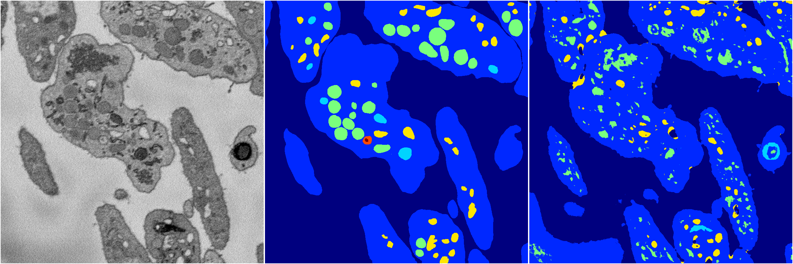
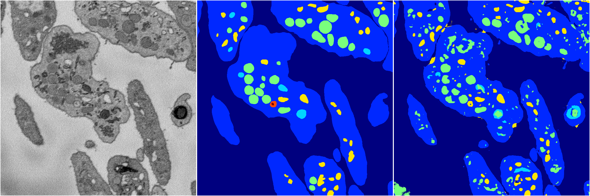
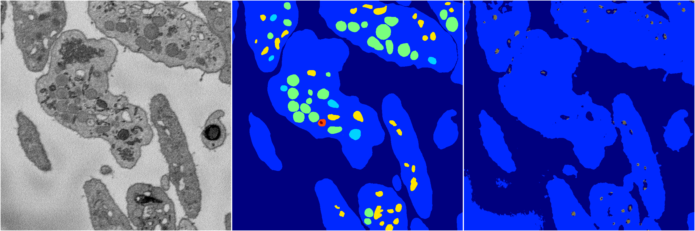

[Back](..)&nbsp;&nbsp;&nbsp;&nbsp;&nbsp;[Home](https://leapmanlab.github.io/snapshots)

---

<a href="4"><h2>random_2d_ed / 1210 / 36 / 4</h2></a>
(Created 13 Dec 2018, 16:44:47. Modified 13 Dec 2018, 16:44:47)

<i>Click for more details</i>

**ari**: 0.6736. **miou**: 0.3235. **accuracy**: 0.8640. **n_params**: 499114.0000. 

---

<a href="3"><h2>random_2d_ed / 1210 / 36 / 3</h2></a>
(Created 13 Dec 2018, 16:44:47. Modified 13 Dec 2018, 16:44:47)

<i>Click for more details</i>

**ari**: 0.7736. **miou**: 0.4472. **accuracy**: 0.9028. **n_params**: 499114.0000. 

---

<a href="2"><h2>random_2d_ed / 1210 / 36 / 2</h2></a>
(Created 13 Dec 2018, 16:44:47. Modified 13 Dec 2018, 16:44:47)

<i>Click for more details</i>

**ari**: 0.7657. **miou**: 0.4207. **accuracy**: 0.8983. **n_params**: 499114.0000. 

---

<a href="1"><h2>random_2d_ed / 1210 / 36 / 1</h2></a>
(Created 13 Dec 2018, 16:44:47. Modified 13 Dec 2018, 16:44:47)

<i>Click for more details</i>

**ari**: 0.6542. **miou**: 0.2372. **accuracy**: 0.8696. **n_params**: 499114.0000. 

---

<a href="0"><h2>random_2d_ed / 1210 / 36 / 0</h2></a>
(Created 13 Dec 2018, 16:44:47. Modified 13 Dec 2018, 16:44:47)

<i>Click for more details</i>

**ari**: 0.6530. **miou**: 0.2473. **accuracy**: 0.8701. **n_params**: 499114.0000. 

---

[Back](..)&nbsp;&nbsp;&nbsp;&nbsp;&nbsp;[Home](https://leapmanlab.github.io/snapshots)

---