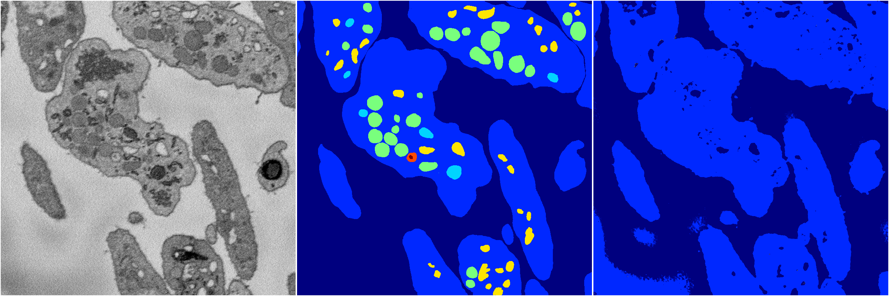
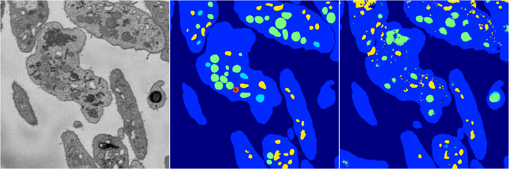
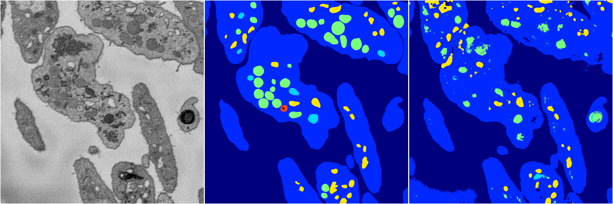
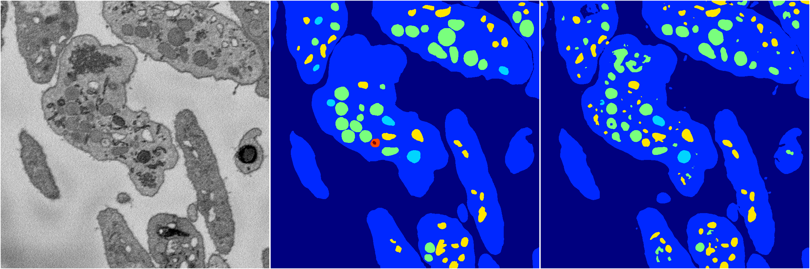
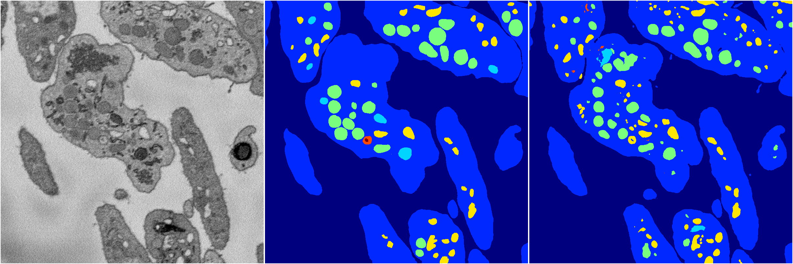

[Back](..)&nbsp;&nbsp;&nbsp;&nbsp;&nbsp;[Home](https://leapmanlab.github.io/snapshots)

---

<a href="4"><h2>random_2d_ed / 1210 / 37 / 4</h2></a>
Created 14 Dec 2018, 11:38:27

<i>Click for more details</i>

**ari**: 0.6472. **miou**: 0.2368. **accuracy**: 0.8786. **n_params**: 16892864.0000. 

---

<a href="3"><h2>random_2d_ed / 1210 / 37 / 3</h2></a>
Created 14 Dec 2018, 11:38:27

<i>Click for more details</i>

**ari**: 0.7429. **miou**: 0.3289. **accuracy**: 0.8988. **n_params**: 16892864.0000. 

---

<a href="2"><h2>random_2d_ed / 1210 / 37 / 2</h2></a>
Created 14 Dec 2018, 11:38:27

<i>Click for more details</i>

**ari**: 0.7177. **miou**: 0.3320. **accuracy**: 0.8914. **n_params**: 16892864.0000. 

---

<a href="0"><h2>random_2d_ed / 1210 / 37 / 0</h2></a>
Created 14 Dec 2018, 11:38:27

<i>Click for more details</i>

**ari**: 0.8110. **miou**: 0.4524. **accuracy**: 0.9294. **n_params**: 16892864.0000. 

---

<a href="1"><h2>random_2d_ed / 1210 / 37 / 1</h2></a>
Created 14 Dec 2018, 11:38:27

<i>Click for more details</i>

**ari**: 0.8071. **miou**: 0.4322. **accuracy**: 0.9253. **n_params**: 16892864.0000. 

---

[Back](..)&nbsp;&nbsp;&nbsp;&nbsp;&nbsp;[Home](https://leapmanlab.github.io/snapshots)

---