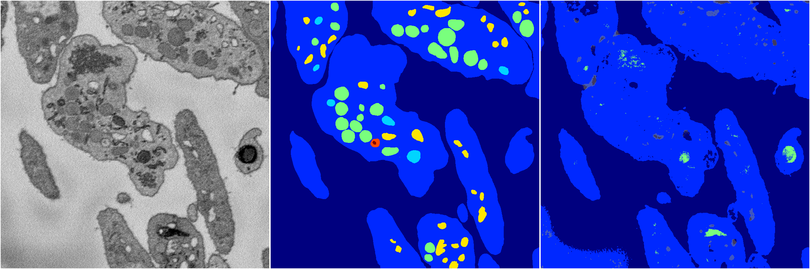
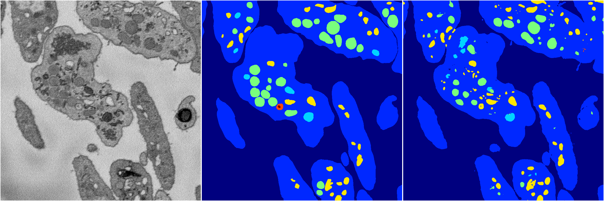
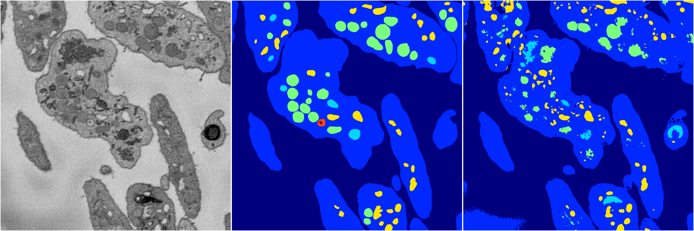
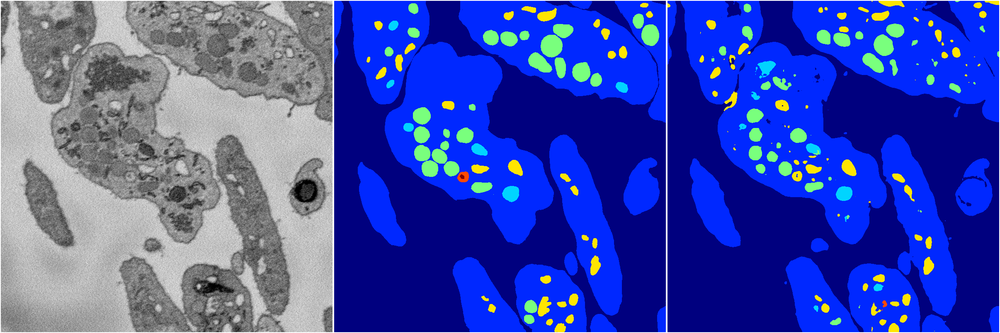

[Back](..)&nbsp;&nbsp;&nbsp;&nbsp;&nbsp;[Home](https://leapmanlab.github.io/snapshots)

---

<a href="4"><h2>random_2d_ed / 1210 / 38 / 4</h2></a>
Created 13 Dec 2018, 16:45:49

<i>Click for more details</i>

**ari**: 0.6598. **miou**: 0.2494. **accuracy**: 0.8791. **n_params**: 64179977.0000. 

---

<a href="3"><h2>random_2d_ed / 1210 / 38 / 3</h2></a>
Created 13 Dec 2018, 16:45:49

<i>Click for more details</i>

**ari**: 0.7976. **miou**: 0.4457. **accuracy**: 0.9275. **n_params**: 64179977.0000. 

---

<a href="2"><h2>random_2d_ed / 1210 / 38 / 2</h2></a>
Created 13 Dec 2018, 16:45:49

<i>Click for more details</i>

**ari**: 0.7338. **miou**: 0.4052. **accuracy**: 0.9063. **n_params**: 64179977.0000. 

---

<a href="1"><h2>random_2d_ed / 1210 / 38 / 1</h2></a>
Created 13 Dec 2018, 16:45:49

<i>Click for more details</i>

**ari**: 0.8033. **miou**: 0.5345. **accuracy**: 0.9286. **n_params**: 64179977.0000. 

---

<a href="0"><h2>random_2d_ed / 1210 / 38 / 0</h2></a>
Created 13 Dec 2018, 16:45:49

<i>Click for more details</i>

**ari**: 0.7895. **miou**: 0.4726. **accuracy**: 0.9269. **n_params**: 64179977.0000. 

---

[Back](..)&nbsp;&nbsp;&nbsp;&nbsp;&nbsp;[Home](https://leapmanlab.github.io/snapshots)

---