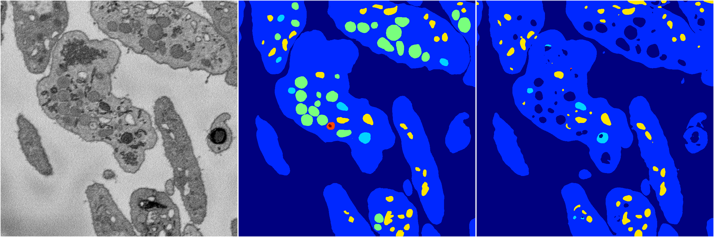
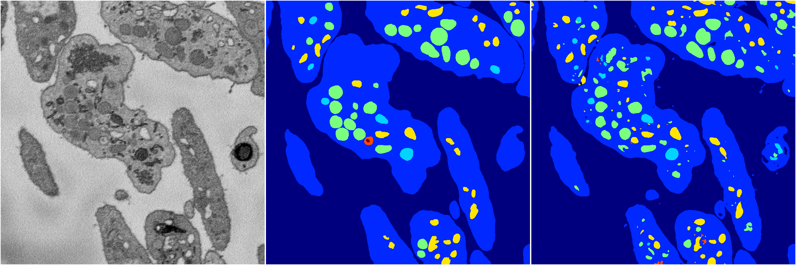
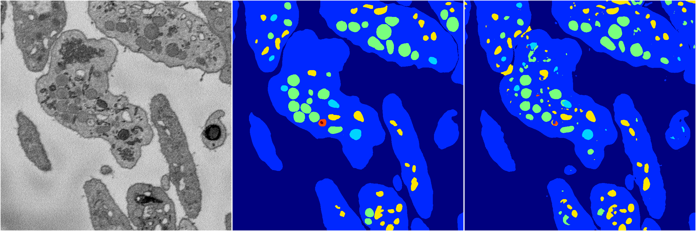
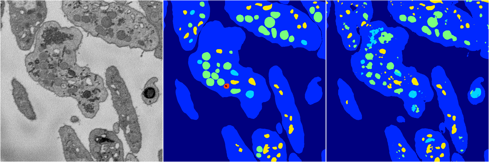

[Back](..)&nbsp;&nbsp;&nbsp;&nbsp;&nbsp;[Home](https://leapmanlab.github.io/snapshots)

---

<a href="2"><h2>random_2d_ed / 1210 / 39 / 2</h2></a>
(Created 13 Dec 2018, 16:44:48. Modified 13 Dec 2018, 16:44:48)

<i>Click for more details</i>

**ari**: 0.8219. **miou**: 0.5823. **accuracy**: 0.9327. **n_params**: 18660626.0000. 

---

<a href="4"><h2>random_2d_ed / 1210 / 39 / 4</h2></a>
(Created 13 Dec 2018, 16:44:48. Modified 13 Dec 2018, 16:44:48)

<i>Click for more details</i>

**ari**: 0.7836. **miou**: 0.4343. **accuracy**: 0.9169. **n_params**: 18660626.0000. 

---

<a href="0"><h2>random_2d_ed / 1210 / 39 / 0</h2></a>
(Created 13 Dec 2018, 16:44:48. Modified 13 Dec 2018, 16:44:48)

<i>Click for more details</i>

**ari**: 0.8056. **miou**: 0.5665. **accuracy**: 0.9239. **n_params**: 18660626.0000. 

---

<a href="3"><h2>random_2d_ed / 1210 / 39 / 3</h2></a>
(Created 13 Dec 2018, 16:44:48. Modified 13 Dec 2018, 16:44:48)

<i>Click for more details</i>

**ari**: 0.8191. **miou**: 0.5052. **accuracy**: 0.9300. **n_params**: 18660626.0000. 

---

<a href="1"><h2>random_2d_ed / 1210 / 39 / 1</h2></a>
(Created 13 Dec 2018, 16:44:48. Modified 13 Dec 2018, 16:44:48)

<i>Click for more details</i>

**ari**: 0.8063. **miou**: 0.4470. **accuracy**: 0.9224. **n_params**: 18660626.0000. 

---

[Back](..)&nbsp;&nbsp;&nbsp;&nbsp;&nbsp;[Home](https://leapmanlab.github.io/snapshots)

---