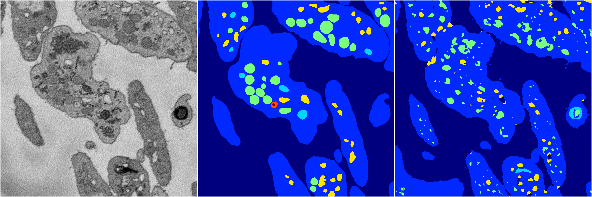
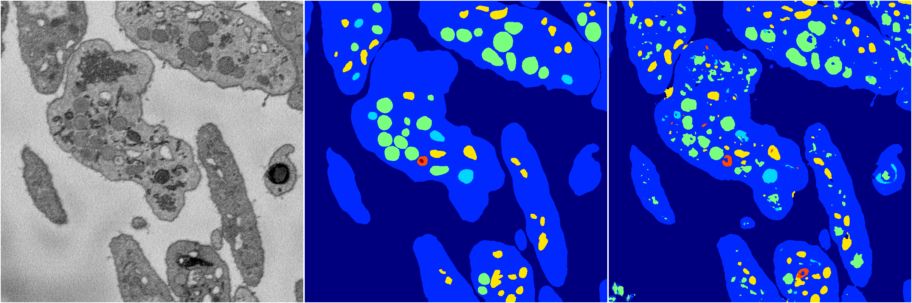
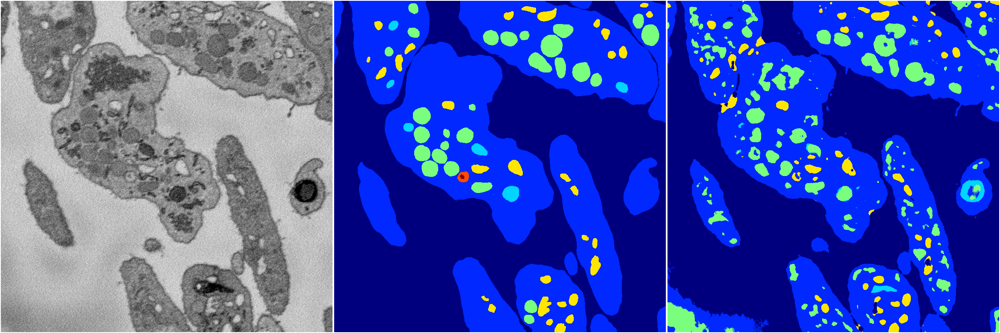
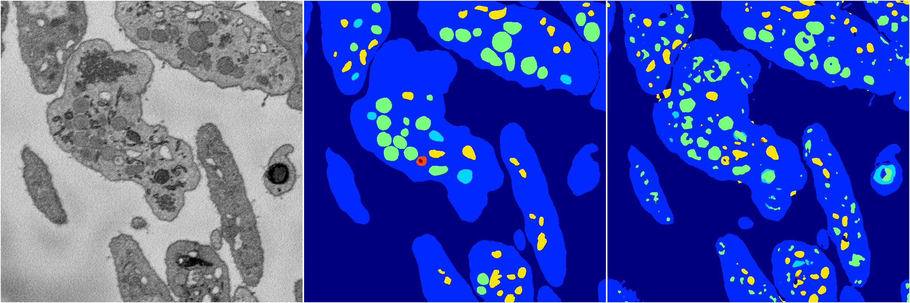
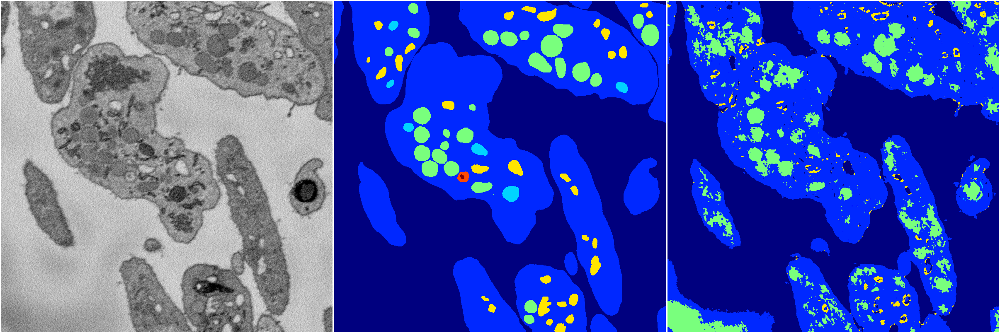

[Back](..)&nbsp;&nbsp;&nbsp;&nbsp;&nbsp;[Home](https://leapmanlab.github.io/snapshots)

---

<a href="4"><h2>random_2d_ed / 1210 / 4 / 4</h2></a>
Created 16 Dec 2018, 10:15:12

<i>Click for more details</i>

**ari**: 0.6965. **miou**: 0.3290. **accuracy**: 0.8738. **n_params**: 1056744.0000. 

---

<a href="3"><h2>random_2d_ed / 1210 / 4 / 3</h2></a>
Created 16 Dec 2018, 10:15:12

<i>Click for more details</i>

**ari**: 0.7843. **miou**: 0.5236. **accuracy**: 0.9102. **n_params**: 1056744.0000. 

---

<a href="2"><h2>random_2d_ed / 1210 / 4 / 2</h2></a>
Created 16 Dec 2018, 10:15:12

<i>Click for more details</i>

**ari**: 0.7328. **miou**: 0.3765. **accuracy**: 0.8814. **n_params**: 1056744.0000. 

---

<a href="1"><h2>random_2d_ed / 1210 / 4 / 1</h2></a>
Created 16 Dec 2018, 10:15:12

<i>Click for more details</i>

**ari**: 0.7817. **miou**: 0.4258. **accuracy**: 0.9057. **n_params**: 1056744.0000. 

---

<a href="0"><h2>random_2d_ed / 1210 / 4 / 0</h2></a>
Created 16 Dec 2018, 10:15:12

<i>Click for more details</i>

**ari**: 0.6566. **miou**: 0.2966. **accuracy**: 0.8427. **n_params**: 1056744.0000. 

---

[Back](..)&nbsp;&nbsp;&nbsp;&nbsp;&nbsp;[Home](https://leapmanlab.github.io/snapshots)

---