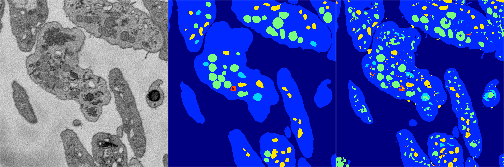
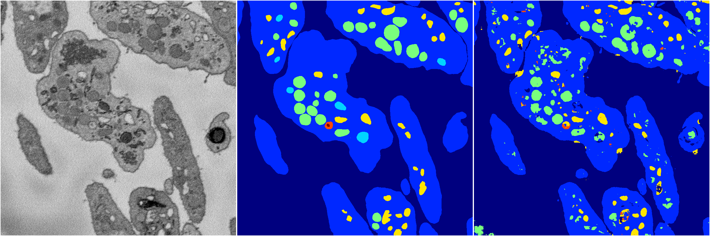
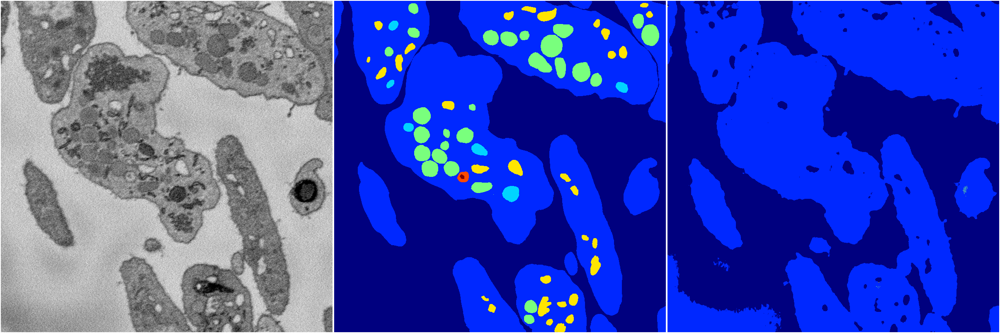
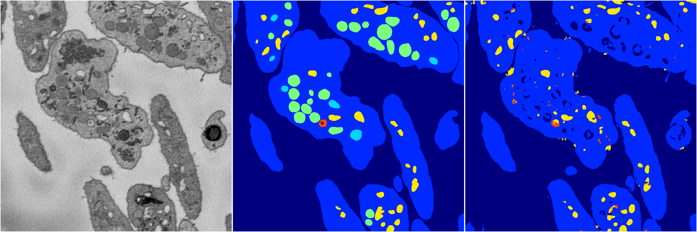
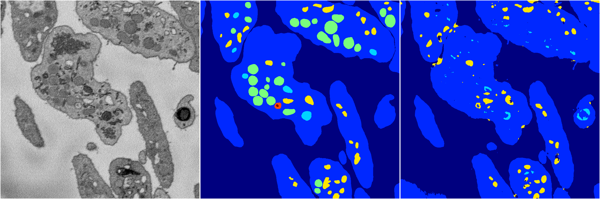

[Back](..)&nbsp;&nbsp;&nbsp;&nbsp;&nbsp;[Home](https://leapmanlab.github.io/snapshots)

---

<a href="4"><h2>random_2d_ed / 1210 / 40 / 4</h2></a>
Created 13 Dec 2018, 16:45:49

<i>Click for more details</i>

**ari**: 0.7561. **miou**: 0.4885. **accuracy**: 0.8945. **n_params**: 413740.0000. 

---

<a href="3"><h2>random_2d_ed / 1210 / 40 / 3</h2></a>
Created 13 Dec 2018, 16:45:49

<i>Click for more details</i>

**ari**: 0.7700. **miou**: 0.4474. **accuracy**: 0.9031. **n_params**: 413740.0000. 

---

<a href="1"><h2>random_2d_ed / 1210 / 40 / 1</h2></a>
Created 13 Dec 2018, 16:45:49

<i>Click for more details</i>

**ari**: 0.6506. **miou**: 0.2371. **accuracy**: 0.8683. **n_params**: 413740.0000. 

---

<a href="0"><h2>random_2d_ed / 1210 / 40 / 0</h2></a>
Created 13 Dec 2018, 16:45:49

<i>Click for more details</i>

**ari**: 0.7455. **miou**: 0.3419. **accuracy**: 0.8953. **n_params**: 413740.0000. 

---

<a href="2"><h2>random_2d_ed / 1210 / 40 / 2</h2></a>
Created 13 Dec 2018, 16:45:49

<i>Click for more details</i>

**ari**: 0.7539. **miou**: 0.3664. **accuracy**: 0.9028. **n_params**: 413740.0000. 

---

[Back](..)&nbsp;&nbsp;&nbsp;&nbsp;&nbsp;[Home](https://leapmanlab.github.io/snapshots)

---