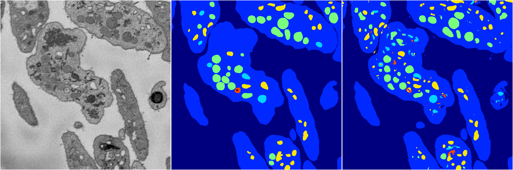
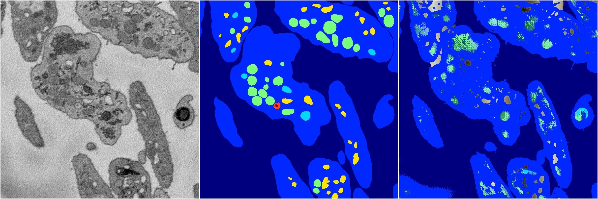
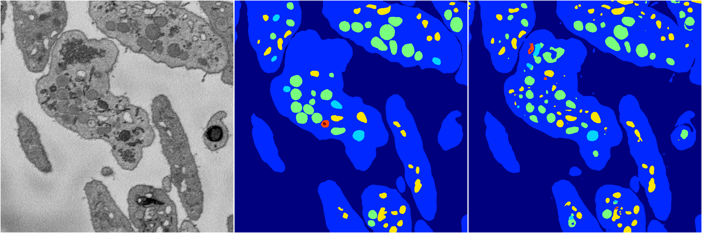
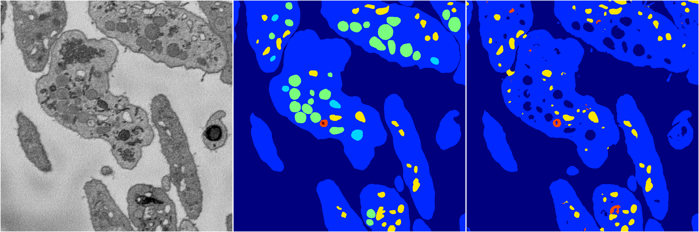

[Back](..)&nbsp;&nbsp;&nbsp;&nbsp;&nbsp;[Home](https://leapmanlab.github.io/snapshots)

---

<a href="4"><h2>random_2d_ed / 1210 / 41 / 4</h2></a>
Created 17 Dec 2018, 02:57:34

<i>Click for more details</i>

**ari**: 0.7719. **miou**: 0.5544. **accuracy**: 0.9094. **n_params**: 29232314.0000. 

---

<a href="1"><h2>random_2d_ed / 1210 / 41 / 1</h2></a>
Created 17 Dec 2018, 02:57:34

<i>Click for more details</i>

**ari**: 0.7952. **miou**: 0.4701. **accuracy**: 0.9227. **n_params**: 29232314.0000. 

---

<a href="0"><h2>random_2d_ed / 1210 / 41 / 0</h2></a>
Created 17 Dec 2018, 02:57:34

<i>Click for more details</i>

**ari**: 0.6634. **miou**: 0.2834. **accuracy**: 0.8680. **n_params**: 29232314.0000. 

---

<a href="2"><h2>random_2d_ed / 1210 / 41 / 2</h2></a>
Created 17 Dec 2018, 02:57:34

<i>Click for more details</i>

**ari**: 0.7908. **miou**: 0.4518. **accuracy**: 0.9210. **n_params**: 29232314.0000. 

---

<a href="3"><h2>random_2d_ed / 1210 / 41 / 3</h2></a>
Created 17 Dec 2018, 02:57:34

<i>Click for more details</i>

**ari**: 0.7712. **miou**: 0.3778. **accuracy**: 0.9111. **n_params**: 29232314.0000. 

---

[Back](..)&nbsp;&nbsp;&nbsp;&nbsp;&nbsp;[Home](https://leapmanlab.github.io/snapshots)

---