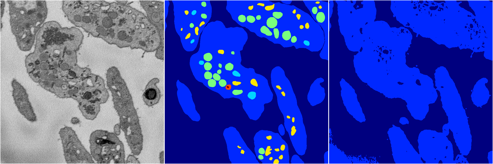
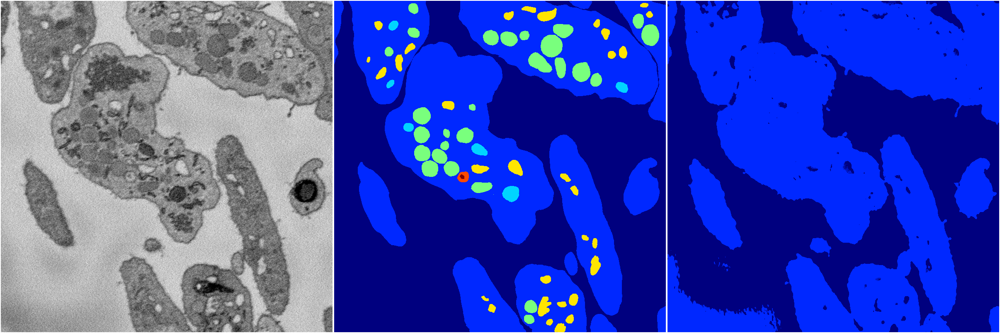
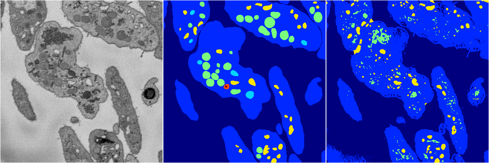
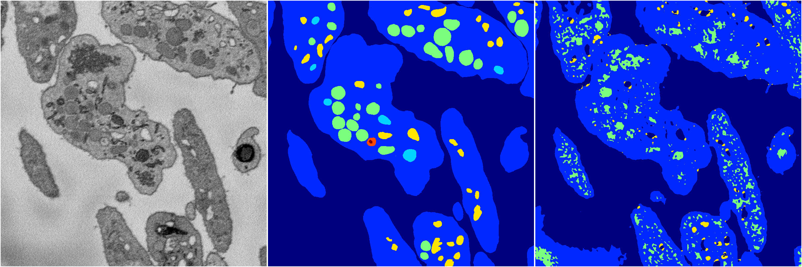
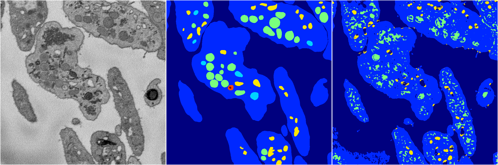

[Back](..)&nbsp;&nbsp;&nbsp;&nbsp;&nbsp;[Home](https://leapmanlab.github.io/snapshots)

---

<a href="3"><h2>random_2d_ed / 1210 / 42 / 3</h2></a>
Created 16 Dec 2018, 10:15:14

<i>Click for more details</i>

**ari**: 0.5620. **miou**: 0.2409. **accuracy**: 0.8816. **n_params**: 32584963.0000. 

---

<a href="2"><h2>random_2d_ed / 1210 / 42 / 2</h2></a>
Created 16 Dec 2018, 10:15:14

<i>Click for more details</i>

**ari**: 0.5590. **miou**: 0.2402. **accuracy**: 0.8805. **n_params**: 32584963.0000. 

---

<a href="4"><h2>random_2d_ed / 1210 / 42 / 4</h2></a>
Created 16 Dec 2018, 10:15:14

<i>Click for more details</i>

**ari**: 0.5973. **miou**: 0.3139. **accuracy**: 0.8800. **n_params**: 32584963.0000. 

---

<a href="1"><h2>random_2d_ed / 1210 / 42 / 1</h2></a>
Created 16 Dec 2018, 10:15:14

<i>Click for more details</i>

**ari**: 0.5692. **miou**: 0.2853. **accuracy**: 0.8571. **n_params**: 32584963.0000. 

---

<a href="0"><h2>random_2d_ed / 1210 / 42 / 0</h2></a>
Created 16 Dec 2018, 10:15:14

<i>Click for more details</i>

**ari**: 0.5833. **miou**: 0.3113. **accuracy**: 0.8658. **n_params**: 32584963.0000. 

---

[Back](..)&nbsp;&nbsp;&nbsp;&nbsp;&nbsp;[Home](https://leapmanlab.github.io/snapshots)

---