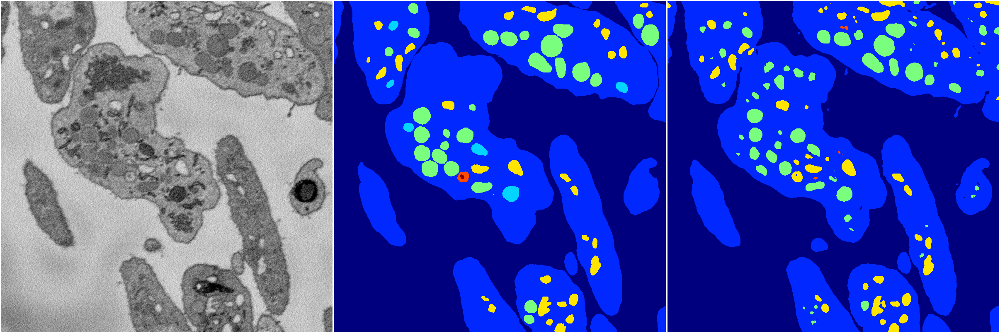
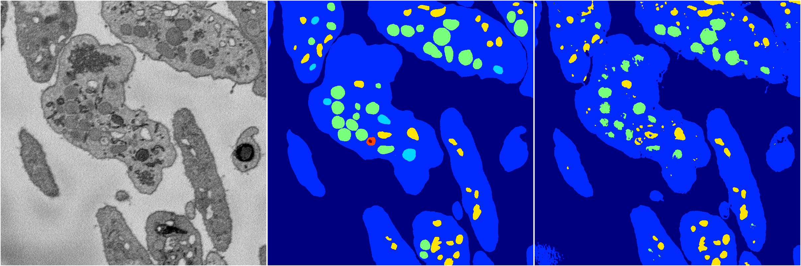
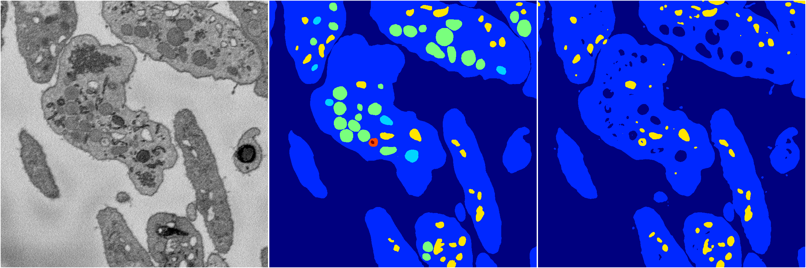
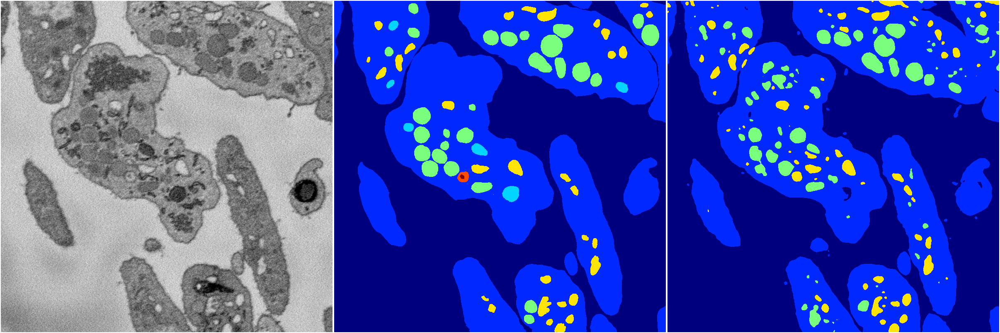

[Back](..)&nbsp;&nbsp;&nbsp;&nbsp;&nbsp;[Home](https://leapmanlab.github.io/snapshots)

---

<a href="2"><h2>random_2d_ed / 1210 / 43 / 2</h2></a>
Created 13 Dec 2018, 16:45:49

<i>Click for more details</i>

**ari**: 0.8175. **miou**: 0.4273. **accuracy**: 0.9238. **n_params**: 23348310.0000. 

---

<a href="1"><h2>random_2d_ed / 1210 / 43 / 1</h2></a>
Created 13 Dec 2018, 16:45:49

<i>Click for more details</i>

**ari**: 0.8053. **miou**: 0.3949. **accuracy**: 0.9237. **n_params**: 23348310.0000. 

---

<a href="3"><h2>random_2d_ed / 1210 / 43 / 3</h2></a>
Created 13 Dec 2018, 16:45:49

<i>Click for more details</i>

**ari**: 0.7732. **miou**: 0.3422. **accuracy**: 0.9121. **n_params**: 23348310.0000. 

---

<a href="4"><h2>random_2d_ed / 1210 / 43 / 4</h2></a>
Created 13 Dec 2018, 16:45:49

<i>Click for more details</i>

**ari**: 0.8003. **miou**: 0.3985. **accuracy**: 0.9195. **n_params**: 23348310.0000. 

---

<a href="0"><h2>random_2d_ed / 1210 / 43 / 0</h2></a>
Created 13 Dec 2018, 16:45:49

<i>Click for more details</i>

**ari**: 0.8062. **miou**: 0.4399. **accuracy**: 0.9185. **n_params**: 23348310.0000. 

---

[Back](..)&nbsp;&nbsp;&nbsp;&nbsp;&nbsp;[Home](https://leapmanlab.github.io/snapshots)

---