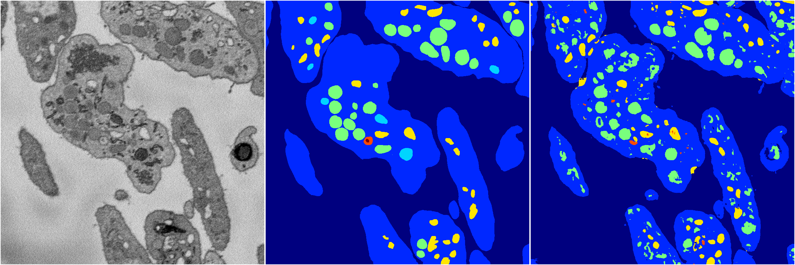
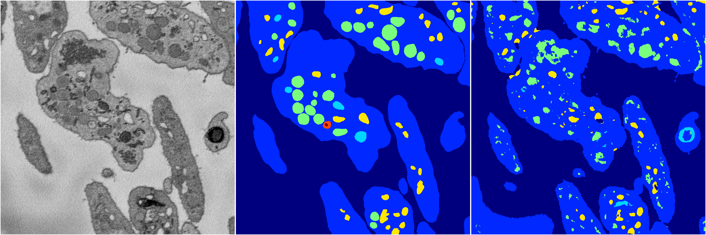
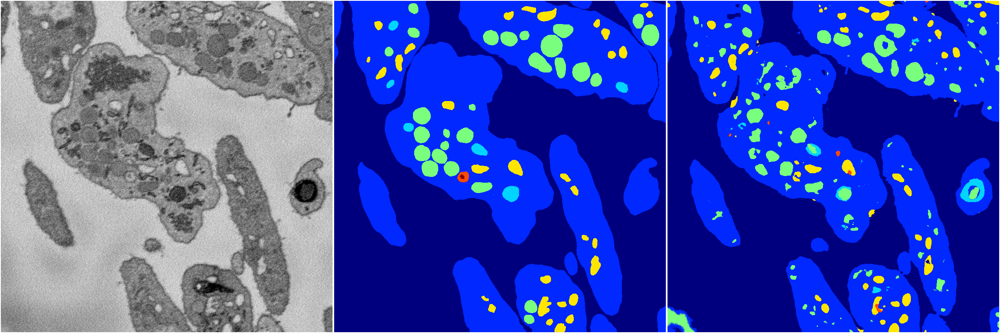
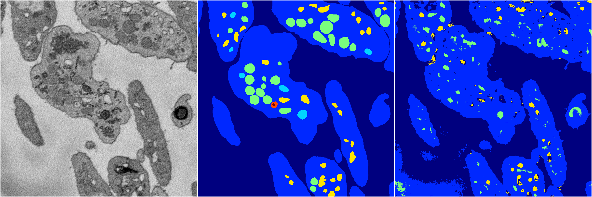

[Back](..)&nbsp;&nbsp;&nbsp;&nbsp;&nbsp;[Home](https://leapmanlab.github.io/snapshots)

---

<a href="4"><h2>random_2d_ed / 1210 / 44 / 4</h2></a>
(Created 13 Dec 2018, 16:39:49. Modified 13 Dec 2018, 16:39:49)

<i>Click for more details</i>

**ari**: 0.7589. **miou**: 0.3995. **accuracy**: 0.8916. **n_params**: 1626124.0000. 

---

<a href="3"><h2>random_2d_ed / 1210 / 44 / 3</h2></a>
(Created 13 Dec 2018, 16:39:49. Modified 13 Dec 2018, 16:39:49)

<i>Click for more details</i>

**ari**: 0.6944. **miou**: 0.3458. **accuracy**: 0.8725. **n_params**: 1626124.0000. 

---

<a href="2"><h2>random_2d_ed / 1210 / 44 / 2</h2></a>
(Created 13 Dec 2018, 16:39:49. Modified 13 Dec 2018, 16:39:49)

<i>Click for more details</i>

**ari**: 0.7823. **miou**: 0.4487. **accuracy**: 0.9088. **n_params**: 1626124.0000. 

---

<a href="1"><h2>random_2d_ed / 1210 / 44 / 1</h2></a>
(Created 13 Dec 2018, 16:39:49. Modified 13 Dec 2018, 16:39:49)

<i>Click for more details</i>

**ari**: 0.7428. **miou**: 0.3567. **accuracy**: 0.8905. **n_params**: 1626124.0000. 

---

<a href="0"><h2>random_2d_ed / 1210 / 44 / 0</h2></a>
(Created 13 Dec 2018, 16:39:49. Modified 13 Dec 2018, 16:39:49)

<i>Click for more details</i>

**ari**: 0.6498. **miou**: 0.2895. **accuracy**: 0.8626. **n_params**: 1626124.0000. 

---

[Back](..)&nbsp;&nbsp;&nbsp;&nbsp;&nbsp;[Home](https://leapmanlab.github.io/snapshots)

---