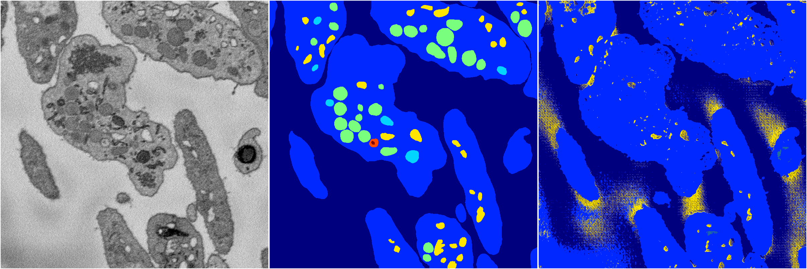
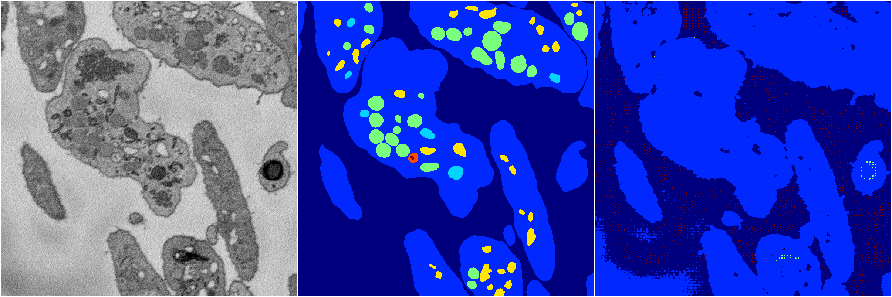
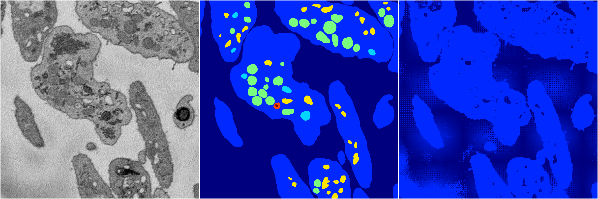
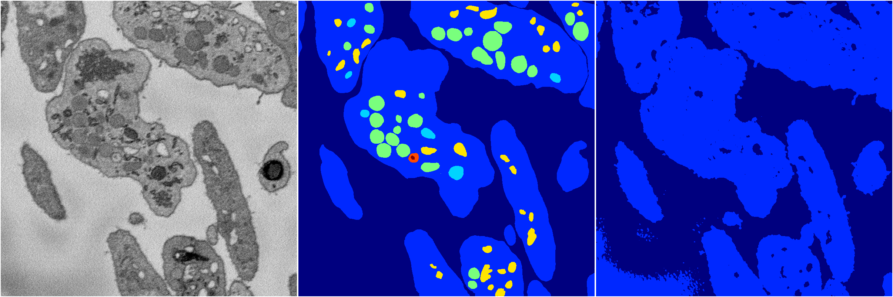

[Back](..)&nbsp;&nbsp;&nbsp;&nbsp;&nbsp;[Home](https://leapmanlab.github.io/snapshots)

---

<a href="1"><h2>random_2d_ed / 1210 / 45 / 1</h2></a>
(Created 13 Dec 2018, 16:44:48. Modified 13 Dec 2018, 16:44:48)

<i>Click for more details</i>

**ari**: 0.3934. **miou**: 0.2290. **accuracy**: 0.8158. **n_params**: 26904529.0000. 

---

<a href="4"><h2>random_2d_ed / 1210 / 45 / 4</h2></a>
(Created 13 Dec 2018, 16:44:48. Modified 13 Dec 2018, 16:44:48)

<i>Click for more details</i>

**ari**: 0.3613. **miou**: 0.2225. **accuracy**: 0.8383. **n_params**: 26904529.0000. 

---

<a href="3"><h2>random_2d_ed / 1210 / 45 / 3</h2></a>
(Created 13 Dec 2018, 16:44:48. Modified 13 Dec 2018, 16:44:48)

<i>Click for more details</i>

**ari**: 0.2557. **miou**: 0.1904. **accuracy**: 0.7749. **n_params**: 26904529.0000. 

---

<a href="2"><h2>random_2d_ed / 1210 / 45 / 2</h2></a>
(Created 13 Dec 2018, 16:44:48. Modified 13 Dec 2018, 16:44:48)

<i>Click for more details</i>

**ari**: 0.4961. **miou**: 0.2344. **accuracy**: 0.8691. **n_params**: 26904529.0000. 

---

<a href="0"><h2>random_2d_ed / 1210 / 45 / 0</h2></a>
(Created 13 Dec 2018, 16:44:48. Modified 13 Dec 2018, 16:44:48)

<i>Click for more details</i>

**ari**: 0.5721. **miou**: 0.3125. **accuracy**: 0.8801. **n_params**: 26904529.0000. 

---

[Back](..)&nbsp;&nbsp;&nbsp;&nbsp;&nbsp;[Home](https://leapmanlab.github.io/snapshots)

---