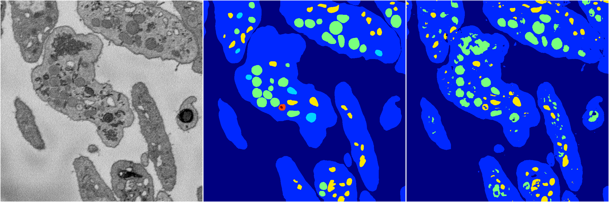
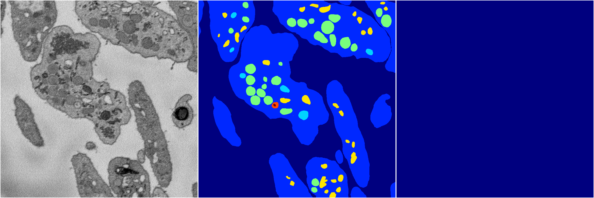
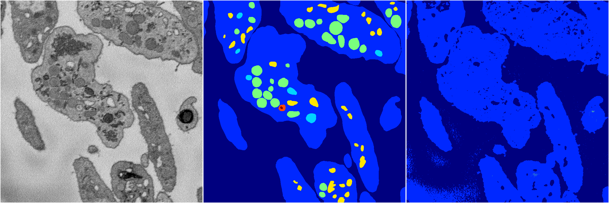
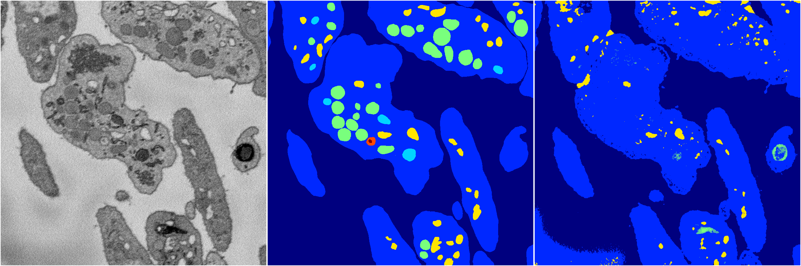

[Back](..)&nbsp;&nbsp;&nbsp;&nbsp;&nbsp;[Home](https://leapmanlab.github.io/snapshots)

---

<a href="4"><h2>random_2d_ed / 1210 / 46 / 4</h2></a>
Created 17 Dec 2018, 23:35:05

<i>Click for more details</i>

**ari**: 0.7730. **miou**: 0.3800. **accuracy**: 0.9091. **n_params**: 209610976.0000. 

---

<a href="2"><h2>random_2d_ed / 1210 / 46 / 2</h2></a>
Created 17 Dec 2018, 23:35:05

<i>Click for more details</i>

**ari**: -0.0000. **miou**: 0.0663. **accuracy**: 0.4638. **n_params**: 209610976.0000. 

---

<a href="1"><h2>random_2d_ed / 1210 / 46 / 1</h2></a>
Created 17 Dec 2018, 23:35:05

<i>Click for more details</i>

**ari**: 0.6115. **miou**: 0.2325. **accuracy**: 0.8661. **n_params**: 209610976.0000. 

---

<a href="0"><h2>random_2d_ed / 1210 / 46 / 0</h2></a>
Created 17 Dec 2018, 23:35:05

<i>Click for more details</i>

**ari**: 0.6703. **miou**: 0.2800. **accuracy**: 0.8834. **n_params**: 209610976.0000. 

---

[Back](..)&nbsp;&nbsp;&nbsp;&nbsp;&nbsp;[Home](https://leapmanlab.github.io/snapshots)

---