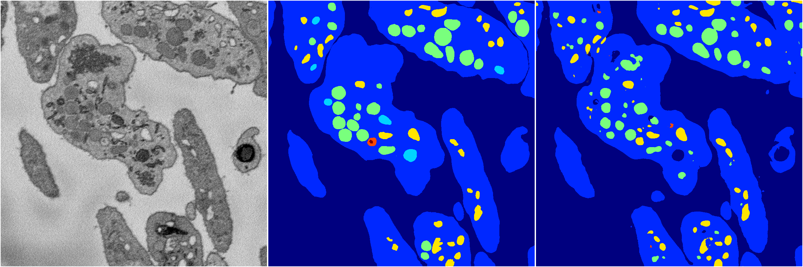
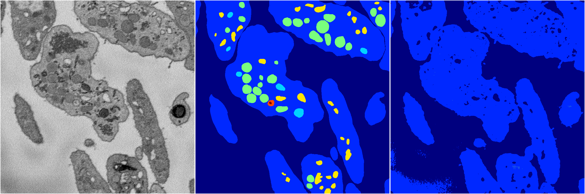
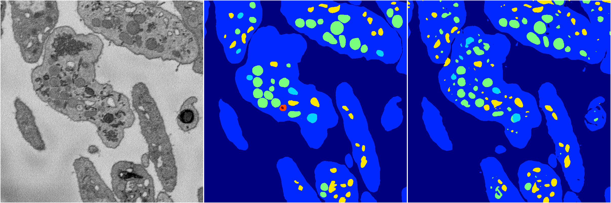
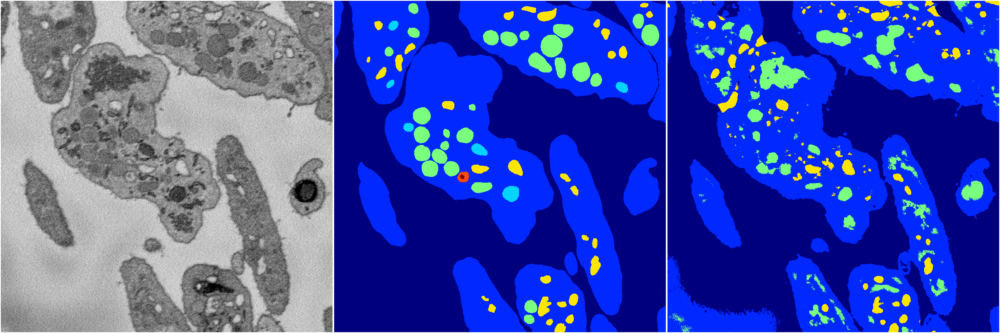
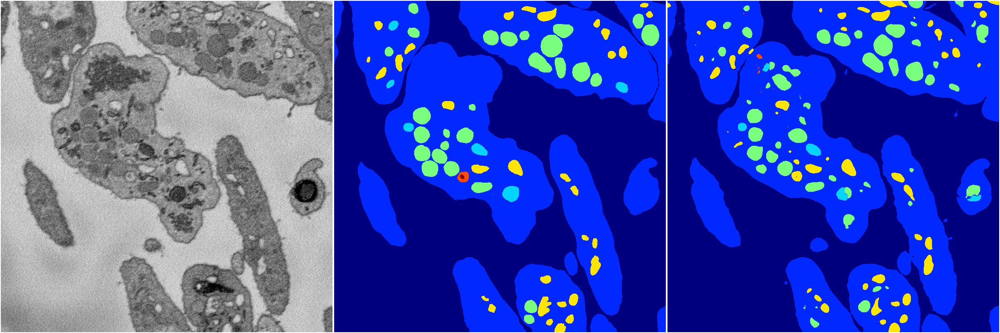

[Back](..)&nbsp;&nbsp;&nbsp;&nbsp;&nbsp;[Home](https://leapmanlab.github.io/snapshots)

---

<a href="0"><h2>random_2d_ed / 1210 / 47 / 0</h2></a>
Created 21 Dec 2018, 01:15:55

<i>Click for more details</i>

**ari**: 0.8101. **miou**: 0.4336. **accuracy**: 0.9250. **n_params**: 10285548.0000. 

---

<a href="3"><h2>random_2d_ed / 1210 / 47 / 3</h2></a>
Created 21 Dec 2018, 01:15:55

<i>Click for more details</i>

**ari**: 0.6705. **miou**: 0.2385. **accuracy**: 0.8805. **n_params**: 10285548.0000. 

---

<a href="1"><h2>random_2d_ed / 1210 / 47 / 1</h2></a>
Created 21 Dec 2018, 01:15:55

<i>Click for more details</i>

**ari**: 0.8166. **miou**: 0.4583. **accuracy**: 0.9290. **n_params**: 10285548.0000. 

---

<a href="4"><h2>random_2d_ed / 1210 / 47 / 4</h2></a>
Created 21 Dec 2018, 01:15:55

<i>Click for more details</i>

**ari**: 0.7171. **miou**: 0.3278. **accuracy**: 0.8770. **n_params**: 10285548.0000. 

---

<a href="2"><h2>random_2d_ed / 1210 / 47 / 2</h2></a>
Created 21 Dec 2018, 01:15:55

<i>Click for more details</i>

**ari**: 0.8210. **miou**: 0.5699. **accuracy**: 0.9310. **n_params**: 10285548.0000. 

---

[Back](..)&nbsp;&nbsp;&nbsp;&nbsp;&nbsp;[Home](https://leapmanlab.github.io/snapshots)

---