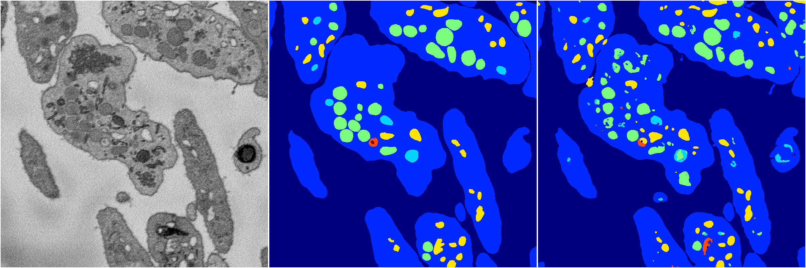
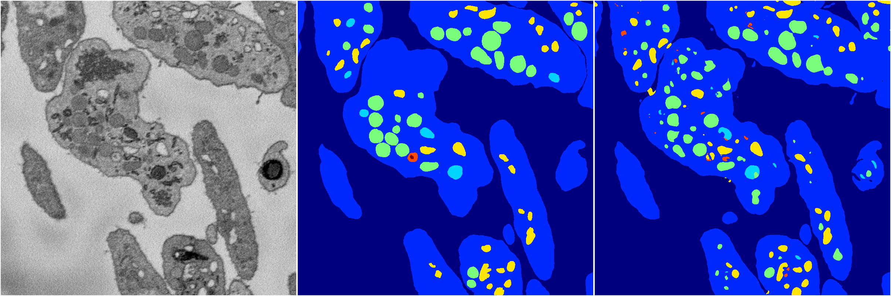
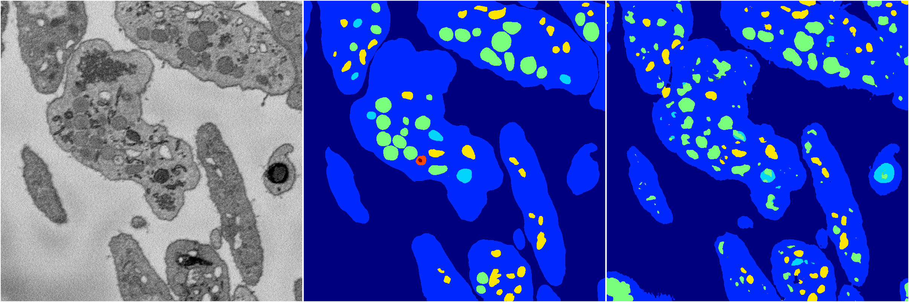
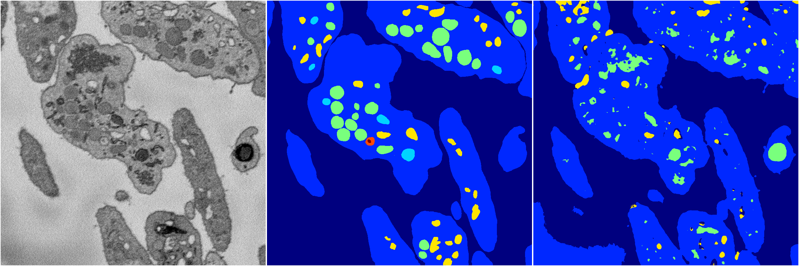
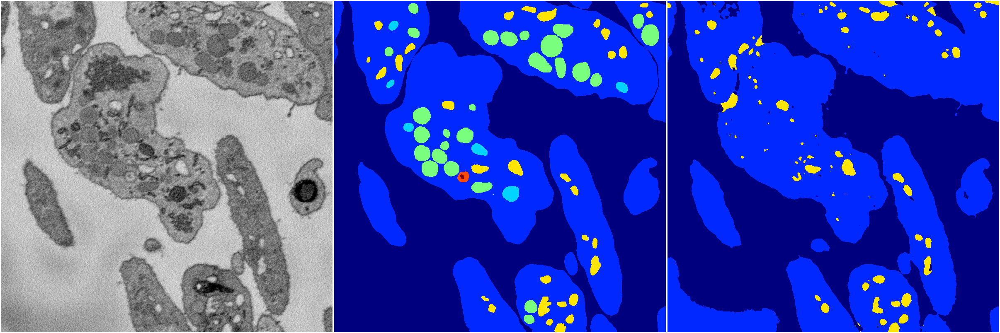

[Back](..)&nbsp;&nbsp;&nbsp;&nbsp;&nbsp;[Home](https://leapmanlab.github.io/snapshots)

---

<a href="4"><h2>random_2d_ed / 1210 / 48 / 4</h2></a>
Created 16 Dec 2018, 10:15:14

<i>Click for more details</i>

**ari**: 0.8184. **miou**: 0.5097. **accuracy**: 0.9301. **n_params**: 15614745.0000. 

---

<a href="3"><h2>random_2d_ed / 1210 / 48 / 3</h2></a>
Created 16 Dec 2018, 10:15:14

<i>Click for more details</i>

**ari**: 0.8218. **miou**: 0.4995. **accuracy**: 0.9306. **n_params**: 15614745.0000. 

---

<a href="1"><h2>random_2d_ed / 1210 / 48 / 1</h2></a>
Created 16 Dec 2018, 10:15:14

<i>Click for more details</i>

**ari**: 0.7899. **miou**: 0.4071. **accuracy**: 0.9102. **n_params**: 15614745.0000. 

---

<a href="2"><h2>random_2d_ed / 1210 / 48 / 2</h2></a>
Created 16 Dec 2018, 10:15:14

<i>Click for more details</i>

**ari**: 0.6916. **miou**: 0.2800. **accuracy**: 0.8717. **n_params**: 15614745.0000. 

---

<a href="0"><h2>random_2d_ed / 1210 / 48 / 0</h2></a>
Created 16 Dec 2018, 10:15:14

<i>Click for more details</i>

**ari**: 0.7578. **miou**: 0.3237. **accuracy**: 0.9082. **n_params**: 15614745.0000. 

---

[Back](..)&nbsp;&nbsp;&nbsp;&nbsp;&nbsp;[Home](https://leapmanlab.github.io/snapshots)

---