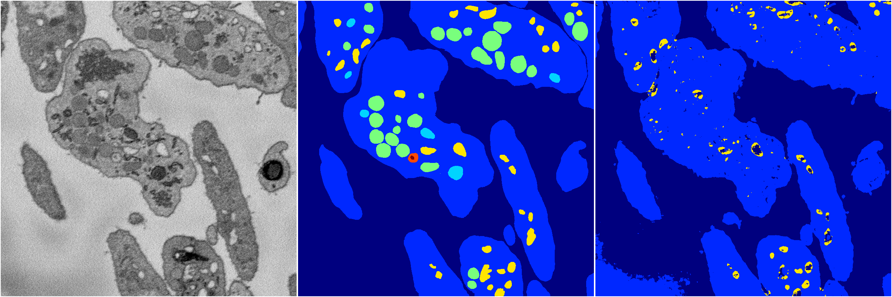
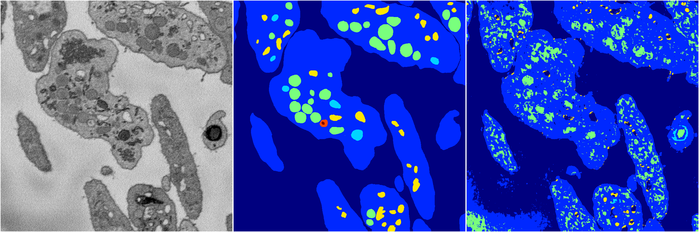
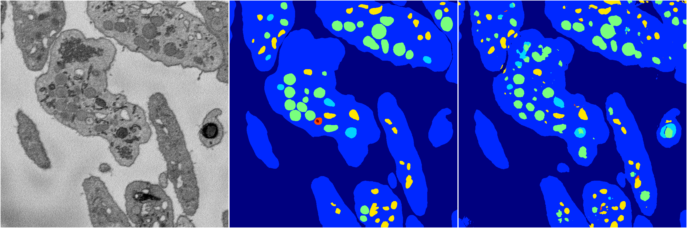
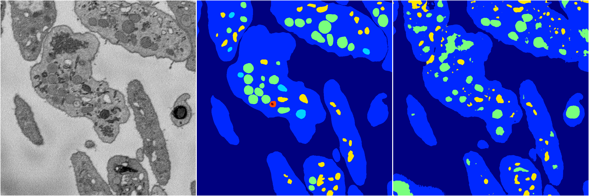

[Back](..)&nbsp;&nbsp;&nbsp;&nbsp;&nbsp;[Home](https://leapmanlab.github.io/snapshots)

---

<a href="3"><h2>random_2d_ed / 1210 / 49 / 3</h2></a>
Created 16 Dec 2018, 10:15:14

<i>Click for more details</i>

**ari**: 0.7278. **miou**: 0.2984. **accuracy**: 0.8999. **n_params**: 8899337.0000. 

---

<a href="4"><h2>random_2d_ed / 1210 / 49 / 4</h2></a>
Created 16 Dec 2018, 10:15:14

<i>Click for more details</i>

**ari**: 0.6538. **miou**: 0.2812. **accuracy**: 0.8452. **n_params**: 8899337.0000. 

---

<a href="2"><h2>random_2d_ed / 1210 / 49 / 2</h2></a>
Created 16 Dec 2018, 10:15:14

<i>Click for more details</i>

**ari**: 0.8147. **miou**: 0.4670. **accuracy**: 0.9255. **n_params**: 8899337.0000. 

---

<a href="1"><h2>random_2d_ed / 1210 / 49 / 1</h2></a>
Created 16 Dec 2018, 10:15:14

<i>Click for more details</i>

**ari**: 0.7592. **miou**: 0.3424. **accuracy**: 0.8971. **n_params**: 8899337.0000. 

---

<a href="0"><h2>random_2d_ed / 1210 / 49 / 0</h2></a>
Created 16 Dec 2018, 10:15:14

<i>Click for more details</i>

**ari**: 0.8088. **miou**: 0.4917. **accuracy**: 0.9215. **n_params**: 8899337.0000. 

---

[Back](..)&nbsp;&nbsp;&nbsp;&nbsp;&nbsp;[Home](https://leapmanlab.github.io/snapshots)

---