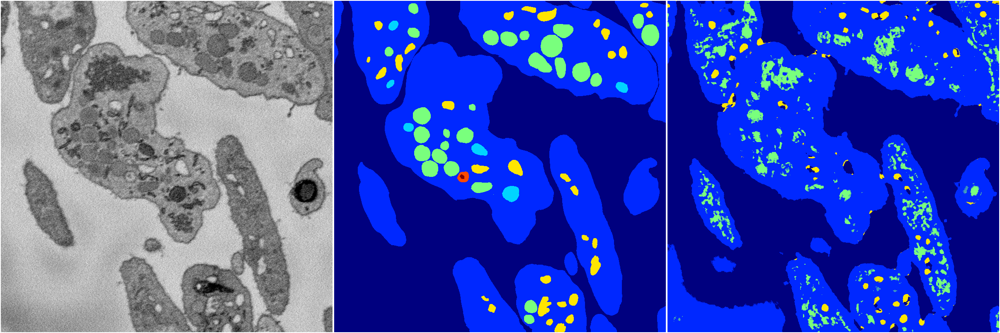
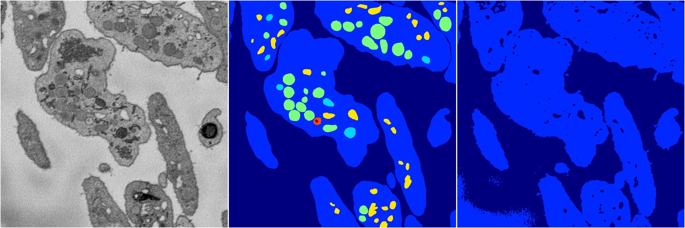

[Back](..)&nbsp;&nbsp;&nbsp;&nbsp;&nbsp;[Home](https://leapmanlab.github.io/snapshots)

---

<a href="3"><h2>random_2d_ed / 1210 / 5 / 3</h2></a>
Created 14 Dec 2018, 11:38:25

<i>Click for more details</i>

**ari**: 0.7468. **miou**: 0.3261. **accuracy**: 0.8975. **n_params**: 108011.0000. 

---

<a href="4"><h2>random_2d_ed / 1210 / 5 / 4</h2></a>
Created 14 Dec 2018, 11:38:25

<i>Click for more details</i>

**ari**: 0.6471. **miou**: 0.2998. **accuracy**: 0.8523. **n_params**: 108011.0000. 

---

<a href="2"><h2>random_2d_ed / 1210 / 5 / 2</h2></a>
Created 14 Dec 2018, 11:38:25

<i>Click for more details</i>

**ari**: 0.4739. **miou**: 0.2098. **accuracy**: 0.8126. **n_params**: 108011.0000. 

---

<a href="1"><h2>random_2d_ed / 1210 / 5 / 1</h2></a>
Created 14 Dec 2018, 11:38:25

<i>Click for more details</i>

**ari**: 0.6342. **miou**: 0.2345. **accuracy**: 0.8633. **n_params**: 108011.0000. 

---

<a href="0"><h2>random_2d_ed / 1210 / 5 / 0</h2></a>
Created 14 Dec 2018, 11:38:25

<i>Click for more details</i>

**ari**: 0.6566. **miou**: 0.2584. **accuracy**: 0.8702. **n_params**: 108011.0000. 

---

[Back](..)&nbsp;&nbsp;&nbsp;&nbsp;&nbsp;[Home](https://leapmanlab.github.io/snapshots)

---