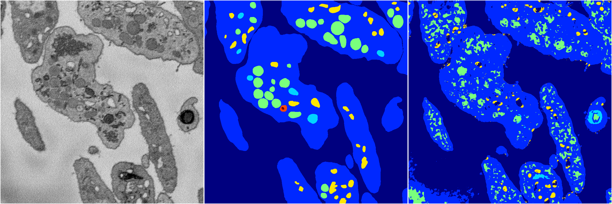
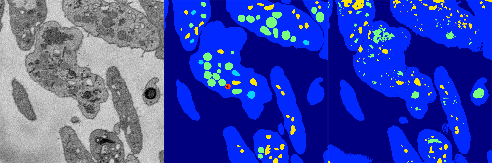
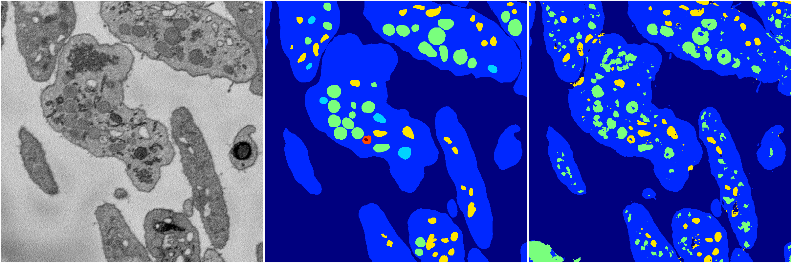

[Back](..)&nbsp;&nbsp;&nbsp;&nbsp;&nbsp;[Home](https://leapmanlab.github.io/snapshots)

---

<a href="4"><h2>random_2d_ed / 1210 / 50 / 4</h2></a>
Created 16 Dec 2018, 15:39:19

<i>Click for more details</i>

**ari**: 0.6341. **miou**: 0.3107. **accuracy**: 0.8602. **n_params**: 32516923.0000. 

---

<a href="2"><h2>random_2d_ed / 1210 / 50 / 2</h2></a>
Created 16 Dec 2018, 15:39:19

<i>Click for more details</i>

**ari**: 0.6698. **miou**: 0.3024. **accuracy**: 0.8797. **n_params**: 32516923.0000. 

---

<a href="3"><h2>random_2d_ed / 1210 / 50 / 3</h2></a>
Created 16 Dec 2018, 15:39:19

<i>Click for more details</i>

**ari**: 0.7196. **miou**: 0.3666. **accuracy**: 0.8990. **n_params**: 32516923.0000. 

---

<a href="1"><h2>random_2d_ed / 1210 / 50 / 1</h2></a>
Created 16 Dec 2018, 15:39:19

<i>Click for more details</i>

**ari**: 0.7309. **miou**: 0.4006. **accuracy**: 0.9073. **n_params**: 32516923.0000. 

---

<a href="0"><h2>random_2d_ed / 1210 / 50 / 0</h2></a>
Created 16 Dec 2018, 15:39:19

<i>Click for more details</i>

**ari**: 0.6943. **miou**: 0.3128. **accuracy**: 0.9020. **n_params**: 32516923.0000. 

---

[Back](..)&nbsp;&nbsp;&nbsp;&nbsp;&nbsp;[Home](https://leapmanlab.github.io/snapshots)

---