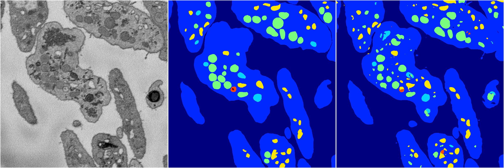
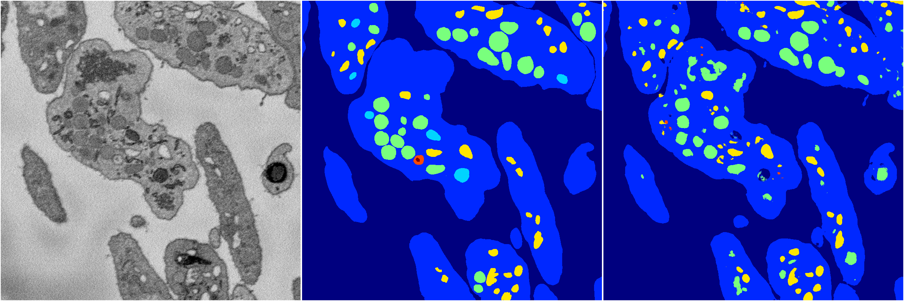
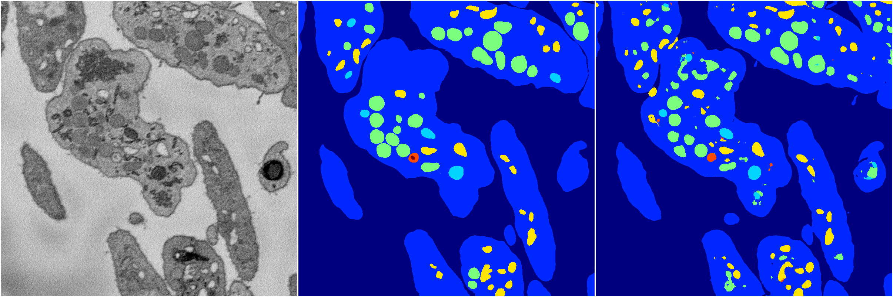
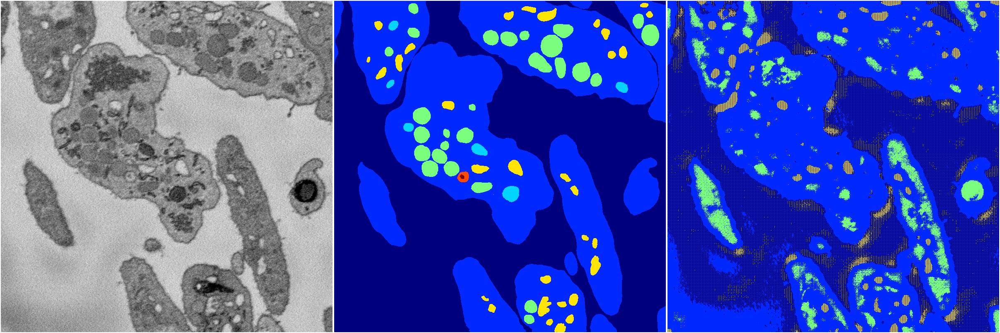

[Back](..)&nbsp;&nbsp;&nbsp;&nbsp;&nbsp;[Home](https://leapmanlab.github.io/snapshots)

---

<a href="1"><h2>random_2d_ed / 1210 / 51 / 1</h2></a>
Created 21 Dec 2018, 01:15:55

<i>Click for more details</i>

**ari**: 0.8168. **miou**: 0.5072. **accuracy**: 0.9299. **n_params**: 15841305.0000. 

---

<a href="4"><h2>random_2d_ed / 1210 / 51 / 4</h2></a>
Created 21 Dec 2018, 01:15:55

<i>Click for more details</i>

**ari**: 0.8070. **miou**: 0.4103. **accuracy**: 0.9205. **n_params**: 15841305.0000. 

---

<a href="2"><h2>random_2d_ed / 1210 / 51 / 2</h2></a>
Created 21 Dec 2018, 01:15:55

<i>Click for more details</i>

**ari**: 0.8165. **miou**: 0.5838. **accuracy**: 0.9295. **n_params**: 15841305.0000. 

---

<a href="0"><h2>random_2d_ed / 1210 / 51 / 0</h2></a>
Created 21 Dec 2018, 01:15:55

<i>Click for more details</i>

**ari**: 0.8136. **miou**: 0.4962. **accuracy**: 0.9261. **n_params**: 15841305.0000. 

---

<a href="3"><h2>random_2d_ed / 1210 / 51 / 3</h2></a>
Created 21 Dec 2018, 01:15:55

<i>Click for more details</i>

**ari**: 0.3354. **miou**: 0.2038. **accuracy**: 0.7123. **n_params**: 15841305.0000. 

---

[Back](..)&nbsp;&nbsp;&nbsp;&nbsp;&nbsp;[Home](https://leapmanlab.github.io/snapshots)

---