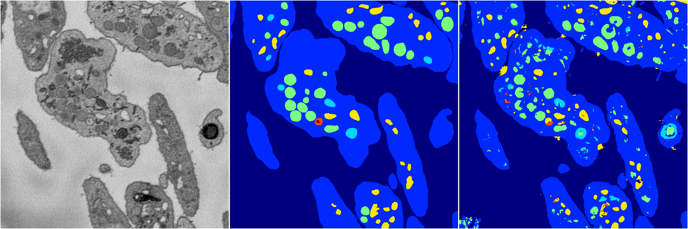
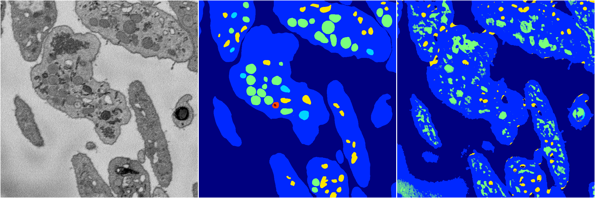
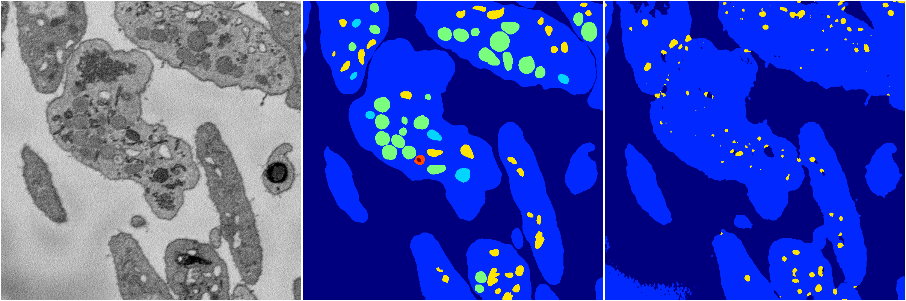
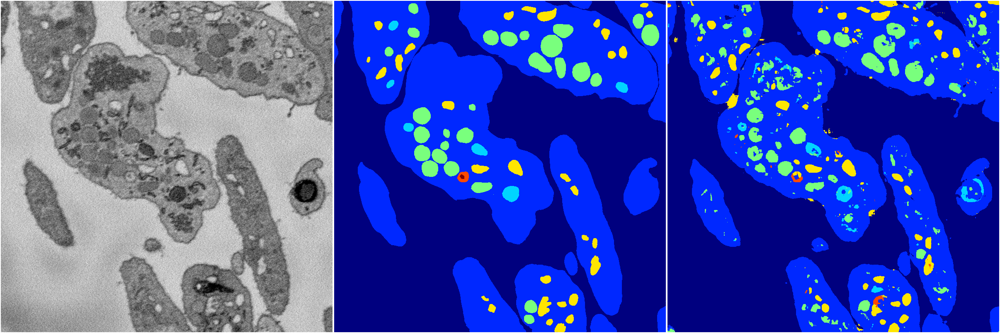

[Back](..)&nbsp;&nbsp;&nbsp;&nbsp;&nbsp;[Home](https://leapmanlab.github.io/snapshots)

---

<a href="3"><h2>random_2d_ed / 1210 / 52 / 3</h2></a>
Created 13 Dec 2018, 23:48:55

<i>Click for more details</i>

**ari**: 0.7792. **miou**: 0.4678. **accuracy**: 0.9084. **n_params**: 1145374.0000. 

---

<a href="4"><h2>random_2d_ed / 1210 / 52 / 4</h2></a>
Created 13 Dec 2018, 23:48:55

<i>Click for more details</i>

**ari**: 0.6281. **miou**: 0.2973. **accuracy**: 0.8385. **n_params**: 1145374.0000. 

---

<a href="2"><h2>random_2d_ed / 1210 / 52 / 2</h2></a>
Created 13 Dec 2018, 23:48:55

<i>Click for more details</i>

**ari**: 0.7865. **miou**: 0.5229. **accuracy**: 0.9107. **n_params**: 1145374.0000. 

---

<a href="0"><h2>random_2d_ed / 1210 / 52 / 0</h2></a>
Created 13 Dec 2018, 23:48:55

<i>Click for more details</i>

**ari**: 0.6881. **miou**: 0.2838. **accuracy**: 0.8804. **n_params**: 1145374.0000. 

---

<a href="1"><h2>random_2d_ed / 1210 / 52 / 1</h2></a>
Created 13 Dec 2018, 23:48:55

<i>Click for more details</i>

**ari**: 0.7804. **miou**: 0.5040. **accuracy**: 0.9091. **n_params**: 1145374.0000. 

---

[Back](..)&nbsp;&nbsp;&nbsp;&nbsp;&nbsp;[Home](https://leapmanlab.github.io/snapshots)

---