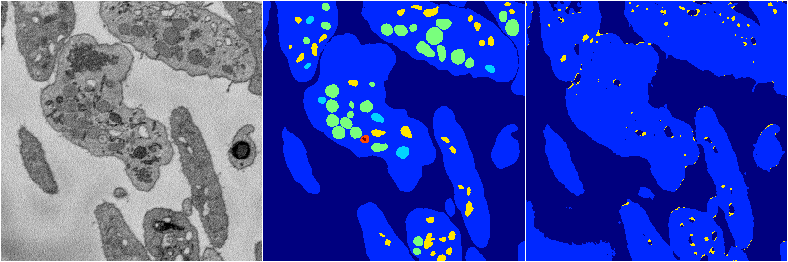
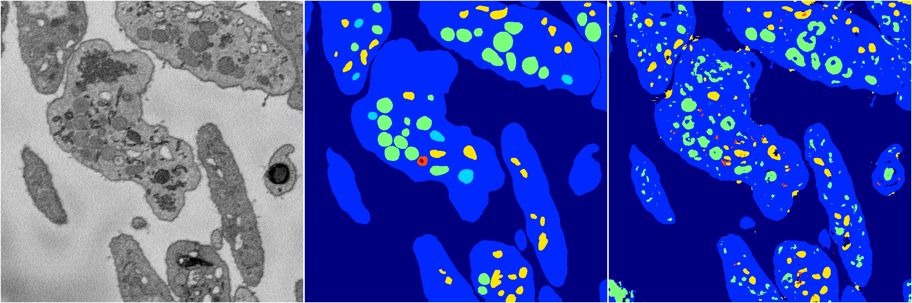
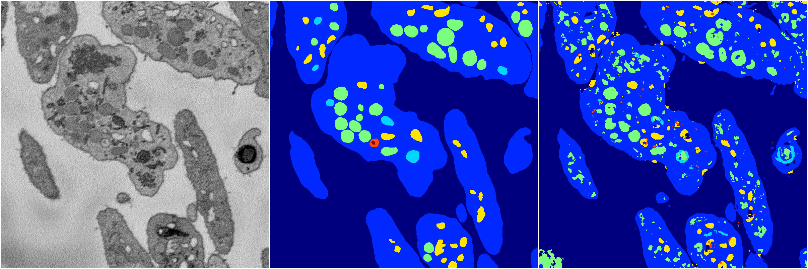
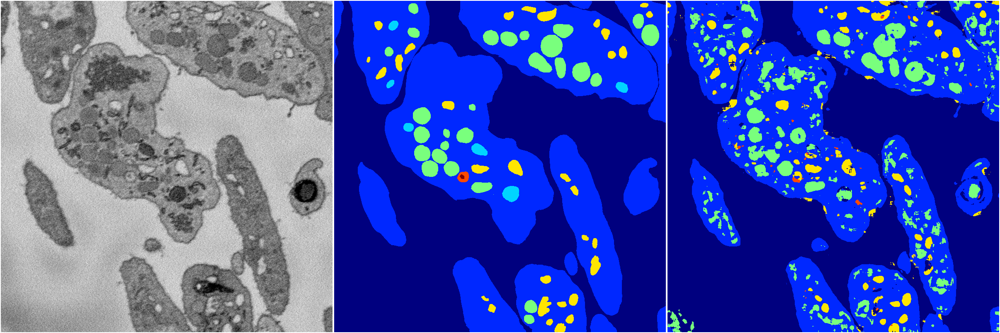

[Back](..)&nbsp;&nbsp;&nbsp;&nbsp;&nbsp;[Home](https://leapmanlab.github.io/snapshots)

---

<a href="4"><h2>random_2d_ed / 1210 / 53 / 4</h2></a>
Created 17 Dec 2018, 02:57:34

<i>Click for more details</i>

**ari**: 0.6826. **miou**: 0.2654. **accuracy**: 0.8763. **n_params**: 1676845.0000. 

---

<a href="3"><h2>random_2d_ed / 1210 / 53 / 3</h2></a>
Created 17 Dec 2018, 02:57:34

<i>Click for more details</i>

**ari**: 0.7549. **miou**: 0.3841. **accuracy**: 0.8929. **n_params**: 1676845.0000. 

---

<a href="2"><h2>random_2d_ed / 1210 / 53 / 2</h2></a>
Created 17 Dec 2018, 02:57:34

<i>Click for more details</i>

**ari**: 0.7437. **miou**: 0.4122. **accuracy**: 0.8861. **n_params**: 1676845.0000. 

---

<a href="0"><h2>random_2d_ed / 1210 / 53 / 0</h2></a>
Created 17 Dec 2018, 02:57:34

<i>Click for more details</i>

**ari**: 0.7239. **miou**: 0.3744. **accuracy**: 0.8736. **n_params**: 1676845.0000. 

---

<a href="1"><h2>random_2d_ed / 1210 / 53 / 1</h2></a>
Created 17 Dec 2018, 02:57:34

<i>Click for more details</i>

**ari**: 0.7126. **miou**: 0.4137. **accuracy**: 0.8657. **n_params**: 1676845.0000. 

---

[Back](..)&nbsp;&nbsp;&nbsp;&nbsp;&nbsp;[Home](https://leapmanlab.github.io/snapshots)

---