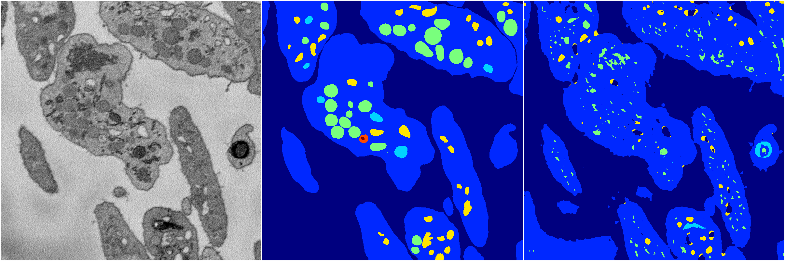
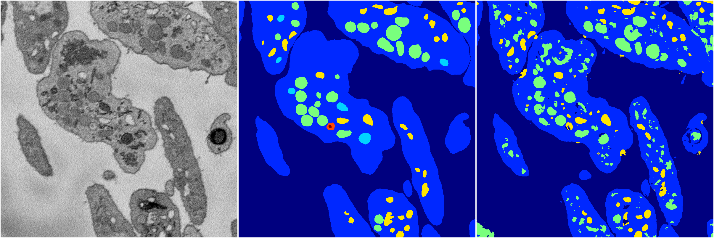
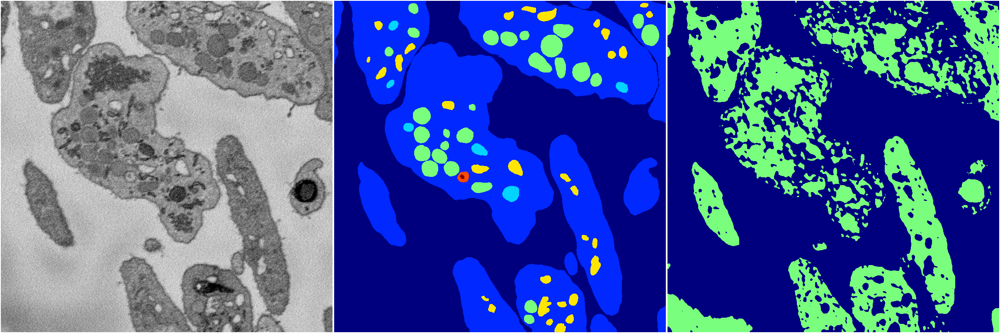

[Back](..)&nbsp;&nbsp;&nbsp;&nbsp;&nbsp;[Home](https://leapmanlab.github.io/snapshots)

---

<a href="4"><h2>random_2d_ed / 1210 / 54 / 4</h2></a>
Created 16 Dec 2018, 15:39:19

<i>Click for more details</i>

**ari**: 0.7779. **miou**: 0.4237. **accuracy**: 0.9043. **n_params**: 1519826.0000. 

---

<a href="3"><h2>random_2d_ed / 1210 / 54 / 3</h2></a>
Created 16 Dec 2018, 15:39:19

<i>Click for more details</i>

**ari**: 0.6644. **miou**: 0.2945. **accuracy**: 0.8663. **n_params**: 1519826.0000. 

---

<a href="2"><h2>random_2d_ed / 1210 / 54 / 2</h2></a>
Created 16 Dec 2018, 15:39:19

<i>Click for more details</i>

**ari**: 0.6568. **miou**: 0.3190. **accuracy**: 0.8492. **n_params**: 1519826.0000. 

---

<a href="1"><h2>random_2d_ed / 1210 / 54 / 1</h2></a>
Created 16 Dec 2018, 15:39:19

<i>Click for more details</i>

**ari**: 0.7493. **miou**: 0.3748. **accuracy**: 0.8897. **n_params**: 1519826.0000. 

---

<a href="0"><h2>random_2d_ed / 1210 / 54 / 0</h2></a>
Created 16 Dec 2018, 15:39:19

<i>Click for more details</i>

**ari**: 0.2464. **miou**: 0.1025. **accuracy**: 0.4525. **n_params**: 1519826.0000. 

---

[Back](..)&nbsp;&nbsp;&nbsp;&nbsp;&nbsp;[Home](https://leapmanlab.github.io/snapshots)

---