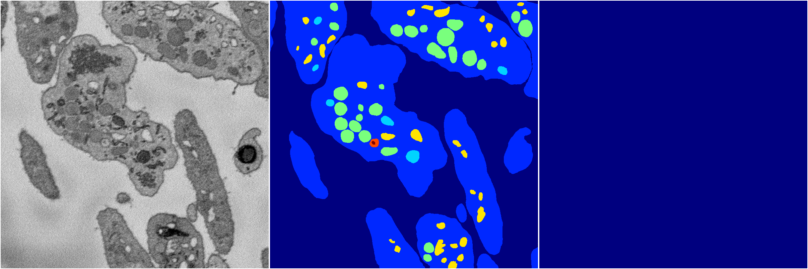
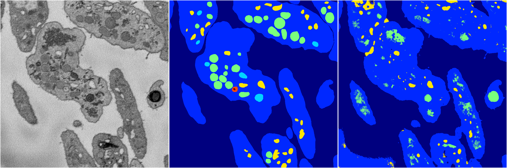
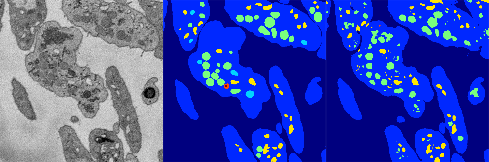
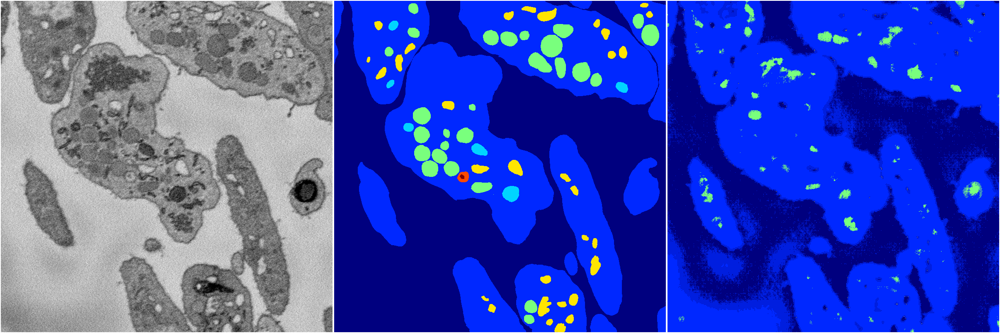

[Back](..)&nbsp;&nbsp;&nbsp;&nbsp;&nbsp;[Home](https://leapmanlab.github.io/snapshots)

---

<a href="4"><h2>random_2d_ed / 1210 / 55 / 4</h2></a>
Created 14 Dec 2018, 11:38:28

<i>Click for more details</i>

**ari**: -0.0000. **miou**: 0.0686. **accuracy**: 0.4799. **n_params**: 13980982.0000. 

---

<a href="3"><h2>random_2d_ed / 1210 / 55 / 3</h2></a>
Created 14 Dec 2018, 11:38:28

<i>Click for more details</i>

**ari**: 0.7034. **miou**: 0.2893. **accuracy**: 0.8729. **n_params**: 13980982.0000. 

---

<a href="0"><h2>random_2d_ed / 1210 / 55 / 0</h2></a>
Created 14 Dec 2018, 11:38:28

<i>Click for more details</i>

**ari**: 0.7943. **miou**: 0.4124. **accuracy**: 0.9146. **n_params**: 13980982.0000. 

---

<a href="2"><h2>random_2d_ed / 1210 / 55 / 2</h2></a>
Created 14 Dec 2018, 11:38:28

<i>Click for more details</i>

**ari**: 0.8071. **miou**: 0.3971. **accuracy**: 0.9200. **n_params**: 13980982.0000. 

---

<a href="1"><h2>random_2d_ed / 1210 / 55 / 1</h2></a>
Created 14 Dec 2018, 11:38:28

<i>Click for more details</i>

**ari**: 0.4974. **miou**: 0.2296. **accuracy**: 0.8118. **n_params**: 13980982.0000. 

---

[Back](..)&nbsp;&nbsp;&nbsp;&nbsp;&nbsp;[Home](https://leapmanlab.github.io/snapshots)

---