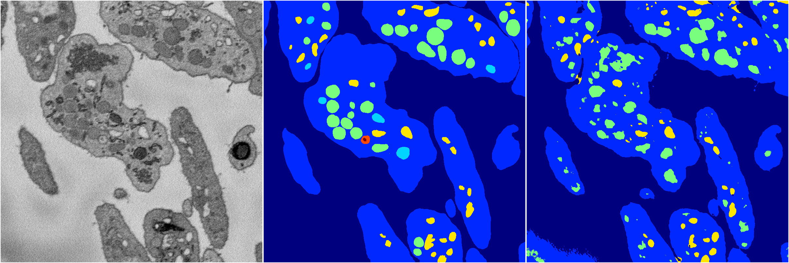
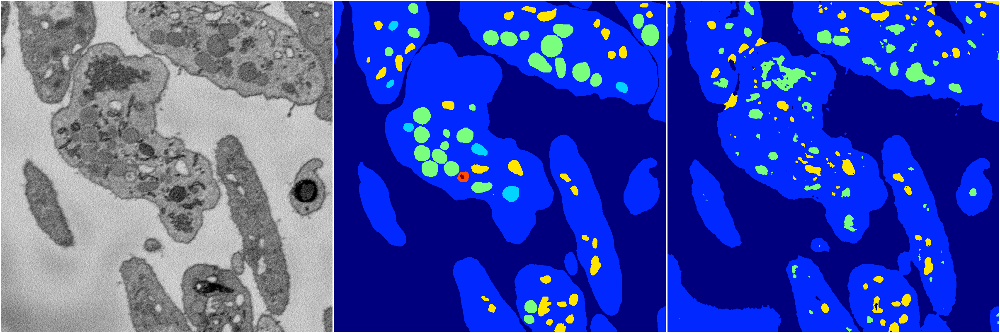
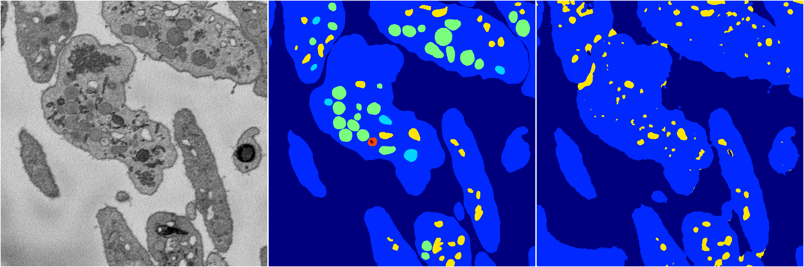
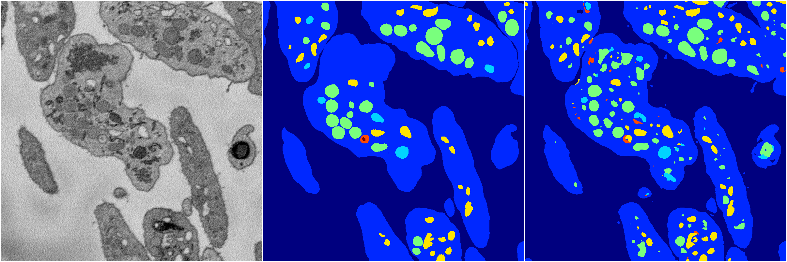

[Back](..)&nbsp;&nbsp;&nbsp;&nbsp;&nbsp;[Home](https://leapmanlab.github.io/snapshots)

---

<a href="4"><h2>random_2d_ed / 1210 / 56 / 4</h2></a>
Created 16 Dec 2018, 10:15:14

<i>Click for more details</i>

**ari**: 0.7796. **miou**: 0.3696. **accuracy**: 0.9074. **n_params**: 7830378.0000. 

---

<a href="3"><h2>random_2d_ed / 1210 / 56 / 3</h2></a>
Created 16 Dec 2018, 10:15:14

<i>Click for more details</i>

**ari**: 0.7417. **miou**: 0.3407. **accuracy**: 0.8979. **n_params**: 7830378.0000. 

---

<a href="2"><h2>random_2d_ed / 1210 / 56 / 2</h2></a>
Created 16 Dec 2018, 10:15:14

<i>Click for more details</i>

**ari**: 0.7986. **miou**: 0.4873. **accuracy**: 0.9190. **n_params**: 7830378.0000. 

---

<a href="1"><h2>random_2d_ed / 1210 / 56 / 1</h2></a>
Created 16 Dec 2018, 10:15:14

<i>Click for more details</i>

**ari**: 0.7290. **miou**: 0.2959. **accuracy**: 0.8959. **n_params**: 7830378.0000. 

---

<a href="0"><h2>random_2d_ed / 1210 / 56 / 0</h2></a>
Created 16 Dec 2018, 10:15:14

<i>Click for more details</i>

**ari**: 0.7904. **miou**: 0.4680. **accuracy**: 0.9130. **n_params**: 7830378.0000. 

---

[Back](..)&nbsp;&nbsp;&nbsp;&nbsp;&nbsp;[Home](https://leapmanlab.github.io/snapshots)

---