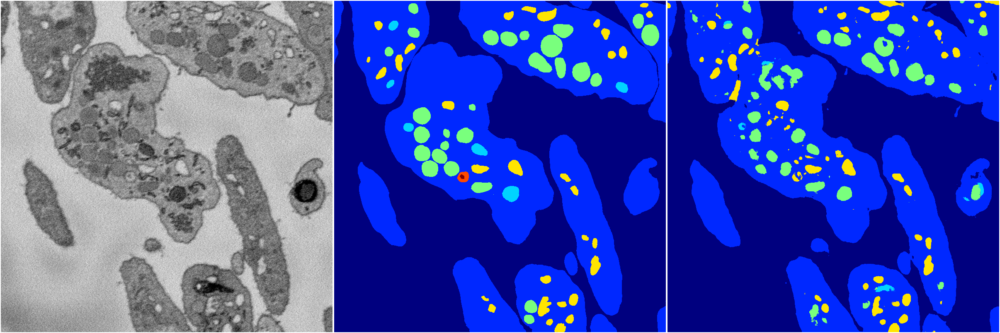
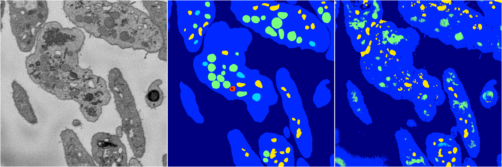
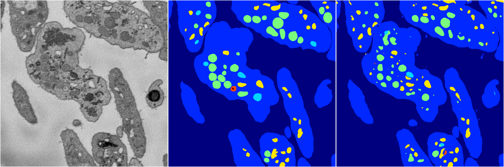

[Back](..)&nbsp;&nbsp;&nbsp;&nbsp;&nbsp;[Home](https://leapmanlab.github.io/snapshots)

---

<a href="2"><h2>random_2d_ed / 1210 / 57 / 2</h2></a>
Created 14 Dec 2018, 11:38:28

<i>Click for more details</i>

**ari**: 0.7278. **miou**: 0.3454. **accuracy**: 0.8976. **n_params**: 58444407.0000. 

---

<a href="4"><h2>random_2d_ed / 1210 / 57 / 4</h2></a>
Created 14 Dec 2018, 11:38:28

<i>Click for more details</i>

**ari**: 0.7875. **miou**: 0.4055. **accuracy**: 0.9200. **n_params**: 58444407.0000. 

---

<a href="3"><h2>random_2d_ed / 1210 / 57 / 3</h2></a>
Created 14 Dec 2018, 11:38:28

<i>Click for more details</i>

**ari**: 0.6891. **miou**: 0.3269. **accuracy**: 0.8783. **n_params**: 58444407.0000. 

---

<a href="0"><h2>random_2d_ed / 1210 / 57 / 0</h2></a>
Created 14 Dec 2018, 11:38:28

<i>Click for more details</i>

**ari**: 0.7980. **miou**: 0.4788. **accuracy**: 0.9283. **n_params**: 58444407.0000. 

---

<a href="1"><h2>random_2d_ed / 1210 / 57 / 1</h2></a>
Created 14 Dec 2018, 11:38:28

<i>Click for more details</i>

**ari**: 0.7989. **miou**: 0.4558. **accuracy**: 0.9284. **n_params**: 58444407.0000. 

---

[Back](..)&nbsp;&nbsp;&nbsp;&nbsp;&nbsp;[Home](https://leapmanlab.github.io/snapshots)

---