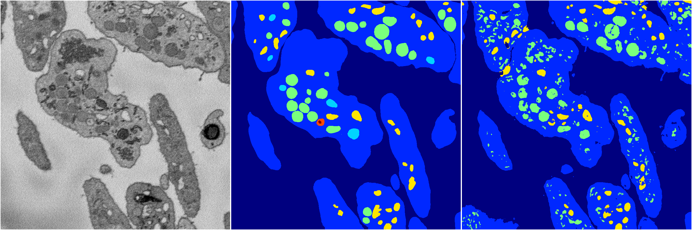
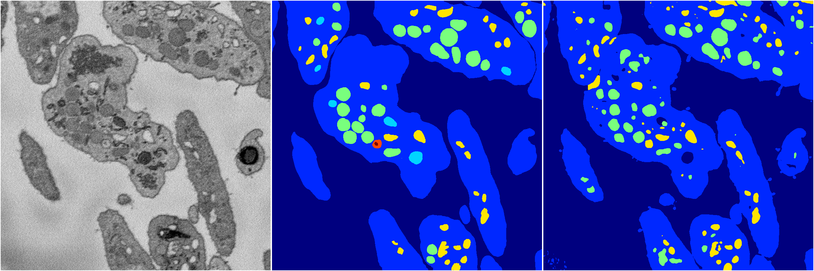
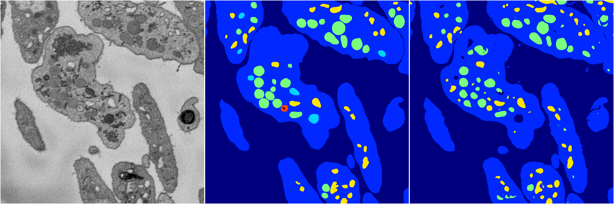
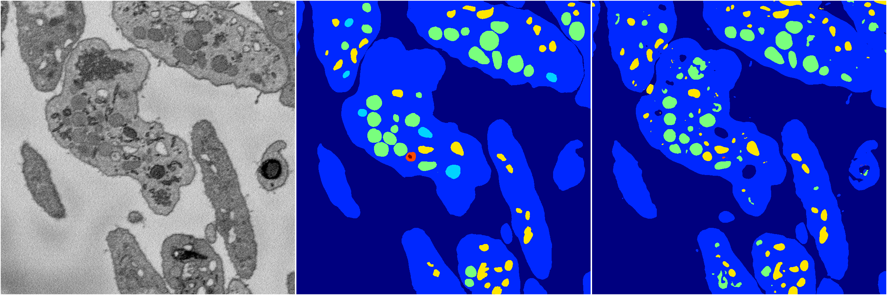

[Back](..)&nbsp;&nbsp;&nbsp;&nbsp;&nbsp;[Home](https://leapmanlab.github.io/snapshots)

---

<a href="4"><h2>random_2d_ed / 1210 / 58 / 4</h2></a>
Created 17 Dec 2018, 23:35:06

<i>Click for more details</i>

**ari**: 0.7673. **miou**: 0.3739. **accuracy**: 0.9030. **n_params**: 30084549.0000. 

---

<a href="3"><h2>random_2d_ed / 1210 / 58 / 3</h2></a>
Created 17 Dec 2018, 23:35:06

<i>Click for more details</i>

**ari**: 0.7444. **miou**: 0.3939. **accuracy**: 0.9046. **n_params**: 30084549.0000. 

---

<a href="0"><h2>random_2d_ed / 1210 / 58 / 0</h2></a>
Created 17 Dec 2018, 23:35:06

<i>Click for more details</i>

**ari**: 0.8148. **miou**: 0.4641. **accuracy**: 0.9269. **n_params**: 30084549.0000. 

---

<a href="2"><h2>random_2d_ed / 1210 / 58 / 2</h2></a>
Created 17 Dec 2018, 23:35:06

<i>Click for more details</i>

**ari**: 0.8124. **miou**: 0.4245. **accuracy**: 0.9259. **n_params**: 30084549.0000. 

---

<a href="1"><h2>random_2d_ed / 1210 / 58 / 1</h2></a>
Created 17 Dec 2018, 23:35:06

<i>Click for more details</i>

**ari**: 0.8079. **miou**: 0.4183. **accuracy**: 0.9236. **n_params**: 30084549.0000. 

---

[Back](..)&nbsp;&nbsp;&nbsp;&nbsp;&nbsp;[Home](https://leapmanlab.github.io/snapshots)

---