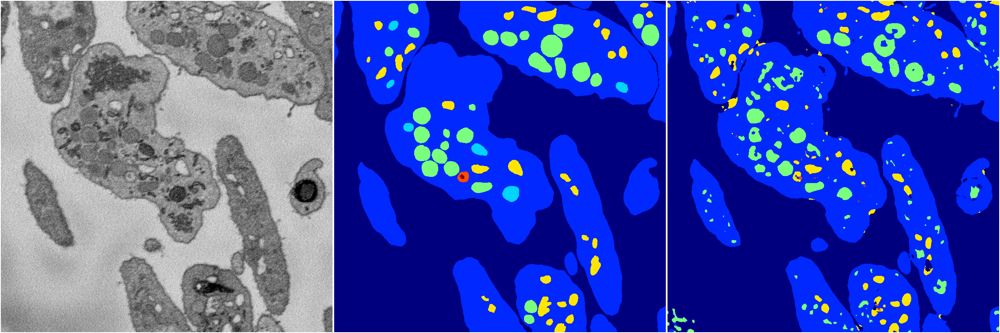
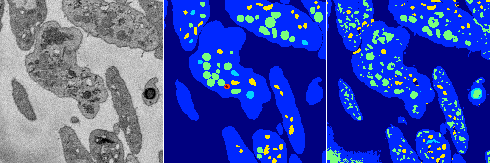
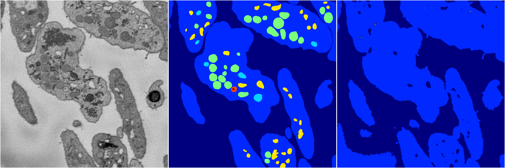
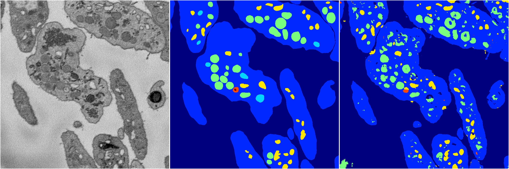
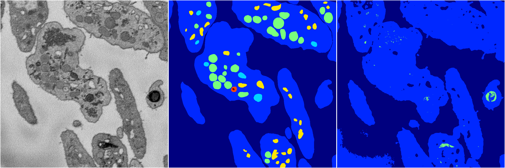

[Back](..)&nbsp;&nbsp;&nbsp;&nbsp;&nbsp;[Home](https://leapmanlab.github.io/snapshots)

---

<a href="4"><h2>random_2d_ed / 1210 / 59 / 4</h2></a>
Created 16 Dec 2018, 15:39:19

<i>Click for more details</i>

**ari**: 0.7771. **miou**: 0.4083. **accuracy**: 0.9032. **n_params**: 1848767.0000. 

---

<a href="3"><h2>random_2d_ed / 1210 / 59 / 3</h2></a>
Created 16 Dec 2018, 15:39:19

<i>Click for more details</i>

**ari**: 0.7018. **miou**: 0.3503. **accuracy**: 0.8656. **n_params**: 1848767.0000. 

---

<a href="1"><h2>random_2d_ed / 1210 / 59 / 1</h2></a>
Created 16 Dec 2018, 15:39:19

<i>Click for more details</i>

**ari**: 0.6428. **miou**: 0.2367. **accuracy**: 0.8665. **n_params**: 1848767.0000. 

---

<a href="2"><h2>random_2d_ed / 1210 / 59 / 2</h2></a>
Created 16 Dec 2018, 15:39:19

<i>Click for more details</i>

**ari**: 0.7609. **miou**: 0.4092. **accuracy**: 0.8983. **n_params**: 1848767.0000. 

---

<a href="0"><h2>random_2d_ed / 1210 / 59 / 0</h2></a>
Created 16 Dec 2018, 15:39:19

<i>Click for more details</i>

**ari**: 0.6472. **miou**: 0.2370. **accuracy**: 0.8645. **n_params**: 1848767.0000. 

---

[Back](..)&nbsp;&nbsp;&nbsp;&nbsp;&nbsp;[Home](https://leapmanlab.github.io/snapshots)

---