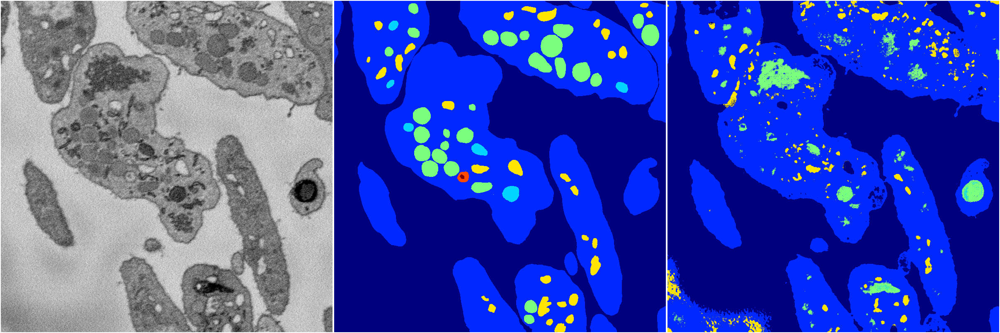
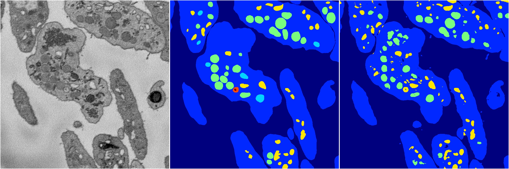
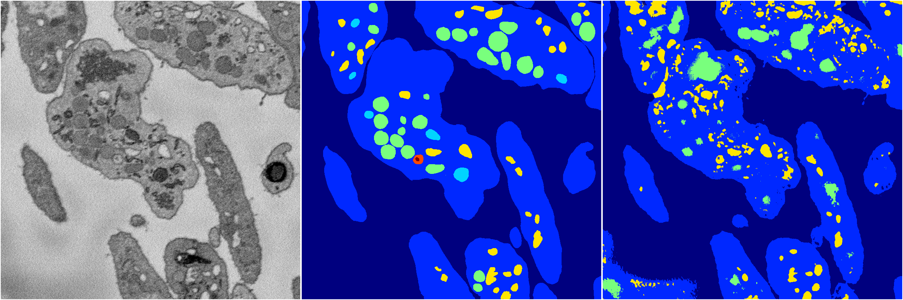
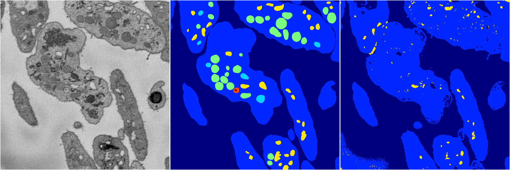
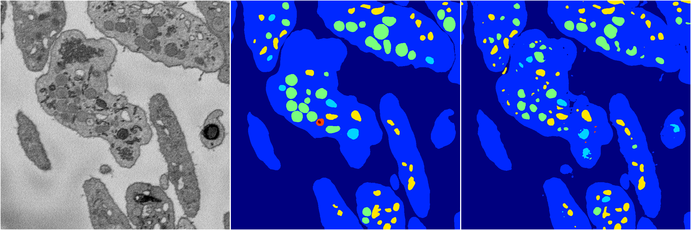

[Back](..)&nbsp;&nbsp;&nbsp;&nbsp;&nbsp;[Home](https://leapmanlab.github.io/snapshots)

---

<a href="4"><h2>random_2d_ed / 1210 / 6 / 4</h2></a>
Created 17 Dec 2018, 23:35:03

<i>Click for more details</i>

**ari**: 0.6490. **miou**: 0.2748. **accuracy**: 0.8621. **n_params**: 183377231.0000. 

---

<a href="3"><h2>random_2d_ed / 1210 / 6 / 3</h2></a>
Created 17 Dec 2018, 23:35:03

<i>Click for more details</i>

**ari**: 0.7564. **miou**: 0.3852. **accuracy**: 0.9142. **n_params**: 183377231.0000. 

---

<a href="2"><h2>random_2d_ed / 1210 / 6 / 2</h2></a>
Created 17 Dec 2018, 23:35:03

<i>Click for more details</i>

**ari**: 0.6605. **miou**: 0.3116. **accuracy**: 0.8697. **n_params**: 183377231.0000. 

---

<a href="1"><h2>random_2d_ed / 1210 / 6 / 1</h2></a>
Created 17 Dec 2018, 23:35:03

<i>Click for more details</i>

**ari**: 0.6408. **miou**: 0.2670. **accuracy**: 0.8809. **n_params**: 183377231.0000. 

---

<a href="0"><h2>random_2d_ed / 1210 / 6 / 0</h2></a>
Created 17 Dec 2018, 23:35:03

<i>Click for more details</i>

**ari**: 0.7619. **miou**: 0.4515. **accuracy**: 0.9205. **n_params**: 183377231.0000. 

---

[Back](..)&nbsp;&nbsp;&nbsp;&nbsp;&nbsp;[Home](https://leapmanlab.github.io/snapshots)

---