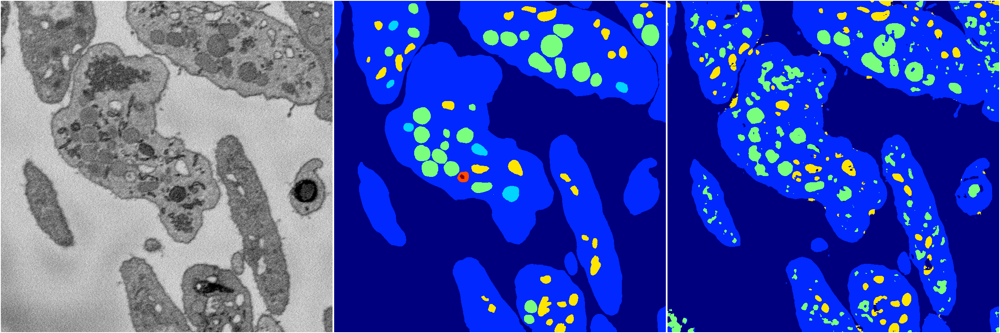
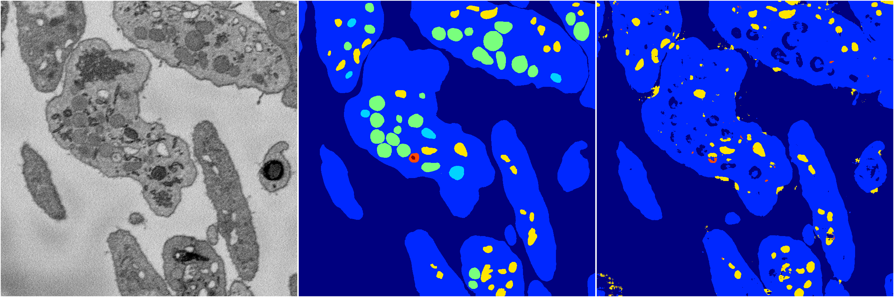
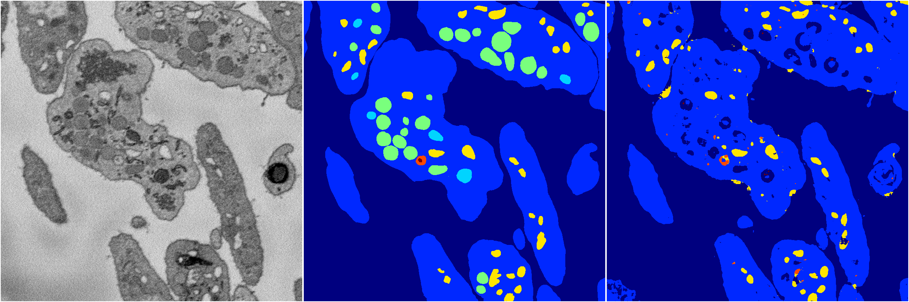
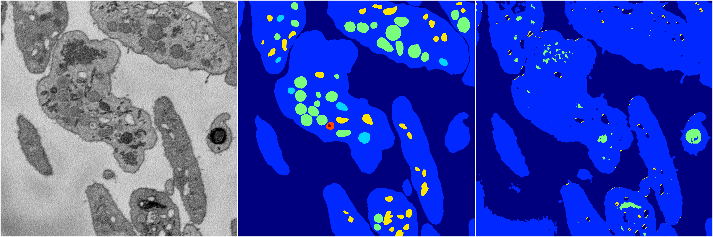

[Back](..)&nbsp;&nbsp;&nbsp;&nbsp;&nbsp;[Home](https://leapmanlab.github.io/snapshots)

---

<a href="4"><h2>random_2d_ed / 1210 / 60 / 4</h2></a>
Created 14 Dec 2018, 11:38:28

<i>Click for more details</i>

**ari**: 0.7541. **miou**: 0.3743. **accuracy**: 0.8917. **n_params**: 2430729.0000. 

---

<a href="3"><h2>random_2d_ed / 1210 / 60 / 3</h2></a>
Created 14 Dec 2018, 11:38:28

<i>Click for more details</i>

**ari**: 0.7394. **miou**: 0.3409. **accuracy**: 0.8928. **n_params**: 2430729.0000. 

---

<a href="2"><h2>random_2d_ed / 1210 / 60 / 2</h2></a>
Created 14 Dec 2018, 11:38:28

<i>Click for more details</i>

**ari**: 0.7362. **miou**: 0.3632. **accuracy**: 0.8922. **n_params**: 2430729.0000. 

---

<a href="1"><h2>random_2d_ed / 1210 / 60 / 1</h2></a>
Created 14 Dec 2018, 11:38:28

<i>Click for more details</i>

**ari**: 0.6539. **miou**: 0.2519. **accuracy**: 0.8600. **n_params**: 2430729.0000. 

---

<a href="0"><h2>random_2d_ed / 1210 / 60 / 0</h2></a>
Created 14 Dec 2018, 11:38:28

<i>Click for more details</i>

**ari**: 0.7727. **miou**: 0.3845. **accuracy**: 0.9058. **n_params**: 2430729.0000. 

---

[Back](..)&nbsp;&nbsp;&nbsp;&nbsp;&nbsp;[Home](https://leapmanlab.github.io/snapshots)

---