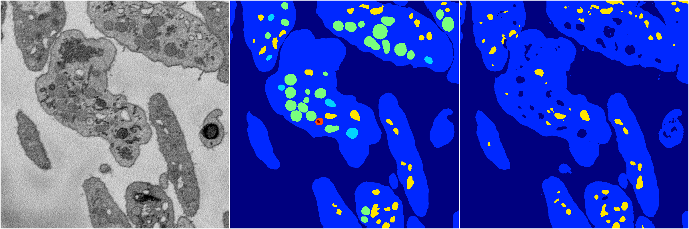
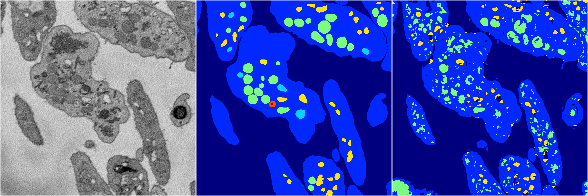
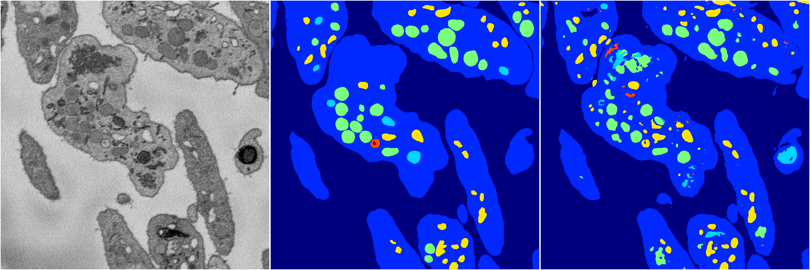
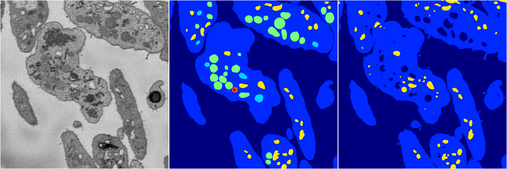
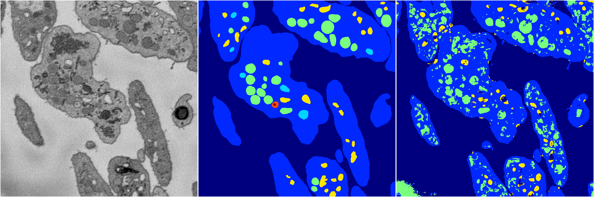

[Back](..)&nbsp;&nbsp;&nbsp;&nbsp;&nbsp;[Home](https://leapmanlab.github.io/snapshots)

---

<a href="1"><h2>random_2d_ed / 1210 / 61 / 1</h2></a>
Created 13 Dec 2018, 23:48:56

<i>Click for more details</i>

**ari**: 0.7768. **miou**: 0.3380. **accuracy**: 0.9172. **n_params**: 20472004.0000. 

---

<a href="0"><h2>random_2d_ed / 1210 / 61 / 0</h2></a>
Created 13 Dec 2018, 23:48:56

<i>Click for more details</i>

**ari**: 0.7337. **miou**: 0.3361. **accuracy**: 0.8884. **n_params**: 20472004.0000. 

---

<a href="3"><h2>random_2d_ed / 1210 / 61 / 3</h2></a>
Created 13 Dec 2018, 23:48:56

<i>Click for more details</i>

**ari**: 0.7875. **miou**: 0.4181. **accuracy**: 0.9146. **n_params**: 20472004.0000. 

---

<a href="2"><h2>random_2d_ed / 1210 / 61 / 2</h2></a>
Created 13 Dec 2018, 23:48:56

<i>Click for more details</i>

**ari**: 0.7176. **miou**: 0.3276. **accuracy**: 0.8975. **n_params**: 20472004.0000. 

---

<a href="4"><h2>random_2d_ed / 1210 / 61 / 4</h2></a>
Created 13 Dec 2018, 23:48:56

<i>Click for more details</i>

**ari**: 0.7216. **miou**: 0.3474. **accuracy**: 0.8709. **n_params**: 20472004.0000. 

---

[Back](..)&nbsp;&nbsp;&nbsp;&nbsp;&nbsp;[Home](https://leapmanlab.github.io/snapshots)

---