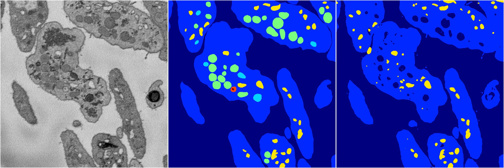
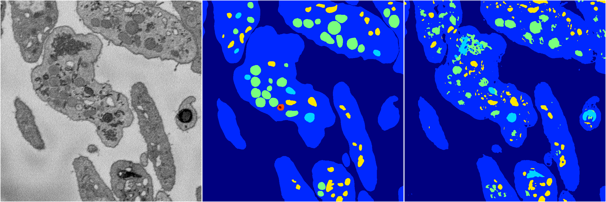
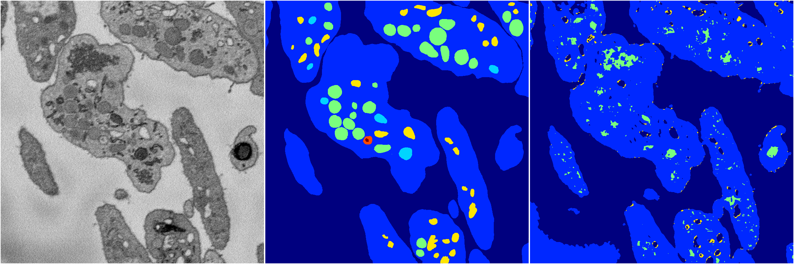
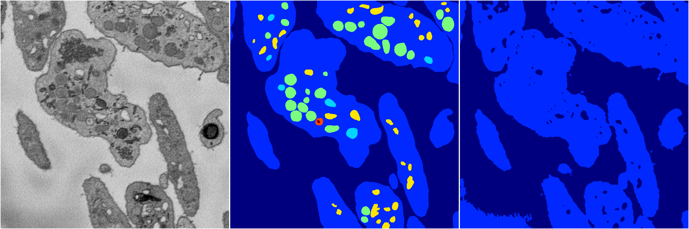
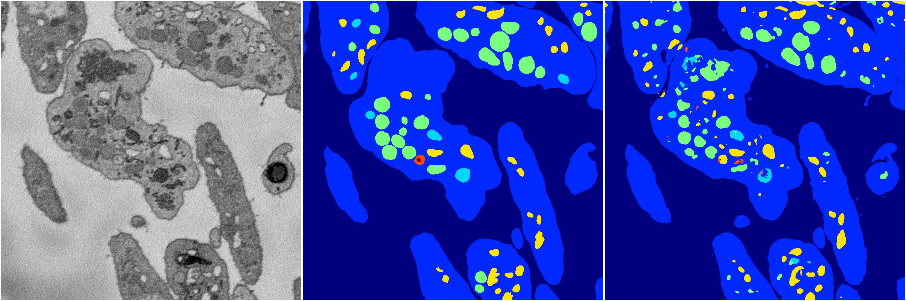

[Back](..)&nbsp;&nbsp;&nbsp;&nbsp;&nbsp;[Home](https://leapmanlab.github.io/snapshots)

---

<a href="4"><h2>random_2d_ed / 1210 / 62 / 4</h2></a>
Created 17 Dec 2018, 02:57:35

<i>Click for more details</i>

**ari**: 0.7778. **miou**: 0.3368. **accuracy**: 0.9163. **n_params**: 33376211.0000. 

---

<a href="2"><h2>random_2d_ed / 1210 / 62 / 2</h2></a>
Created 17 Dec 2018, 02:57:35

<i>Click for more details</i>

**ari**: 0.7686. **miou**: 0.4100. **accuracy**: 0.9102. **n_params**: 33376211.0000. 

---

<a href="3"><h2>random_2d_ed / 1210 / 62 / 3</h2></a>
Created 17 Dec 2018, 02:57:35

<i>Click for more details</i>

**ari**: 0.6897. **miou**: 0.2696. **accuracy**: 0.8784. **n_params**: 33376211.0000. 

---

<a href="0"><h2>random_2d_ed / 1210 / 62 / 0</h2></a>
Created 17 Dec 2018, 02:57:35

<i>Click for more details</i>

**ari**: 0.6883. **miou**: 0.2429. **accuracy**: 0.8914. **n_params**: 33376211.0000. 

---

<a href="1"><h2>random_2d_ed / 1210 / 62 / 1</h2></a>
Created 17 Dec 2018, 02:57:35

<i>Click for more details</i>

**ari**: 0.7997. **miou**: 0.4520. **accuracy**: 0.9237. **n_params**: 33376211.0000. 

---

[Back](..)&nbsp;&nbsp;&nbsp;&nbsp;&nbsp;[Home](https://leapmanlab.github.io/snapshots)

---