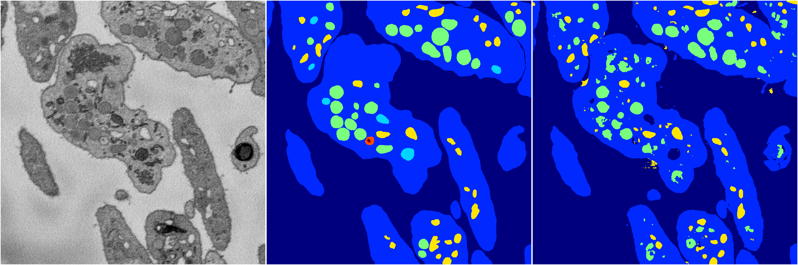
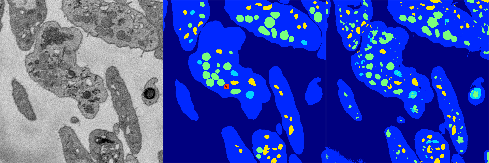
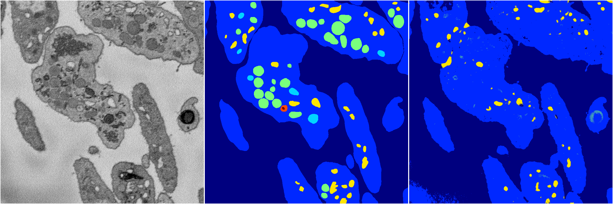
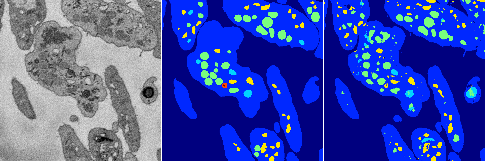

[Back](..)&nbsp;&nbsp;&nbsp;&nbsp;&nbsp;[Home](https://leapmanlab.github.io/snapshots)

---

<a href="4"><h2>random_2d_ed / 1210 / 63 / 4</h2></a>
Created 16 Dec 2018, 10:15:15

<i>Click for more details</i>

**ari**: 0.7911. **miou**: 0.3911. **accuracy**: 0.9140. **n_params**: 1829719.0000. 

---

<a href="3"><h2>random_2d_ed / 1210 / 63 / 3</h2></a>
Created 16 Dec 2018, 10:15:15

<i>Click for more details</i>

**ari**: 0.7710. **miou**: 0.4254. **accuracy**: 0.9031. **n_params**: 1829719.0000. 

---

<a href="2"><h2>random_2d_ed / 1210 / 63 / 2</h2></a>
Created 16 Dec 2018, 10:15:15

<i>Click for more details</i>

**ari**: 0.7235. **miou**: 0.2934. **accuracy**: 0.8937. **n_params**: 1829719.0000. 

---

<a href="1"><h2>random_2d_ed / 1210 / 63 / 1</h2></a>
Created 16 Dec 2018, 10:15:15

<i>Click for more details</i>

**ari**: 0.7902. **miou**: 0.4390. **accuracy**: 0.9124. **n_params**: 1829719.0000. 

---

<a href="0"><h2>random_2d_ed / 1210 / 63 / 0</h2></a>
Created 16 Dec 2018, 10:15:15

<i>Click for more details</i>

**ari**: 0.8006. **miou**: 0.5462. **accuracy**: 0.9196. **n_params**: 1829719.0000. 

---

[Back](..)&nbsp;&nbsp;&nbsp;&nbsp;&nbsp;[Home](https://leapmanlab.github.io/snapshots)

---