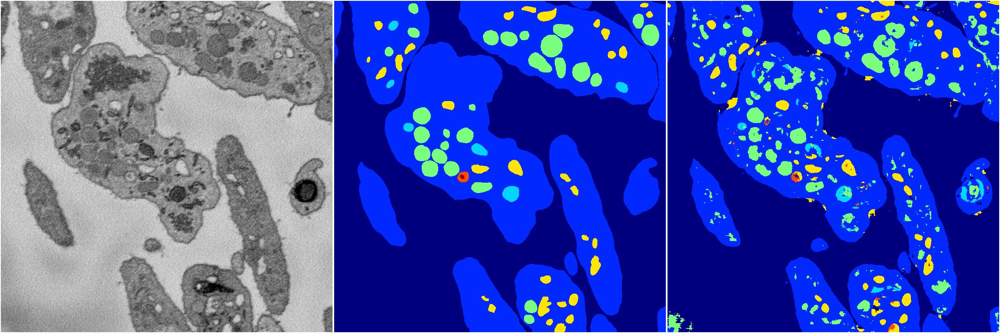
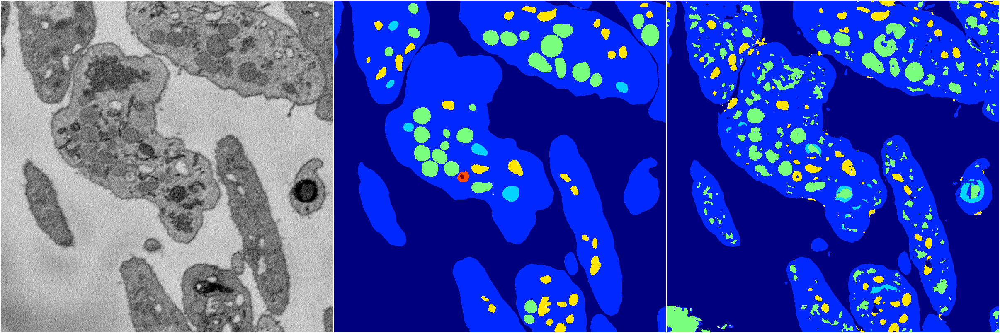
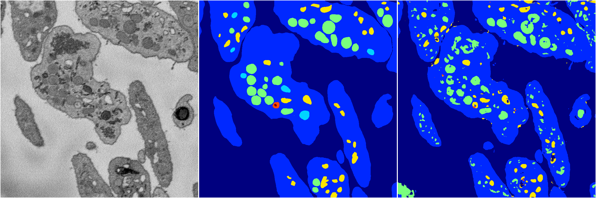

[Back](..)&nbsp;&nbsp;&nbsp;&nbsp;&nbsp;[Home](https://leapmanlab.github.io/snapshots)

---

<a href="4"><h2>random_2d_ed / 1210 / 64 / 4</h2></a>
Created 14 Dec 2018, 11:38:28

<i>Click for more details</i>

**ari**: 0.7661. **miou**: 0.4997. **accuracy**: 0.8988. **n_params**: 1181003.0000. 

---

<a href="3"><h2>random_2d_ed / 1210 / 64 / 3</h2></a>
Created 14 Dec 2018, 11:38:28

<i>Click for more details</i>

**ari**: 0.7461. **miou**: 0.4022. **accuracy**: 0.8855. **n_params**: 1181003.0000. 

---

<a href="2"><h2>random_2d_ed / 1210 / 64 / 2</h2></a>
Created 14 Dec 2018, 11:38:28

<i>Click for more details</i>

**ari**: 0.7667. **miou**: 0.4276. **accuracy**: 0.8980. **n_params**: 1181003.0000. 

---

<a href="1"><h2>random_2d_ed / 1210 / 64 / 1</h2></a>
Created 14 Dec 2018, 11:38:28

<i>Click for more details</i>

**ari**: 0.7623. **miou**: 0.4056. **accuracy**: 0.8944. **n_params**: 1181003.0000. 

---

<a href="0"><h2>random_2d_ed / 1210 / 64 / 0</h2></a>
Created 14 Dec 2018, 11:38:28

<i>Click for more details</i>

**ari**: 0.6532. **miou**: 0.2705. **accuracy**: 0.8690. **n_params**: 1181003.0000. 

---

[Back](..)&nbsp;&nbsp;&nbsp;&nbsp;&nbsp;[Home](https://leapmanlab.github.io/snapshots)

---