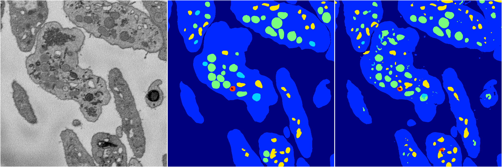
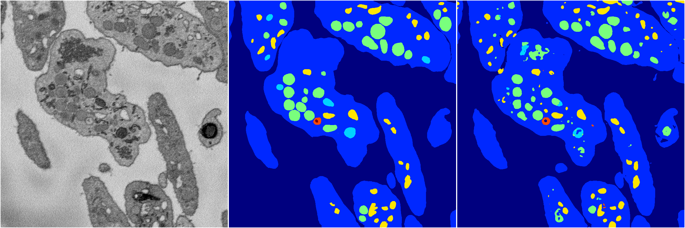
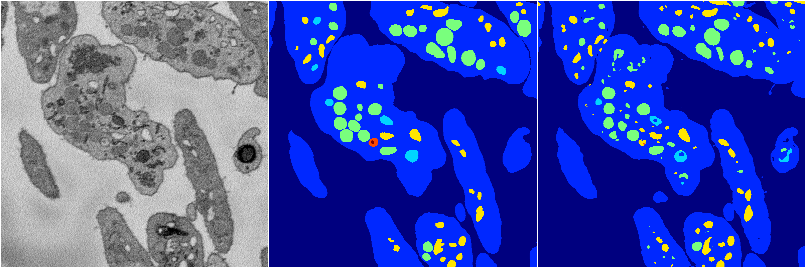
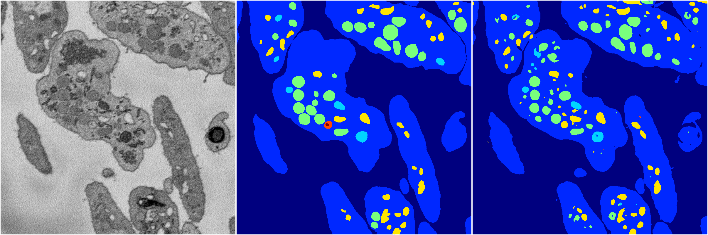
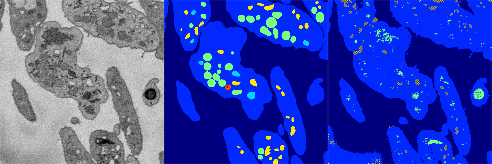

[Back](..)&nbsp;&nbsp;&nbsp;&nbsp;&nbsp;[Home](https://leapmanlab.github.io/snapshots)

---

<a href="4"><h2>random_2d_ed / 1210 / 65 / 4</h2></a>
Created 16 Dec 2018, 10:15:15

<i>Click for more details</i>

**ari**: 0.8163. **miou**: 0.5803. **accuracy**: 0.9285. **n_params**: 13644535.0000. 

---

<a href="3"><h2>random_2d_ed / 1210 / 65 / 3</h2></a>
Created 16 Dec 2018, 10:15:15

<i>Click for more details</i>

**ari**: 0.8214. **miou**: 0.4909. **accuracy**: 0.9291. **n_params**: 13644535.0000. 

---

<a href="2"><h2>random_2d_ed / 1210 / 65 / 2</h2></a>
Created 16 Dec 2018, 10:15:15

<i>Click for more details</i>

**ari**: 0.8107. **miou**: 0.5008. **accuracy**: 0.9272. **n_params**: 13644535.0000. 

---

<a href="1"><h2>random_2d_ed / 1210 / 65 / 1</h2></a>
Created 16 Dec 2018, 10:15:15

<i>Click for more details</i>

**ari**: 0.8134. **miou**: 0.4949. **accuracy**: 0.9283. **n_params**: 13644535.0000. 

---

<a href="0"><h2>random_2d_ed / 1210 / 65 / 0</h2></a>
Created 16 Dec 2018, 10:15:15

<i>Click for more details</i>

**ari**: 0.6792. **miou**: 0.2634. **accuracy**: 0.8724. **n_params**: 13644535.0000. 

---

[Back](..)&nbsp;&nbsp;&nbsp;&nbsp;&nbsp;[Home](https://leapmanlab.github.io/snapshots)

---