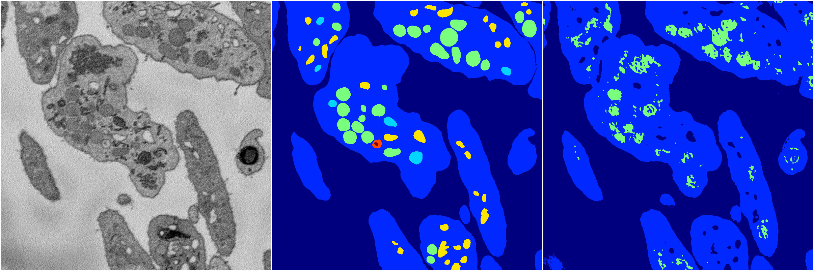
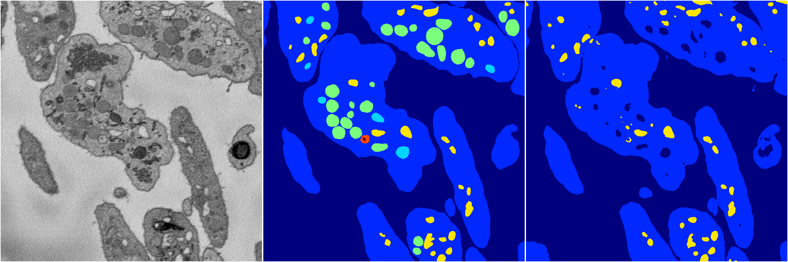
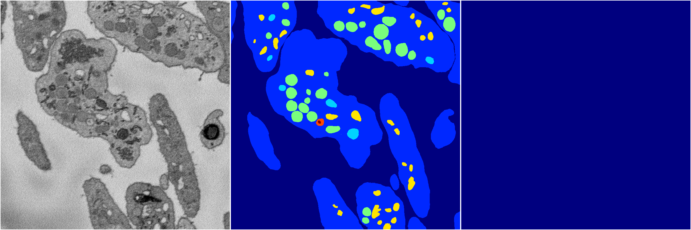
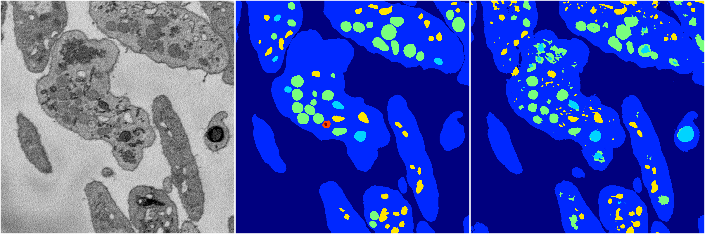
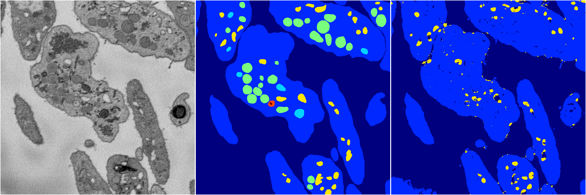

[Back](..)&nbsp;&nbsp;&nbsp;&nbsp;&nbsp;[Home](https://leapmanlab.github.io/snapshots)

---

<a href="0"><h2>random_2d_ed / 1210 / 66 / 0</h2></a>
Created 21 Dec 2018, 01:15:55

<i>Click for more details</i>

**ari**: 0.7529. **miou**: 0.2873. **accuracy**: 0.9012. **n_params**: 69375063.0000. 

---

<a href="3"><h2>random_2d_ed / 1210 / 66 / 3</h2></a>
Created 21 Dec 2018, 01:15:55

<i>Click for more details</i>

**ari**: 0.7765. **miou**: 0.3425. **accuracy**: 0.9189. **n_params**: 69375063.0000. 

---

<a href="1"><h2>random_2d_ed / 1210 / 66 / 1</h2></a>
Created 21 Dec 2018, 01:15:55

<i>Click for more details</i>

**ari**: -0.0000. **miou**: 0.0694. **accuracy**: 0.4857. **n_params**: 69375063.0000. 

---

<a href="4"><h2>random_2d_ed / 1210 / 66 / 4</h2></a>
Created 21 Dec 2018, 01:15:55

<i>Click for more details</i>

**ari**: 0.7974. **miou**: 0.4425. **accuracy**: 0.9232. **n_params**: 69375063.0000. 

---

<a href="2"><h2>random_2d_ed / 1210 / 66 / 2</h2></a>
Created 21 Dec 2018, 01:15:55

<i>Click for more details</i>

**ari**: 0.7446. **miou**: 0.3077. **accuracy**: 0.9098. **n_params**: 69375063.0000. 

---

[Back](..)&nbsp;&nbsp;&nbsp;&nbsp;&nbsp;[Home](https://leapmanlab.github.io/snapshots)

---