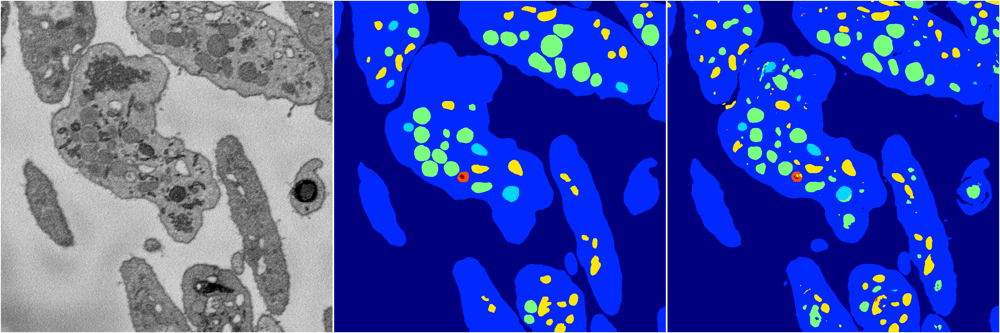
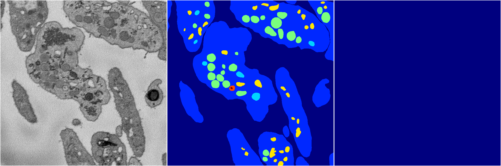
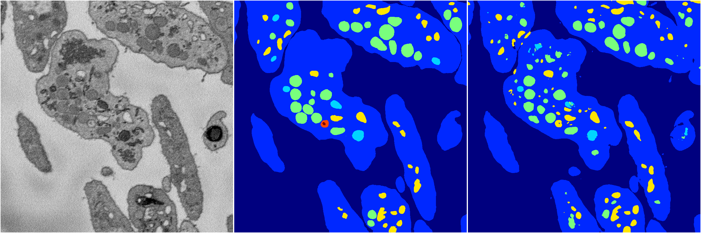

[Back](..)&nbsp;&nbsp;&nbsp;&nbsp;&nbsp;[Home](https://leapmanlab.github.io/snapshots)

---

<a href="2"><h2>random_2d_ed / 1210 / 67 / 2</h2></a>
Created 16 Dec 2018, 10:15:15

<i>Click for more details</i>

**ari**: 0.8122. **miou**: 0.5664. **accuracy**: 0.9258. **n_params**: 16138544.0000. 

---

<a href="3"><h2>random_2d_ed / 1210 / 67 / 3</h2></a>
Created 16 Dec 2018, 10:15:15

<i>Click for more details</i>

**ari**: 0.0000. **miou**: 0.0691. **accuracy**: 0.4837. **n_params**: 16138544.0000. 

---

<a href="4"><h2>random_2d_ed / 1210 / 67 / 4</h2></a>
Created 16 Dec 2018, 10:15:15

<i>Click for more details</i>

**ari**: 0.8245. **miou**: 0.4636. **accuracy**: 0.9322. **n_params**: 16138544.0000. 

---

<a href="1"><h2>random_2d_ed / 1210 / 67 / 1</h2></a>
Created 16 Dec 2018, 10:15:15

<i>Click for more details</i>

**ari**: 0.8180. **miou**: 0.5917. **accuracy**: 0.9296. **n_params**: 16138544.0000. 

---

<a href="0"><h2>random_2d_ed / 1210 / 67 / 0</h2></a>
Created 16 Dec 2018, 10:15:15

<i>Click for more details</i>

**ari**: 0.8217. **miou**: 0.5710. **accuracy**: 0.9310. **n_params**: 16138544.0000. 

---

[Back](..)&nbsp;&nbsp;&nbsp;&nbsp;&nbsp;[Home](https://leapmanlab.github.io/snapshots)

---