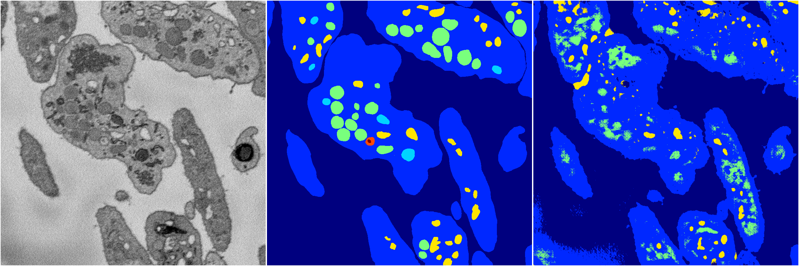
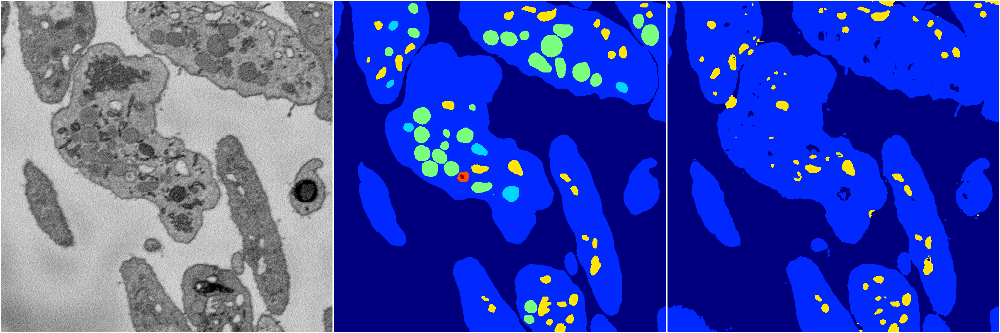
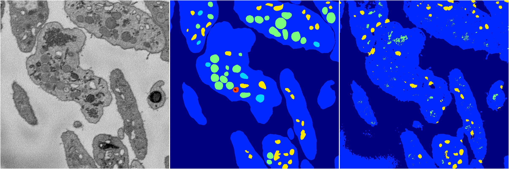
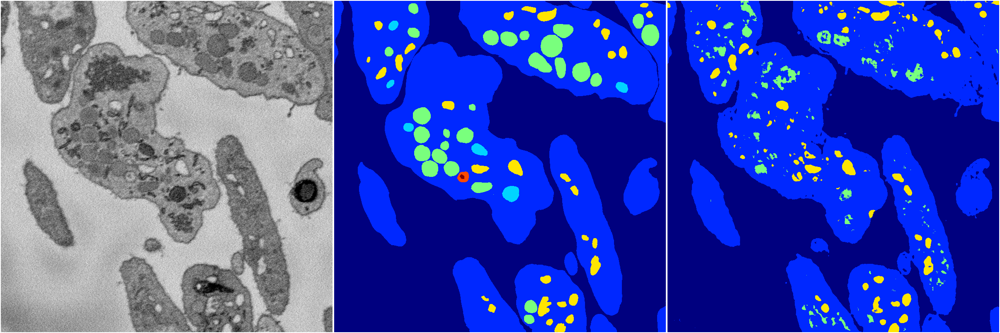

[Back](..)&nbsp;&nbsp;&nbsp;&nbsp;&nbsp;[Home](https://leapmanlab.github.io/snapshots)

---

<a href="4"><h2>random_2d_ed / 1210 / 68 / 4</h2></a>
Created 13 Dec 2018, 23:48:56

<i>Click for more details</i>

**ari**: 0.5075. **miou**: 0.3015. **accuracy**: 0.8448. **n_params**: 110541902.0000. 

---

<a href="3"><h2>random_2d_ed / 1210 / 68 / 3</h2></a>
Created 13 Dec 2018, 23:48:56

<i>Click for more details</i>

**ari**: 0.6679. **miou**: 0.3368. **accuracy**: 0.9131. **n_params**: 110541902.0000. 

---

<a href="0"><h2>random_2d_ed / 1210 / 68 / 0</h2></a>
Created 13 Dec 2018, 23:48:56

<i>Click for more details</i>

**ari**: 0.5599. **miou**: 0.3048. **accuracy**: 0.8780. **n_params**: 110541902.0000. 

---

<a href="2"><h2>random_2d_ed / 1210 / 68 / 2</h2></a>
Created 13 Dec 2018, 23:48:56

<i>Click for more details</i>

**ari**: 0.6425. **miou**: 0.3614. **accuracy**: 0.8801. **n_params**: 110541902.0000. 

---

<a href="1"><h2>random_2d_ed / 1210 / 68 / 1</h2></a>
Created 13 Dec 2018, 23:48:56

<i>Click for more details</i>

**ari**: 0.6176. **miou**: 0.3417. **accuracy**: 0.8915. **n_params**: 110541902.0000. 

---

[Back](..)&nbsp;&nbsp;&nbsp;&nbsp;&nbsp;[Home](https://leapmanlab.github.io/snapshots)

---