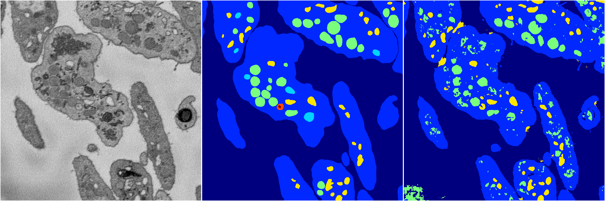
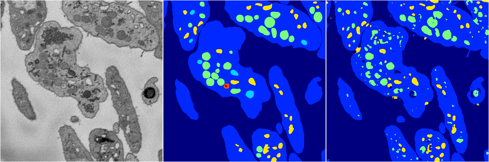
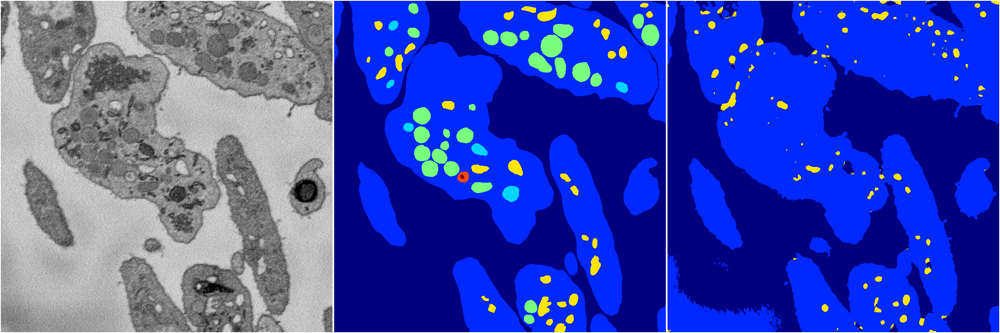
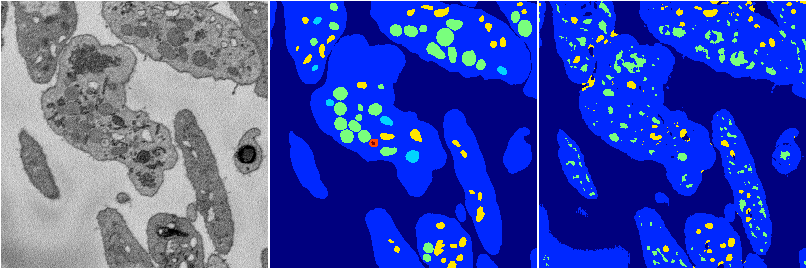

[Back](..)&nbsp;&nbsp;&nbsp;&nbsp;&nbsp;[Home](https://leapmanlab.github.io/snapshots)

---

<a href="3"><h2>random_2d_ed / 1210 / 69 / 3</h2></a>
Created 17 Dec 2018, 23:35:06

<i>Click for more details</i>

**ari**: 0.7634. **miou**: 0.3753. **accuracy**: 0.8975. **n_params**: 1059188.0000. 

---

<a href="4"><h2>random_2d_ed / 1210 / 69 / 4</h2></a>
Created 17 Dec 2018, 23:35:06

<i>Click for more details</i>

**ari**: 0.7752. **miou**: 0.3886. **accuracy**: 0.9066. **n_params**: 1059188.0000. 

---

<a href="2"><h2>random_2d_ed / 1210 / 69 / 2</h2></a>
Created 17 Dec 2018, 23:35:06

<i>Click for more details</i>

**ari**: 0.6695. **miou**: 0.2814. **accuracy**: 0.8756. **n_params**: 1059188.0000. 

---

<a href="1"><h2>random_2d_ed / 1210 / 69 / 1</h2></a>
Created 17 Dec 2018, 23:35:06

<i>Click for more details</i>

**ari**: 0.6986. **miou**: 0.3286. **accuracy**: 0.8733. **n_params**: 1059188.0000. 

---

<a href="0"><h2>random_2d_ed / 1210 / 69 / 0</h2></a>
Created 17 Dec 2018, 23:35:06

<i>Click for more details</i>

**ari**: 0.7821. **miou**: 0.4920. **accuracy**: 0.9063. **n_params**: 1059188.0000. 

---

[Back](..)&nbsp;&nbsp;&nbsp;&nbsp;&nbsp;[Home](https://leapmanlab.github.io/snapshots)

---