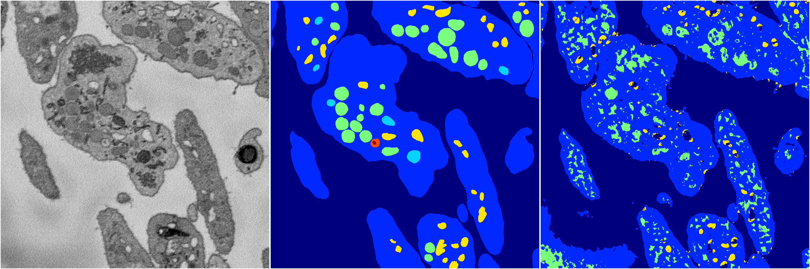
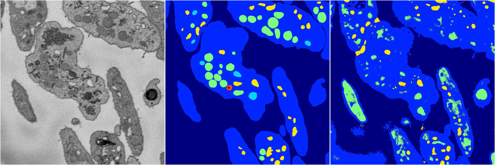
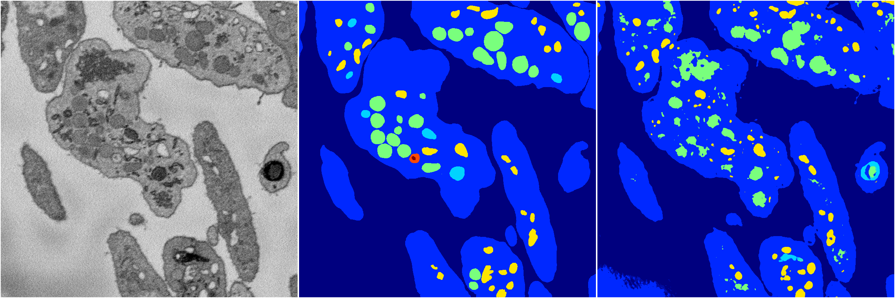
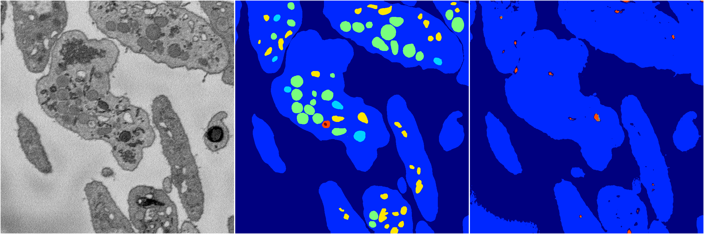

[Back](..)&nbsp;&nbsp;&nbsp;&nbsp;&nbsp;[Home](https://leapmanlab.github.io/snapshots)

---

<a href="4"><h2>random_2d_ed / 1210 / 7 / 4</h2></a>
(Created 13 Dec 2018, 16:39:45. Modified 13 Dec 2018, 16:39:45)

<i>Click for more details</i>

**ari**: 0.6705. **miou**: 0.3066. **accuracy**: 0.8602. **n_params**: 3407898.0000. 

---

<a href="0"><h2>random_2d_ed / 1210 / 7 / 0</h2></a>
(Created 13 Dec 2018, 16:39:45. Modified 13 Dec 2018, 16:39:45)

<i>Click for more details</i>

**ari**: 0.6404. **miou**: 0.2980. **accuracy**: 0.8377. **n_params**: 3407898.0000. 

---

<a href="2"><h2>random_2d_ed / 1210 / 7 / 2</h2></a>
(Created 13 Dec 2018, 16:39:45. Modified 13 Dec 2018, 16:39:45)

<i>Click for more details</i>

**ari**: 0.7601. **miou**: 0.3649. **accuracy**: 0.9009. **n_params**: 3407898.0000. 

---

<a href="1"><h2>random_2d_ed / 1210 / 7 / 1</h2></a>
(Created 13 Dec 2018, 16:39:45. Modified 13 Dec 2018, 16:39:45)

<i>Click for more details</i>

**ari**: 0.7000. **miou**: 0.2466. **accuracy**: 0.8905. **n_params**: 3407898.0000. 

---

<a href="3"><h2>random_2d_ed / 1210 / 7 / 3</h2></a>
(Created 13 Dec 2018, 16:39:45. Modified 13 Dec 2018, 16:39:45)

<i>Click for more details</i>

**ari**: 0.7420. **miou**: 0.3698. **accuracy**: 0.8957. **n_params**: 3407898.0000. 

---

[Back](..)&nbsp;&nbsp;&nbsp;&nbsp;&nbsp;[Home](https://leapmanlab.github.io/snapshots)

---