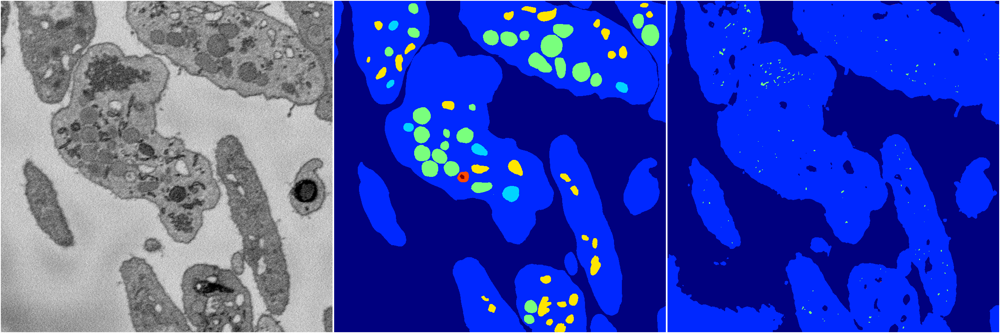
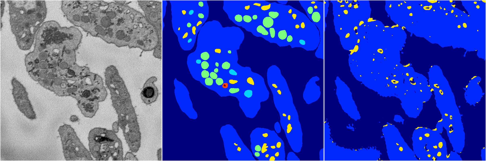
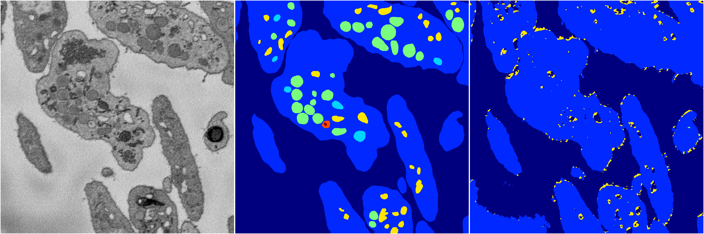
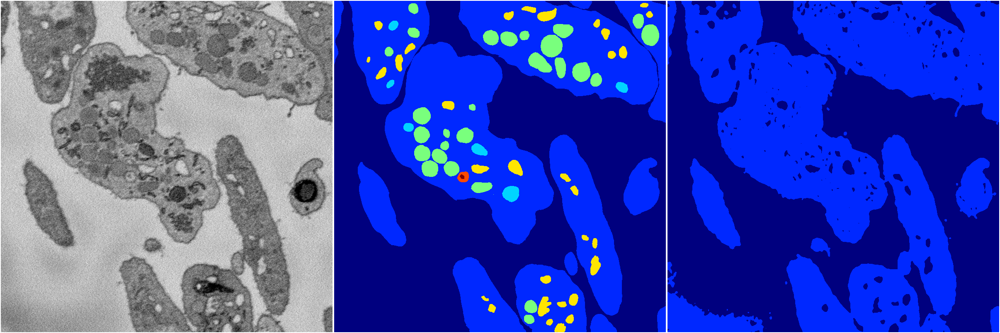

[Back](..)&nbsp;&nbsp;&nbsp;&nbsp;&nbsp;[Home](https://leapmanlab.github.io/snapshots)

---

<a href="4"><h2>random_2d_ed / 1210 / 70 / 4</h2></a>
Created 21 Dec 2018, 14:17:38

<i>Click for more details</i>

**ari**: 0.5726. **miou**: 0.2913. **accuracy**: 0.8856. **n_params**: 8151091.0000. 

---

<a href="2"><h2>random_2d_ed / 1210 / 70 / 2</h2></a>
Created 21 Dec 2018, 14:17:38

<i>Click for more details</i>

**ari**: 0.5097. **miou**: 0.2400. **accuracy**: 0.8754. **n_params**: 8151091.0000. 

---

<a href="3"><h2>random_2d_ed / 1210 / 70 / 3</h2></a>
Created 21 Dec 2018, 14:17:38

<i>Click for more details</i>

**ari**: 0.5574. **miou**: 0.2864. **accuracy**: 0.8782. **n_params**: 8151091.0000. 

---

<a href="0"><h2>random_2d_ed / 1210 / 70 / 0</h2></a>
Created 21 Dec 2018, 14:17:38

<i>Click for more details</i>

**ari**: 0.5565. **miou**: 0.2647. **accuracy**: 0.8753. **n_params**: 8151091.0000. 

---

<a href="1"><h2>random_2d_ed / 1210 / 70 / 1</h2></a>
Created 21 Dec 2018, 14:17:38

<i>Click for more details</i>

**ari**: 0.5074. **miou**: 0.2433. **accuracy**: 0.8778. **n_params**: 8151091.0000. 

---

[Back](..)&nbsp;&nbsp;&nbsp;&nbsp;&nbsp;[Home](https://leapmanlab.github.io/snapshots)

---