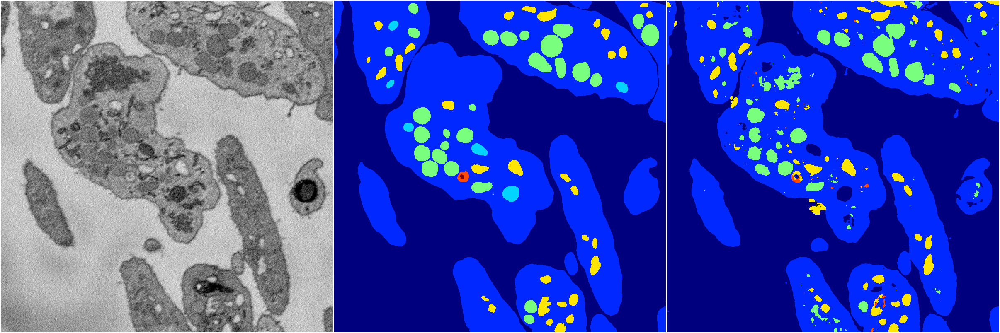
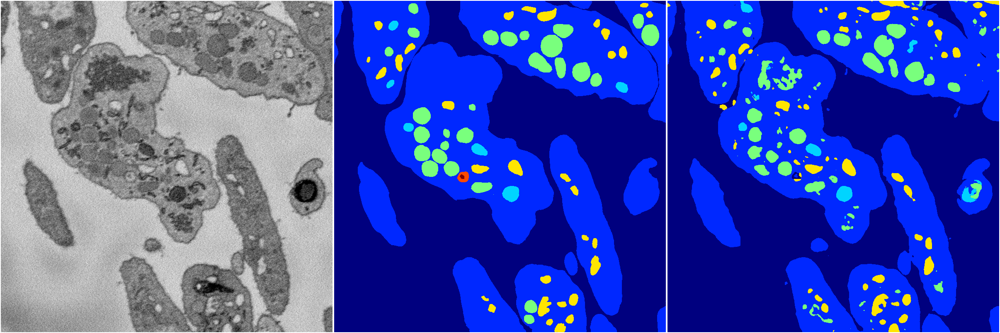
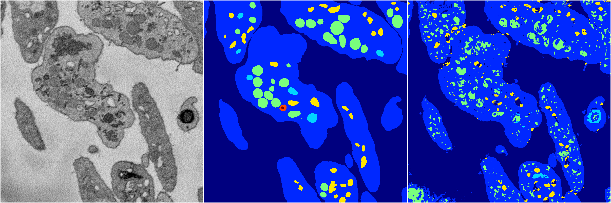
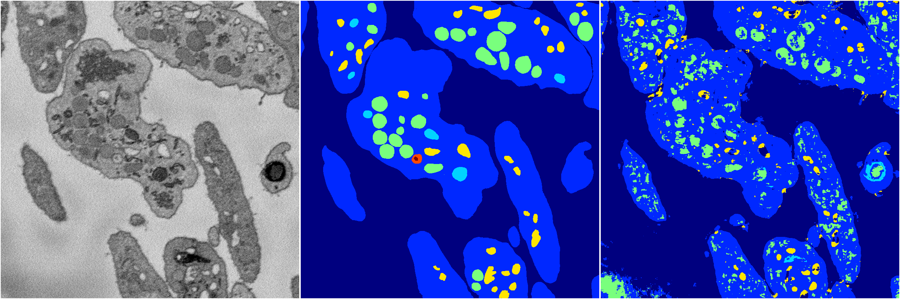

[Back](..)&nbsp;&nbsp;&nbsp;&nbsp;&nbsp;[Home](https://leapmanlab.github.io/snapshots)

---

<a href="2"><h2>random_2d_ed / 1210 / 71 / 2</h2></a>
Created 21 Dec 2018, 01:15:55

<i>Click for more details</i>

**ari**: 0.8009. **miou**: 0.4288. **accuracy**: 0.9230. **n_params**: 3721395.0000. 

---

<a href="0"><h2>random_2d_ed / 1210 / 71 / 0</h2></a>
Created 21 Dec 2018, 01:15:55

<i>Click for more details</i>

**ari**: 0.8136. **miou**: 0.4590. **accuracy**: 0.9272. **n_params**: 3721395.0000. 

---

<a href="3"><h2>random_2d_ed / 1210 / 71 / 3</h2></a>
Created 21 Dec 2018, 01:15:55

<i>Click for more details</i>

**ari**: 0.8118. **miou**: 0.5387. **accuracy**: 0.9257. **n_params**: 3721395.0000. 

---

<a href="1"><h2>random_2d_ed / 1210 / 71 / 1</h2></a>
Created 21 Dec 2018, 01:15:55

<i>Click for more details</i>

**ari**: 0.7369. **miou**: 0.3334. **accuracy**: 0.8855. **n_params**: 3721395.0000. 

---

<a href="4"><h2>random_2d_ed / 1210 / 71 / 4</h2></a>
Created 21 Dec 2018, 01:15:55

<i>Click for more details</i>

**ari**: 0.7166. **miou**: 0.3252. **accuracy**: 0.8741. **n_params**: 3721395.0000. 

---

[Back](..)&nbsp;&nbsp;&nbsp;&nbsp;&nbsp;[Home](https://leapmanlab.github.io/snapshots)

---