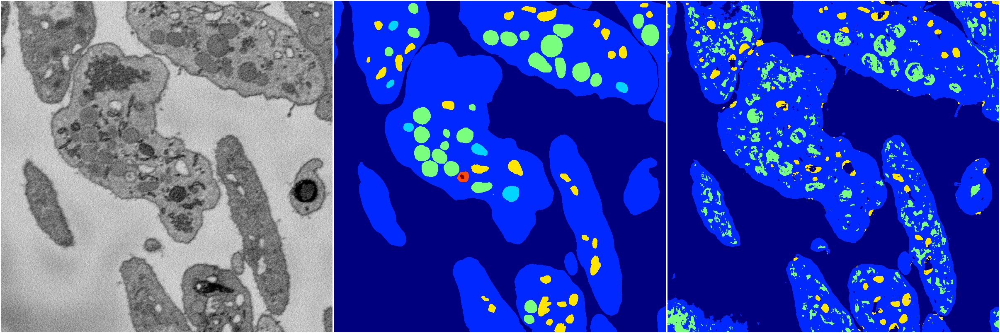
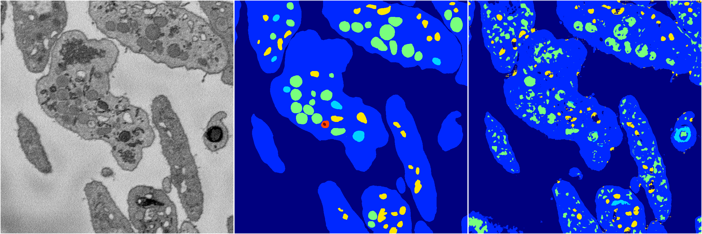
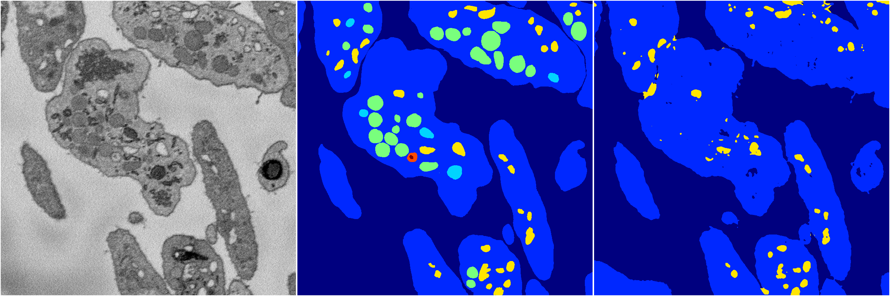

[Back](..)&nbsp;&nbsp;&nbsp;&nbsp;&nbsp;[Home](https://leapmanlab.github.io/snapshots)

---

<a href="3"><h2>random_2d_ed / 1210 / 72 / 3</h2></a>
Created 17 Dec 2018, 23:35:06

<i>Click for more details</i>

**ari**: 0.7720. **miou**: 0.3123. **accuracy**: 0.9130. **n_params**: 2208110.0000. 

---

<a href="4"><h2>random_2d_ed / 1210 / 72 / 4</h2></a>
Created 17 Dec 2018, 23:35:06

<i>Click for more details</i>

**ari**: 0.7392. **miou**: 0.3271. **accuracy**: 0.8840. **n_params**: 2208110.0000. 

---

<a href="2"><h2>random_2d_ed / 1210 / 72 / 2</h2></a>
Created 17 Dec 2018, 23:35:06

<i>Click for more details</i>

**ari**: 0.8088. **miou**: 0.4513. **accuracy**: 0.9220. **n_params**: 2208110.0000. 

---

<a href="1"><h2>random_2d_ed / 1210 / 72 / 1</h2></a>
Created 17 Dec 2018, 23:35:06

<i>Click for more details</i>

**ari**: 0.7410. **miou**: 0.3368. **accuracy**: 0.8859. **n_params**: 2208110.0000. 

---

<a href="0"><h2>random_2d_ed / 1210 / 72 / 0</h2></a>
Created 17 Dec 2018, 23:35:06

<i>Click for more details</i>

**ari**: 0.7740. **miou**: 0.3294. **accuracy**: 0.9152. **n_params**: 2208110.0000. 

---

[Back](..)&nbsp;&nbsp;&nbsp;&nbsp;&nbsp;[Home](https://leapmanlab.github.io/snapshots)

---