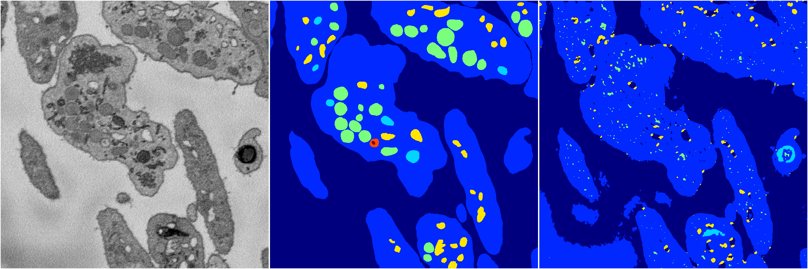
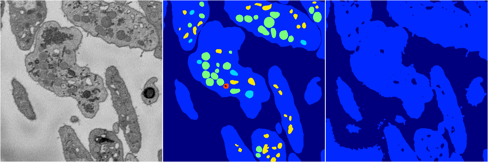
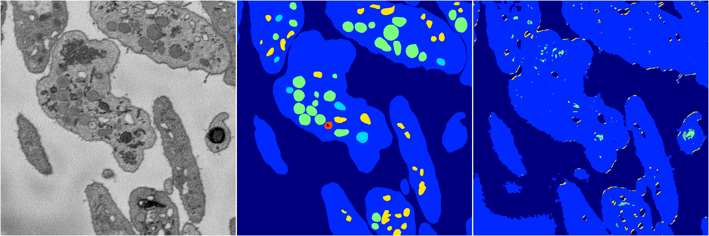
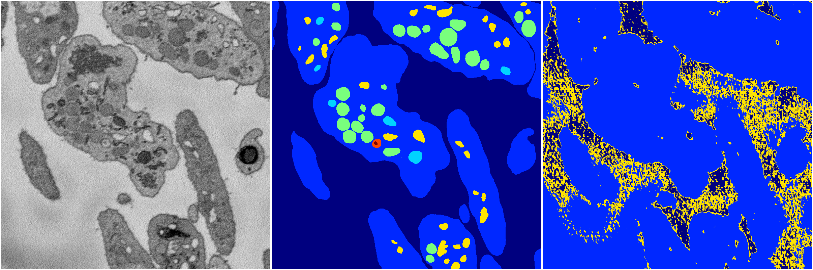

[Back](..)&nbsp;&nbsp;&nbsp;&nbsp;&nbsp;[Home](https://leapmanlab.github.io/snapshots)

---

<a href="0"><h2>random_2d_ed / 1210 / 73 / 0</h2></a>
Created 21 Dec 2018, 01:15:55

<i>Click for more details</i>

**ari**: 0.7052. **miou**: 0.3379. **accuracy**: 0.8700. **n_params**: 849934.0000. 

---

<a href="3"><h2>random_2d_ed / 1210 / 73 / 3</h2></a>
Created 21 Dec 2018, 01:15:55

<i>Click for more details</i>

**ari**: 0.6445. **miou**: 0.2734. **accuracy**: 0.8605. **n_params**: 849934.0000. 

---

<a href="1"><h2>random_2d_ed / 1210 / 73 / 1</h2></a>
Created 21 Dec 2018, 01:15:55

<i>Click for more details</i>

**ari**: 0.6384. **miou**: 0.2358. **accuracy**: 0.8634. **n_params**: 849934.0000. 

---

<a href="4"><h2>random_2d_ed / 1210 / 73 / 4</h2></a>
Created 21 Dec 2018, 01:15:55

<i>Click for more details</i>

**ari**: 0.6437. **miou**: 0.2519. **accuracy**: 0.8579. **n_params**: 849934.0000. 

---

<a href="2"><h2>random_2d_ed / 1210 / 73 / 2</h2></a>
Created 21 Dec 2018, 01:15:55

<i>Click for more details</i>

**ari**: 0.2594. **miou**: 0.1436. **accuracy**: 0.6362. **n_params**: 849934.0000. 

---

[Back](..)&nbsp;&nbsp;&nbsp;&nbsp;&nbsp;[Home](https://leapmanlab.github.io/snapshots)

---