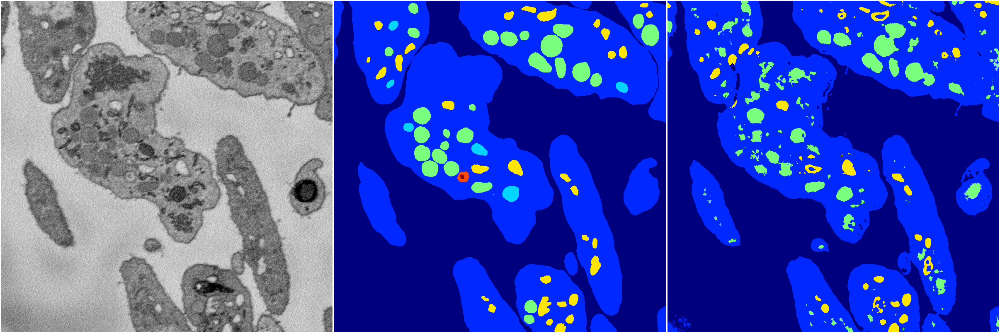
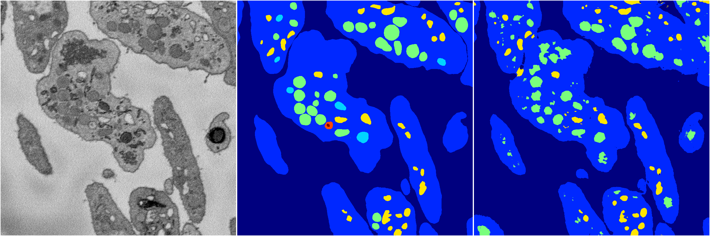

[Back](..)&nbsp;&nbsp;&nbsp;&nbsp;&nbsp;[Home](https://leapmanlab.github.io/snapshots)

---

<a href="1"><h2>random_2d_ed / 1210 / 75 / 1</h2></a>
Created 13 Dec 2018, 23:48:57

<i>Click for more details</i>

**ari**: 0.7636. **miou**: 0.3543. **accuracy**: 0.9030. **n_params**: 7997183.0000. 

---

<a href="4"><h2>random_2d_ed / 1210 / 75 / 4</h2></a>
Created 13 Dec 2018, 23:48:57

<i>Click for more details</i>

**ari**: 0.8095. **miou**: 0.4712. **accuracy**: 0.9227. **n_params**: 7997183.0000. 

---

<a href="2"><h2>random_2d_ed / 1210 / 75 / 2</h2></a>
Created 13 Dec 2018, 23:48:57

<i>Click for more details</i>

**ari**: 0.7860. **miou**: 0.3821. **accuracy**: 0.9060. **n_params**: 7997183.0000. 

---

<a href="3"><h2>random_2d_ed / 1210 / 75 / 3</h2></a>
Created 13 Dec 2018, 23:48:57

<i>Click for more details</i>

**ari**: 0.7374. **miou**: 0.3422. **accuracy**: 0.8824. **n_params**: 7997183.0000. 

---

<a href="0"><h2>random_2d_ed / 1210 / 75 / 0</h2></a>
Created 13 Dec 2018, 23:48:57

<i>Click for more details</i>

**ari**: 0.7928. **miou**: 0.3773. **accuracy**: 0.9133. **n_params**: 7997183.0000. 

---

[Back](..)&nbsp;&nbsp;&nbsp;&nbsp;&nbsp;[Home](https://leapmanlab.github.io/snapshots)

---