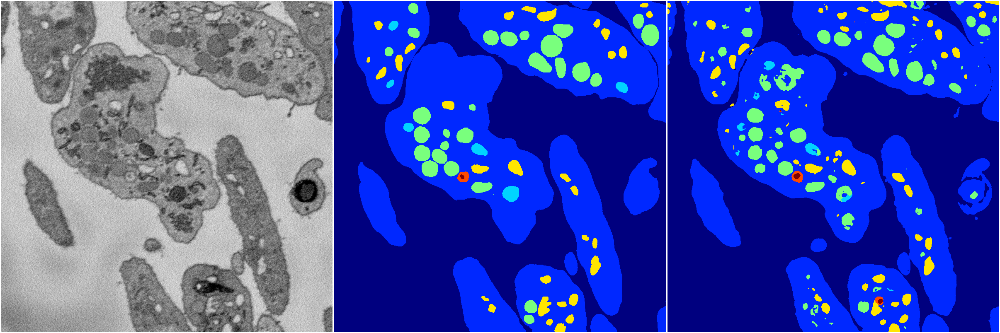
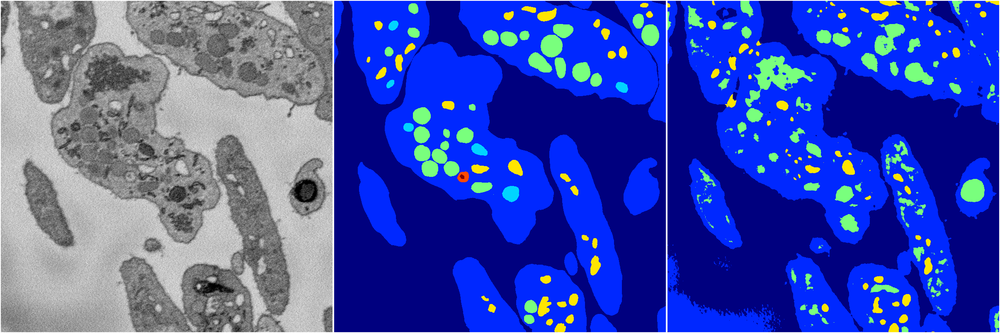

[Back](..)&nbsp;&nbsp;&nbsp;&nbsp;&nbsp;[Home](https://leapmanlab.github.io/snapshots)

---

<a href="4"><h2>random_2d_ed / 1210 / 76 / 4</h2></a>
Created 14 Dec 2018, 11:38:29

<i>Click for more details</i>

**ari**: 0.8108. **miou**: 0.5085. **accuracy**: 0.9256. **n_params**: 59950744.0000. 

---

<a href="3"><h2>random_2d_ed / 1210 / 76 / 3</h2></a>
Created 14 Dec 2018, 11:38:29

<i>Click for more details</i>

**ari**: 0.8073. **miou**: 0.4054. **accuracy**: 0.9238. **n_params**: 59950744.0000. 

---

<a href="2"><h2>random_2d_ed / 1210 / 76 / 2</h2></a>
Created 14 Dec 2018, 11:38:29

<i>Click for more details</i>

**ari**: 0.8115. **miou**: 0.5684. **accuracy**: 0.9270. **n_params**: 59950744.0000. 

---

<a href="1"><h2>random_2d_ed / 1210 / 76 / 1</h2></a>
Created 14 Dec 2018, 11:38:29

<i>Click for more details</i>

**ari**: 0.8095. **miou**: 0.4665. **accuracy**: 0.9229. **n_params**: 59950744.0000. 

---

<a href="0"><h2>random_2d_ed / 1210 / 76 / 0</h2></a>
Created 14 Dec 2018, 11:38:29

<i>Click for more details</i>

**ari**: 0.8137. **miou**: 0.4716. **accuracy**: 0.9232. **n_params**: 59950744.0000. 

---

[Back](..)&nbsp;&nbsp;&nbsp;&nbsp;&nbsp;[Home](https://leapmanlab.github.io/snapshots)

---