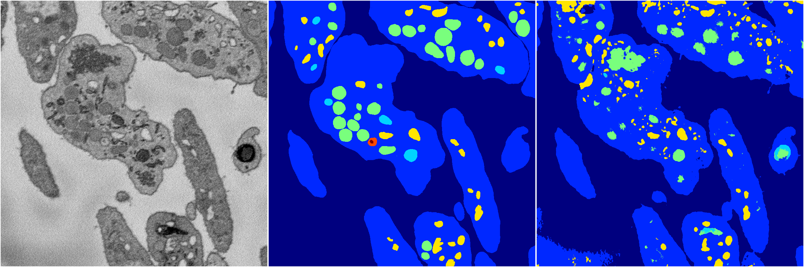
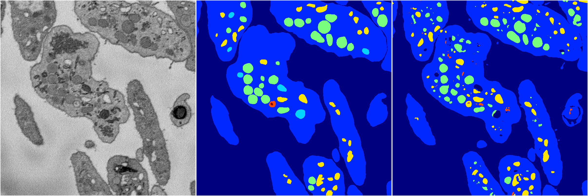
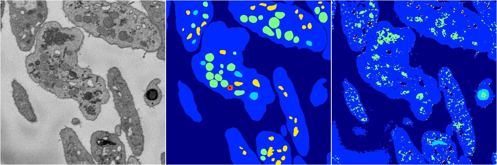
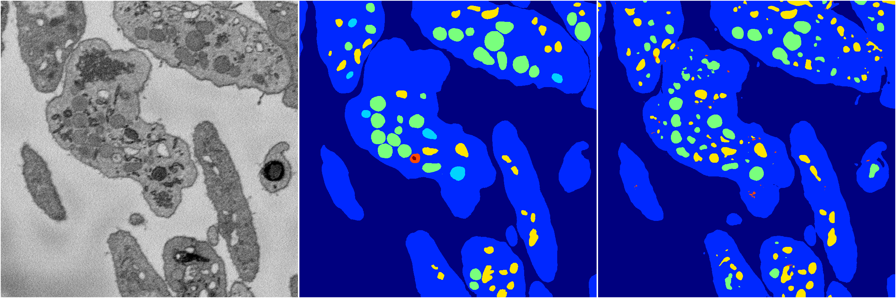
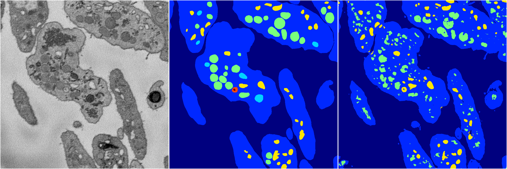

[Back](..)&nbsp;&nbsp;&nbsp;&nbsp;&nbsp;[Home](https://leapmanlab.github.io/snapshots)

---

<a href="4"><h2>random_2d_ed / 1210 / 77 / 4</h2></a>
Created 16 Dec 2018, 15:39:20

<i>Click for more details</i>

**ari**: 0.7088. **miou**: 0.3330. **accuracy**: 0.8836. **n_params**: 42185389.0000. 

---

<a href="2"><h2>random_2d_ed / 1210 / 77 / 2</h2></a>
Created 16 Dec 2018, 15:39:20

<i>Click for more details</i>

**ari**: 0.7798. **miou**: 0.4203. **accuracy**: 0.9191. **n_params**: 42185389.0000. 

---

<a href="3"><h2>random_2d_ed / 1210 / 77 / 3</h2></a>
Created 16 Dec 2018, 15:39:20

<i>Click for more details</i>

**ari**: 0.6371. **miou**: 0.2761. **accuracy**: 0.8461. **n_params**: 42185389.0000. 

---

<a href="0"><h2>random_2d_ed / 1210 / 77 / 0</h2></a>
Created 16 Dec 2018, 15:39:20

<i>Click for more details</i>

**ari**: 0.7871. **miou**: 0.4059. **accuracy**: 0.9215. **n_params**: 42185389.0000. 

---

<a href="1"><h2>random_2d_ed / 1210 / 77 / 1</h2></a>
Created 16 Dec 2018, 15:39:20

<i>Click for more details</i>

**ari**: 0.7752. **miou**: 0.4285. **accuracy**: 0.9115. **n_params**: 42185389.0000. 

---

[Back](..)&nbsp;&nbsp;&nbsp;&nbsp;&nbsp;[Home](https://leapmanlab.github.io/snapshots)

---